# Import Manager

## Import Manager

Create or Update operation currently not supported. Available in future release.

Update or Ignore operation currently not supported. Available in future release.

If the spreadsheet is set up correctly, all mapping fields will be auto-mapped. If they are not, simply

select to the right of "Clear Mapping" and select the proper column heading name.

## Category Mapping

Category Mapping exists and functions the same way as the attribute mapping does.

The operation for this spreadsheet will be create, as the categories are brand new along with the new

attributes above.

If it's new structure going in, select either "Create" or "Create or Ignore" to direct Convergence PIM to

create new categories.

Update operation currently not supported. Available in future release.

Create or Update operation currently not supported. Available in future release.

Update or Ignore operation currently not supported. Available in future release.

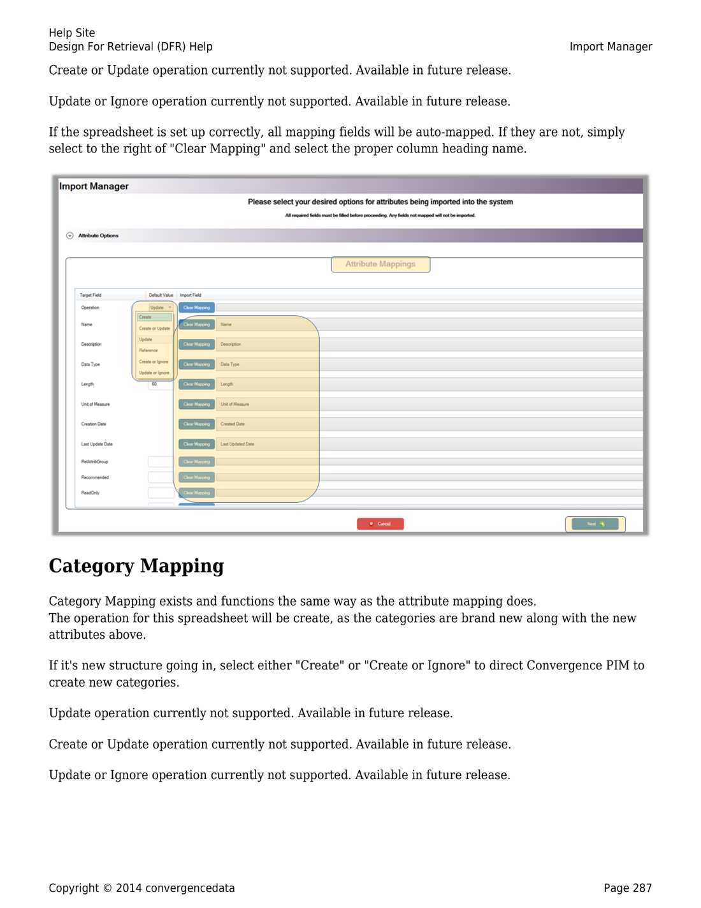

## Import Manager

## Category Attribute Mapping

Lastly is the category attribute mapping screen which is the screen that tells Convergence PIM what

attributes are being applied to which categories.

The operation for this spreadsheet is "Create," as the mappings are brand new, along with the new

attributes and new categories above.

"Create" or "Create or Ignore" for new mappings.

Update operation currently not supported. Available in future release.

Create or Update operation currently not supported. Available in future release.

Update or Ignore operation currently not supported. Available in future release.

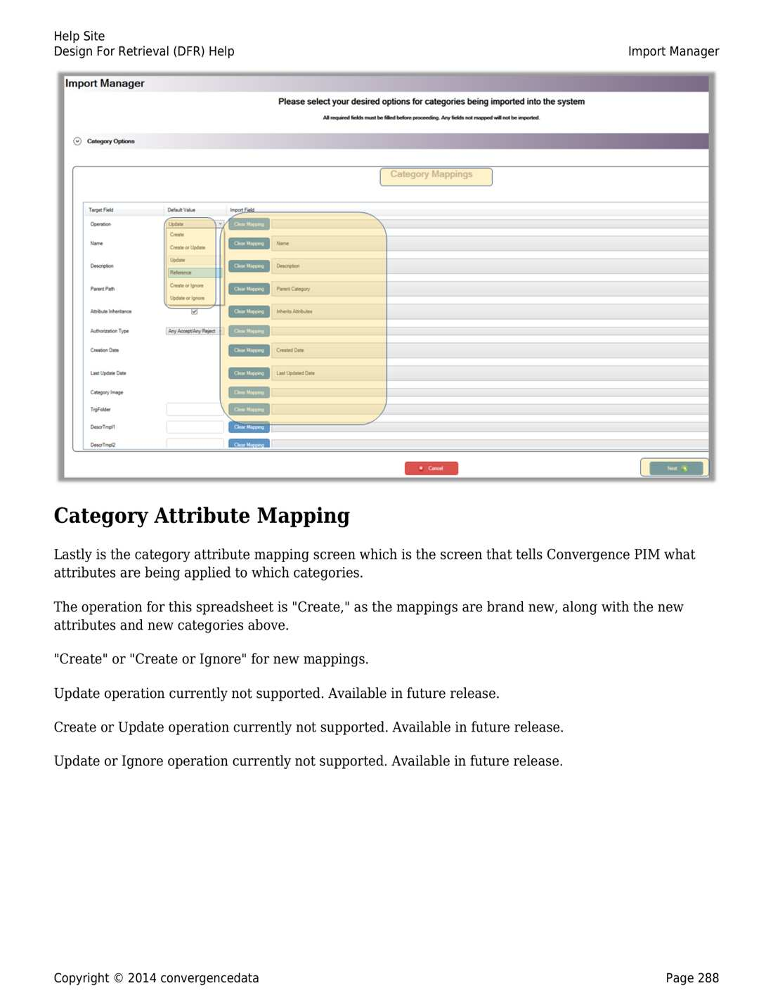

## Import Manager

Next is the validation screen.

If there is anything wrong with the data, it will be shown after validations are run.

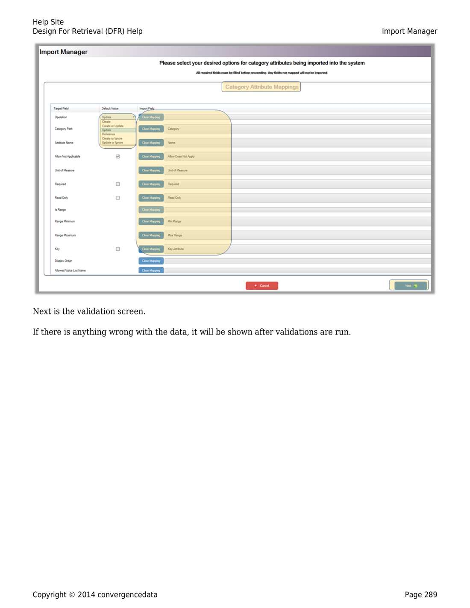

## Import Manager

Once validated and no errors occur, select Next and then Import.

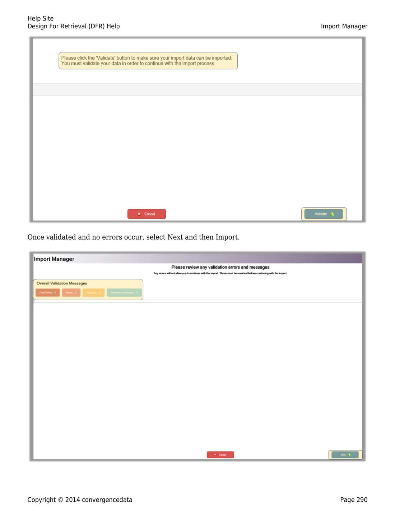

## Import Manager

The structure has been successfully loaded into Convergence PIM.

Next, it's time to load Parts.

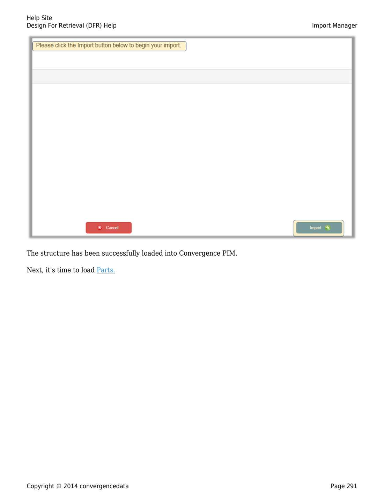

## How to Import New Classification Data

## Creating a Classification Load File

There is a specific load file format needed for Convergence PIM Import Manager when it comes to

classification data.

In this example, the spreadsheet will be set up for attributes, categories, and the mapping of the two.

The column headers must be named exactly what the mapping fields show in Convergence PIM.

## Name

## Description

## Data Type

## Length

## Unit of Measure

If they are not listed in the Excel spreadsheet exactly as they appear in Convergence PIM, the auto-

mapping will not recognize it and the user will have to manually select the column headers from a drop

down list.

### The pages of the spreadsheet must always indicate what it belongs to, as seen below

## Attributes

## Categories

## Classification

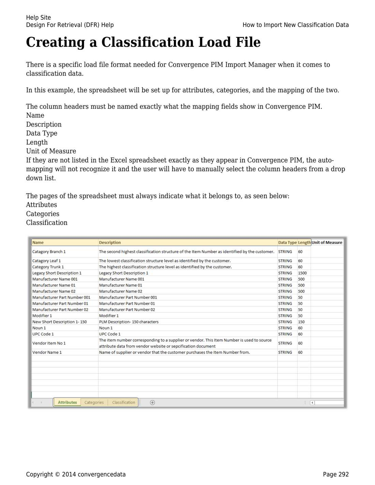

## How to Import New Classification Data

## Attributes

The attributes listed above will all be imported as new attributes. This means they did not exist before

and are being created brand new in the spreadsheet.

If the user would like to use existing attributes, they simply need to pull the name, description, type and

UoM (if applicable) and fill them in on this sheet.

Name: How the attribute name will appear in Convergence PIM on the master attribute list,

classification, exports, SmartFind, etc.

Description: This isn't mandatory but it is helpful to users to understand what it is the attribute is being

used for.

Data Type: Tells Convergence PIM if this attribute needs to be created a specific way, such as a

boolean, string, numeric, or file attribute.

Length: Tells Convergence PIM how many characters it should allow before showing up as errors when

validating in Data Developer.

Unit of Measure: This isn't mandatory, but is helpful to create a base unit of measure that will apply to

all data under that attribute. For example: V, in, cm, ft, W

## Categories

The categories page is used to lay down the structure.

This needs to be built-out in the particular order shown below, otherwise Convergence PIM will not

read it.

Only Parent Category, Name, Description, and Full Path are mandatory on this page to have filled out.

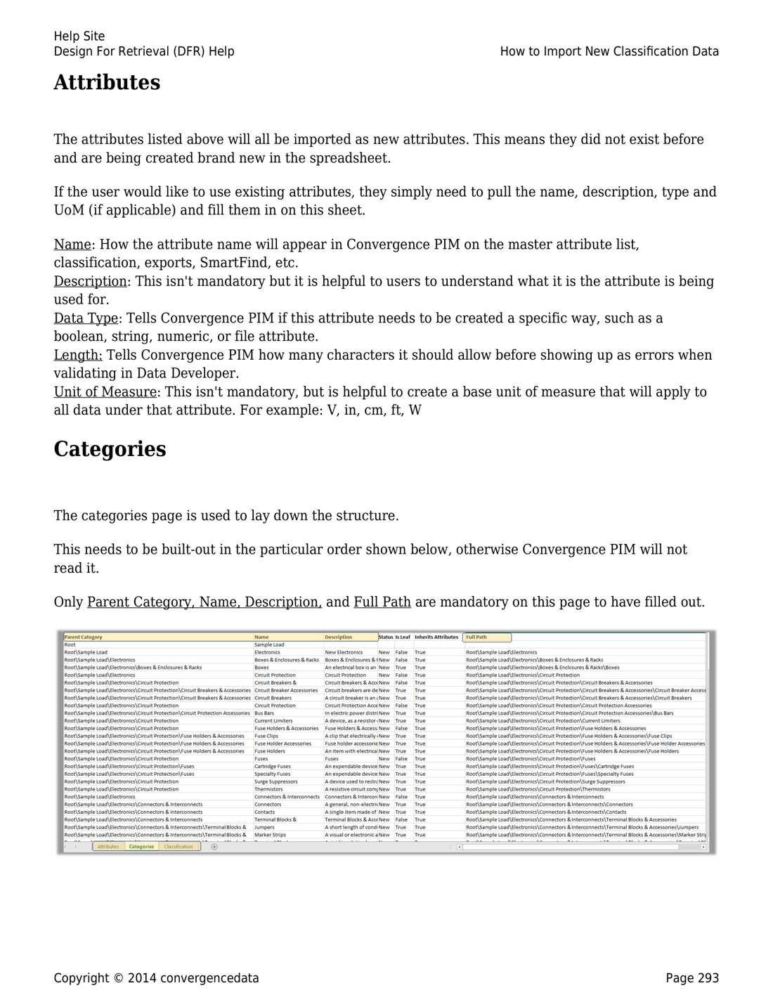

## How to Import New Classification Data

## Category Attribute Mapping

This screen brings everything together: structure and attributes.

It's all the same information listed on the previous two sheets, put together.

This tells Convergence PIM which categories will hold which attributes.

As seen  below, the only difference is that the columns highlighted in blue are optional.

These can be set up from a high level to import in with predetermined key and required attributes as

well as a display order, or those things can be decided at a later date through SmartClass.

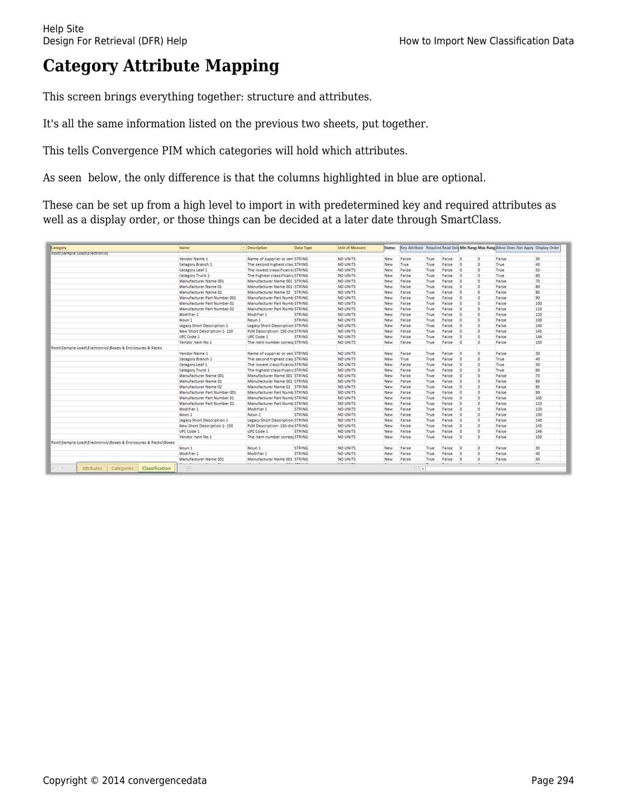

## Import Manager

## Import Part Images

Importing part images is done through an Item Data Import. This can be done using the Create or

Update function.

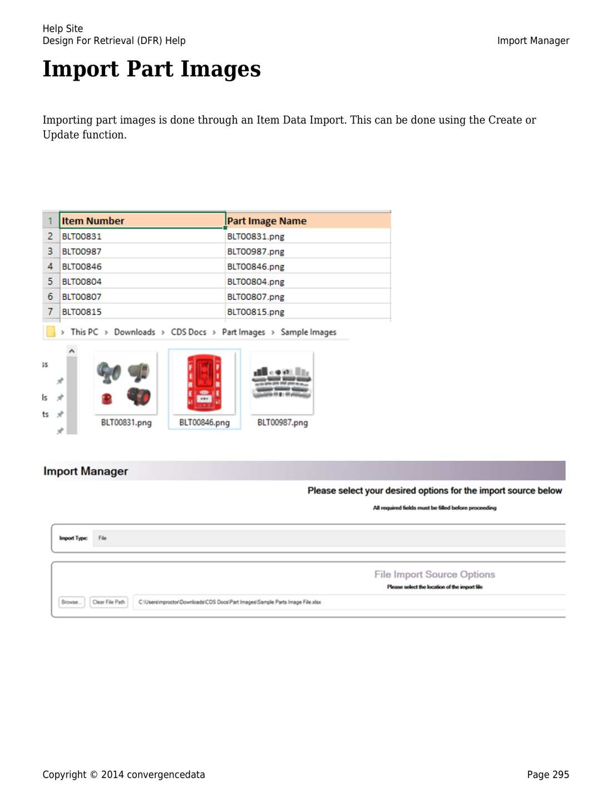

## Import Manager

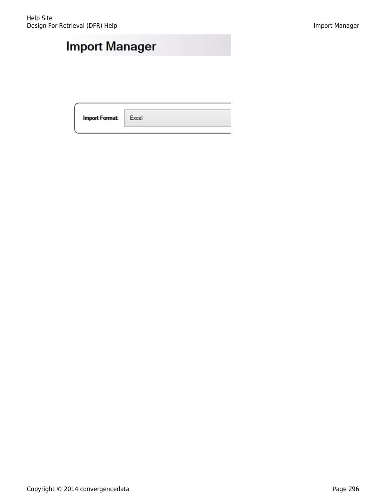

## Import Part Images

## Adding Multiple Images Using Import Manger

An Excel file must be set up first before the import process can begin.

### It must look like the attached list. This includes

## The column headings matching the format of

## ItemNumber (no spaces)

## ImagePath  (no spaces)

## The worksheet itself must be named "Image"

The Image Path must be whatever it is named in the folder that will be referenced later in this

document.

Usually this is located in a category folder or on the computer desktop.

The image must be in PNG format.

It is most simple to, but not a requirement, to name the image file the same name as the part number.

## Locate the Import Manager and select Item Data

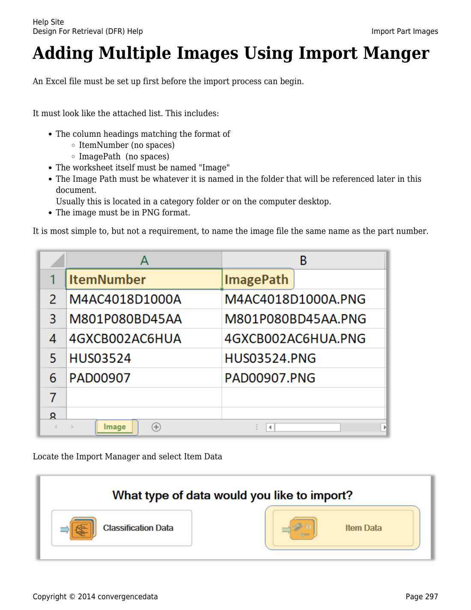

## Import Part Images

Browse for the file and select it.

Select Next on the bottom right of the screen.

Select Excel as the Import Format.

Excel Collection Data will also work for multiple image loading.

If the images are being loaded with new parts, the operation will need to be set as Create.

If the images already exist and images are being loaded after the fact, the operation will need to be

selected as Update.

When loading images, the user must expand the arrow next to "Item Options."

### The Item Options will open up the following

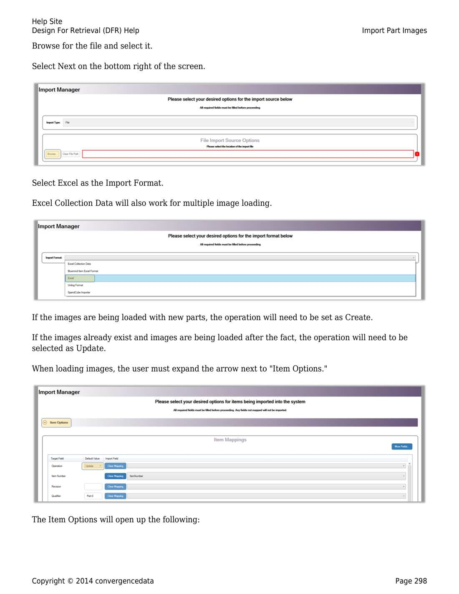

## Import Part Images

Default Category: This will always default to "RootTo Be Classified".

This can be changed to any target category, but will always default if left alone.

New Batch: This will always default to "Default_Batch" meaning that there will always be a leaf node

by that name under "To Be Classified" where parts will automatically be delivered to if they are not

given another category path.

The user can rename this batch to anything else, creating additional leaf nodes under "To Be

## Classified."

Existing Batch: This option will allow the user to deliver parts to an existing batch or deliverable.

Import Files from Directory: This option allows the user to choose an image path from their desktop

or documents on their computer.

Select Import Files from Directory and choose your category path.

Once the category/image path has been selected, drop to the bottom of the mapping page.

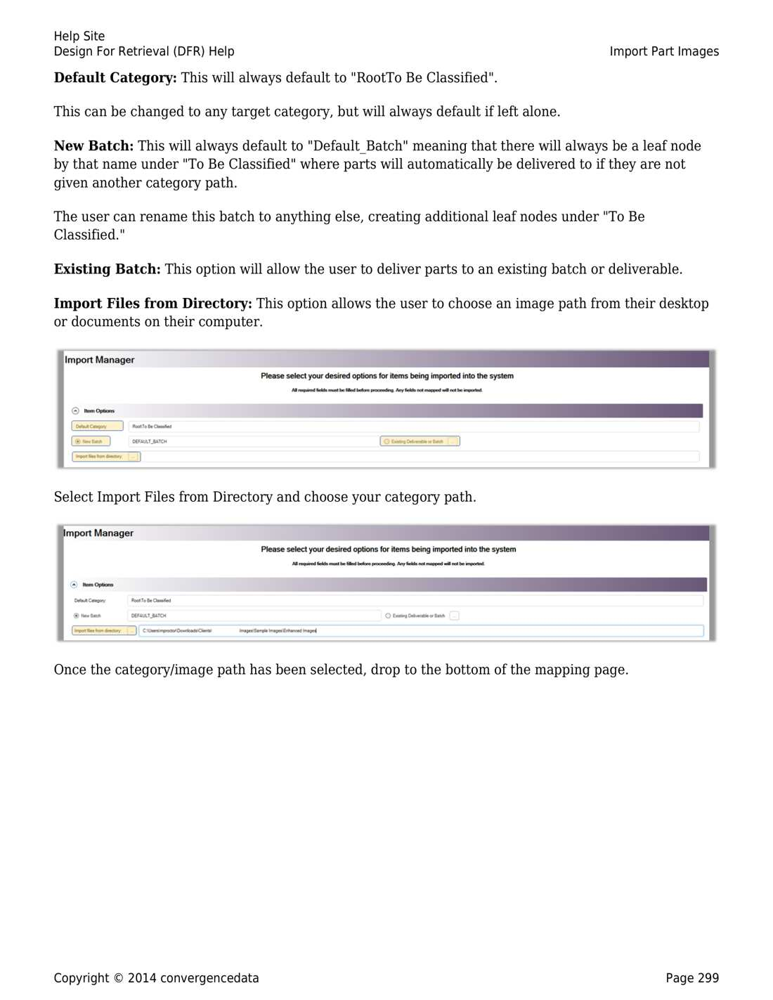

## Import Part Images

Locate the File Number on the drop down from the excel file chosen in previous steps.

"Document.0" will be the default but since images are being uploaded, this must be changed to

## Image.0

Locate the File Path on the drop down from the excel file chosen in previous steps.

The operation will be set to Add, since images are being added for the first time.

Select Next on this page, and next on the following.

Select Validate.

The ThickClient will then validate the data to ensure there are no errors or discrepancies.

## As long as there are no errors, select "Next."

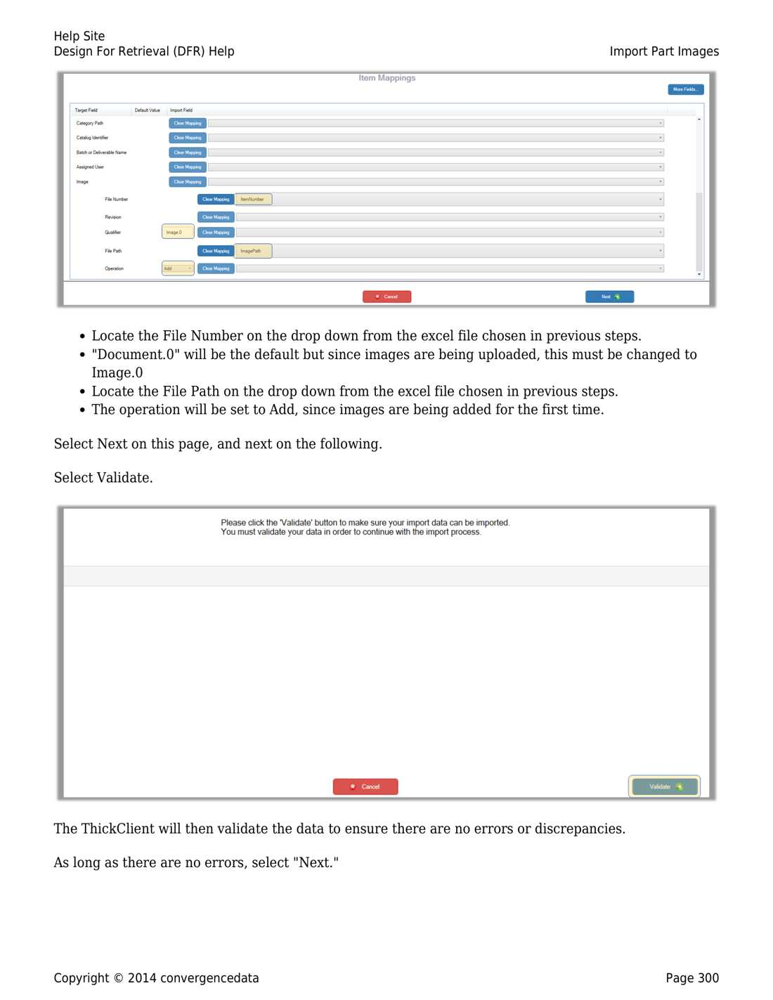

## Import Part Images

Select Import.

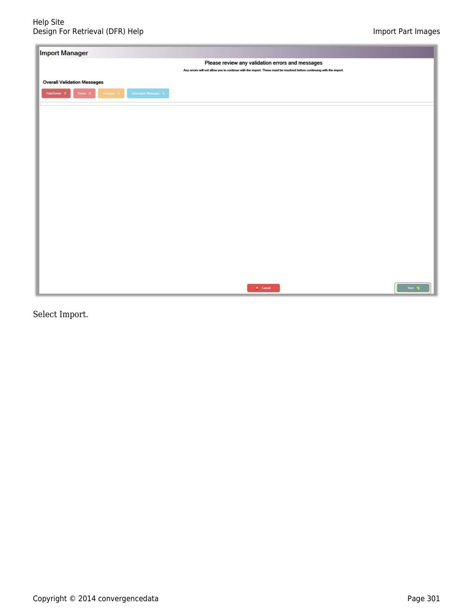

## Import Part Images

The import process will take place and once complete, select Done.

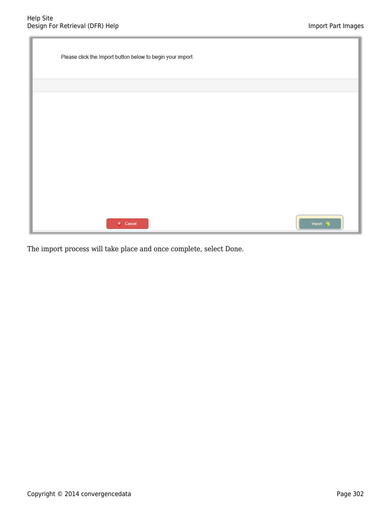

## Import Part Images

Finally, locate the part in SmartFind and notice the updated image.

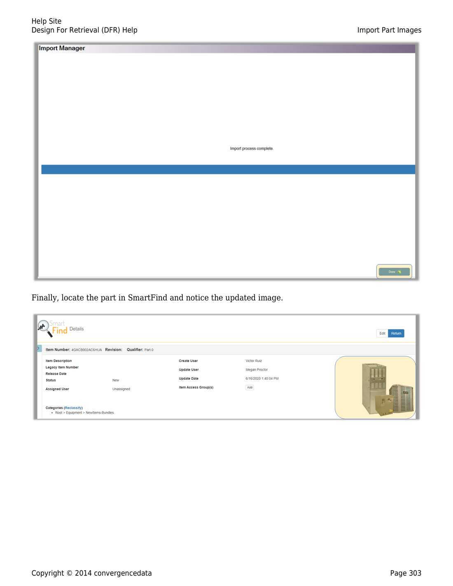

