# Teamcenter

## Teamcenter

## Table of Contents

## Getting Started

## 1

...................................................................................................................................

## How to Set Up Contextual Attributes

## 2

...........................................................................................

## How to Import New Item Data

## 6

.....................................................................................................

## How to Display Images in Items

## 10

................................................................................................

## Applying Image Attribute

## 11

...................................................................................................

## Manually Adding Image by Item

## 19

.........................................................................................

## Adding Multiple Images Using Import Manger

## 22

....................................................................

## Convergence PIM Online

## 29

...................................................................................................................

## SmartTrack

## 30

................................................................................................................................

## How to Navigate SmartTrack

## 31

..............................................................................................

## Set Up Owners and Tasks for a Deliverable

## 33

........................................................................

## Create and Manage a Deliverable

## 36

......................................................................................

## Data Validations in SmartTrack

## 40

..........................................................................................

## Data Validation Filtering

## 44

.....................................................................................................

## SmartFind

## 46

..................................................................................................................................

## Search for Parts

## 47

..................................................................................................................

## Item Details

## 48

.................................................................................................................

## Multi-Classify

## 52

........................................................................................................

## Data Validation Toggle

## 54

.........................................................................................

## Reclassify Parts

## 57

....................................................................................................

## Copy from Another Part

## 61

........................................................................................

## Attributes Display Order

## 64

.......................................................................................

## Add Attributes to a Display Tab

## 65

............................................................................

## Navigating Data Through Category Images

## 67

.................................................................

## Search by Category

## 69

.....................................................................................................

## Saved Search

## 71 Search by part number

..............................................................................................................

## 74

...............................................................................................

## Search by Keyword

## 76

......................................................................................................

## Search by Text File

## 78

......................................................................................................

## Find Duplicate Parts

## 80

...........................................................................................................

## Filter on Parts

## 89

.....................................................................................................................

## Assigned User Filtering

## 93

................................................................................................

## Category Filtering

## 97

........................................................................................................

## Data Validation Filtering

## 98

..............................................................................................

## Status Filtering

## 101

..........................................................................................................

## Attribute Filtering

## 104

......................................................................................................

## SmartClass

## 107

..............................................................................................................................

## Classification

## 109

....................................................................................................................

## Structure

## 111

...................................................................................................................

## Navigate Classification Structure

## 113

.......................................................................

## Category Management

## 116

.......................................................................................

## Copy and Paste Categories

## 117

..........................................................................

## Merge Categories

## 120

........................................................................................

## Add New Categories

## 125

....................................................................................

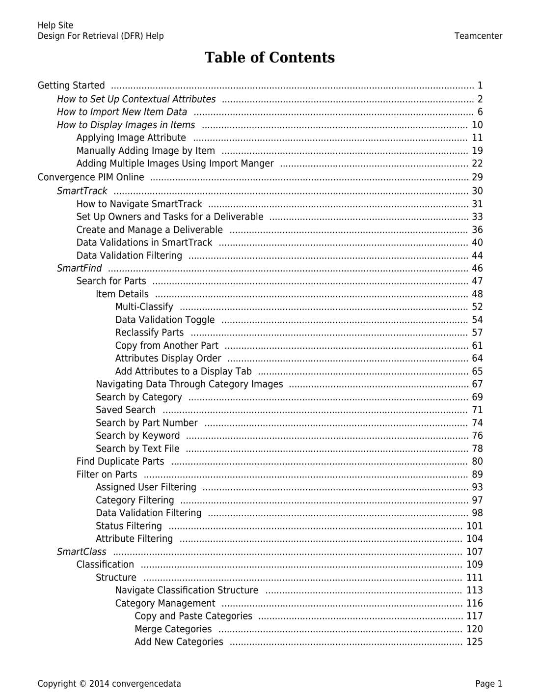

## Teamcenter

## Add New Parts Category

## 126

.......................................................................

## Add New File Category

## 129

.........................................................................

## Edit Categories

## 132

............................................................................................

## Edit Category Details

## 135

............................................................................

## Delete Categories

## 137

........................................................................................

## Add Category Images

## 141

..................................................................................

## Assign Allowed Values Lists from a Category

## 146

..............................................

## Attributes

## 149

..................................................................................................................

## Add New Attributes

## 150

............................................................................................

## Add Existing Attributes

## 151

.......................................................................................

## Remove Attributes

## 152

..............................................................................................

## Edit Attribute Details

## 154

..........................................................................................

## Sort Attributes

## 158

....................................................................................................

## Filter Attributes

## 162

..................................................................................................

## Set Attributes as Key, Required, DNA, and Read Only

## 166

........................................

## System Attributes

## 170

...............................................................................................

## Attributes(Master Attributes)

## 175

............................................................................................

## Create New Attributes(Master Attributes)

## 176

.................................................................

## Delete Attributes(Master Attributes)

## 179

.........................................................................

## Rich Text Attributes

## 182

...................................................................................................

## Localized Attributes

## 183

...................................................................................................

## Attribute Groups

## 188

...............................................................................................................

## Create and Delete Attribute Groups

## 189

..........................................................................

## Allowed Values

## 201

.................................................................................................................

## Create Allowed Values Lists

## 202

.......................................................................................

## Edit Allowed Values Lists

## 204

...........................................................................................

## Add Values Manually & Suggested Values

## 207

..........................................................

## Load Values from a Text File

## 210

..............................................................................

## Sort Values

## 213

.........................................................................................................

## SmartCreate

## 216

............................................................................................................................

## Create Parts

## 217

......................................................................................................................

## SmartAnalytics

## 221

........................................................................................................................

## Administration

## 222

.........................................................................................................................

## Catalog Administration

## 223

.....................................................................................................

## Status Management

## 224

..................................................................................................

## Creating a New Status

## 227

........................................................................................

## Editing a Status

## 230

..................................................................................................

## Deleting a Status

## 232

................................................................................................

## System Administration

## 234

.....................................................................................................

## User Administration

## 235

...................................................................................................

## SmartTeardown

## 236

.......................................................................................................................

## Adding a Model

## 237

.................................................................................................................

## Family Management

## 243

.........................................................................................................

## General Management

## 250

.......................................................................................................

## Importing New Data

## 255

.........................................................................................................

## Convergence PIM Thick Client

## 262

........................................................................................................

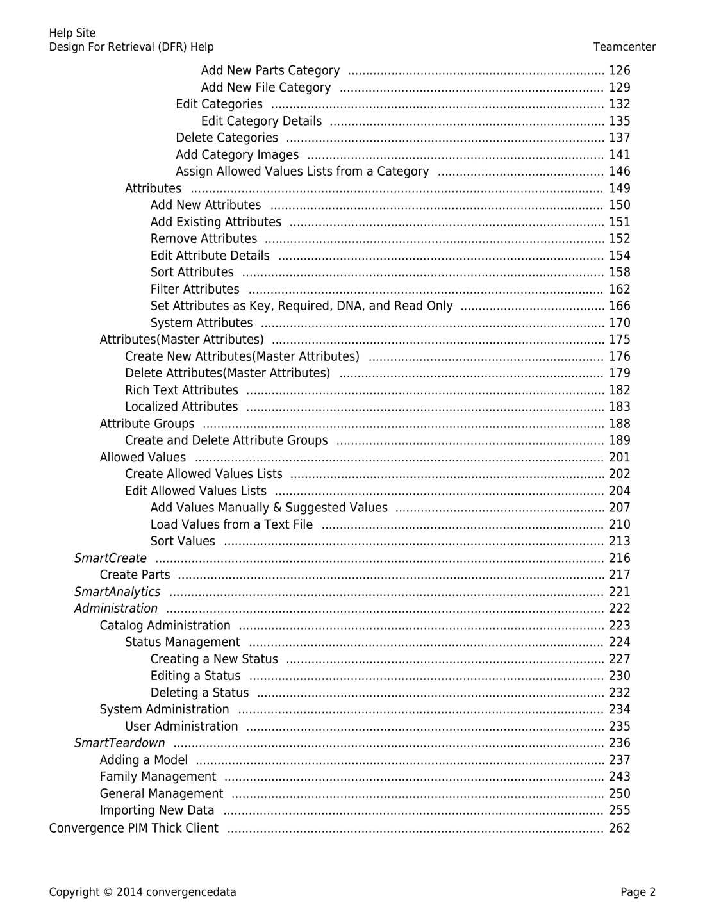

## Teamcenter

## Item Relationship Management

## 263

...............................................................................................

## Data Developer

## 272

.......................................................................................................................

## Changing System Attributes

## 273

.............................................................................................

## Batch Management

## 275

..........................................................................................................

## Removing Items from a Batch

## 276

...................................................................................

## Export Manager

## 279

.......................................................................................................................

## Import Manager

## 280

.......................................................................................................................

## How to Import New Item Data

## 281

..........................................................................................

## How to Import New Classification Data

## 285

............................................................................

## Creating a Classification Load File

## 292

.............................................................................

## Import Part Images

## 295

...........................................................................................................

## Adding Multiple Images Using Import Manger

## 297

...........................................................

## Cluster Tool

## 304

.............................................................................................................................

## Generating Descriptions

## 313

..........................................................................................................

## Unit of Measure Editor

## 321

.............................................................................................................

## Creating a UoM

## 322

.................................................................................................................

## Integrations

## 325

....................................................................................................................................

## Teamcenter

## 326

.............................................................................................................................

## First Time Setup

## 327

...............................................................................................................

## PLMXML Specific Export Considerations

## 330

...........................................................................

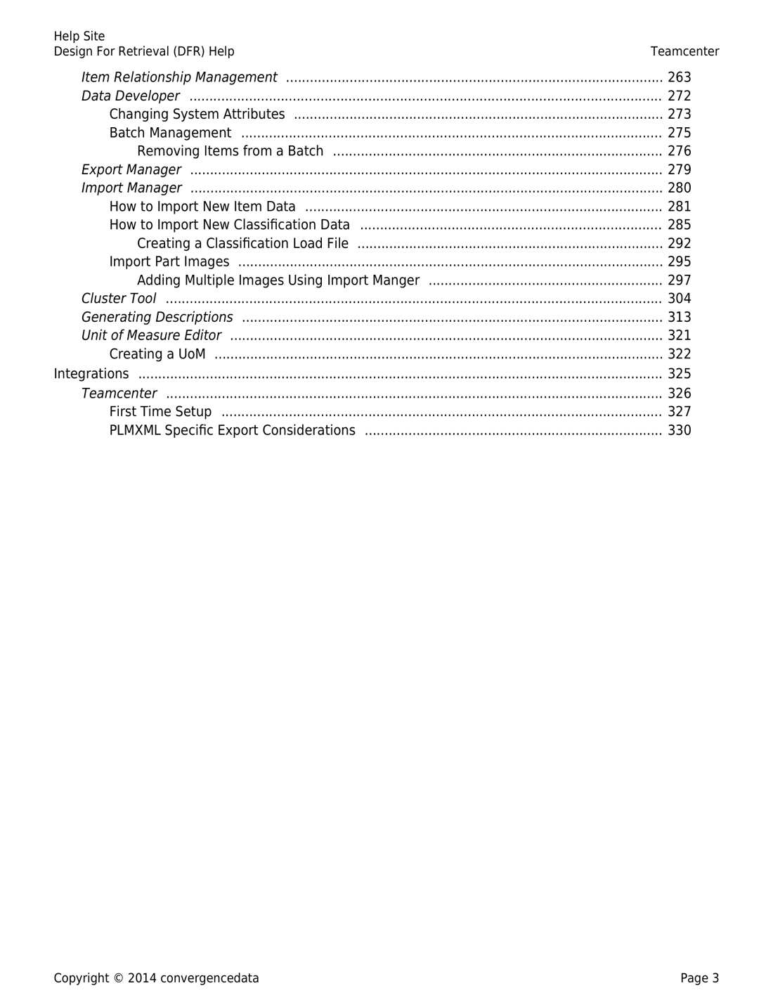

## Teamcenter

## Getting Started

## How To

## How to Set Up Contextual Attributes

Contextual Attributes should be used when the information for a single item can vary

depending on a specific context. For example, you may need to enter different attribute values for

the same item based on region, syndication channel, brand, or customer segment.

### Concepts

Contextual Attributes are the attributes where the contextual options are selected.

A Contextual Attribution Category is where the attributes that vary by context are

managed.

### Steps

## SmartClass

## Set up the Contextual Attribution Category

Create a category and assign the attributes that could differ among selected

## contexts

## Set up the Contextual Attribute

## Data Type: Custom

## CustomData: MultiVal

Contextual Attribution Category: select the category created in the previous

## step

## Assign to the appropriate category or categories

It is not required to set up an AVL for contextual attributes, but it is strongly

recommended.

## SmartFind

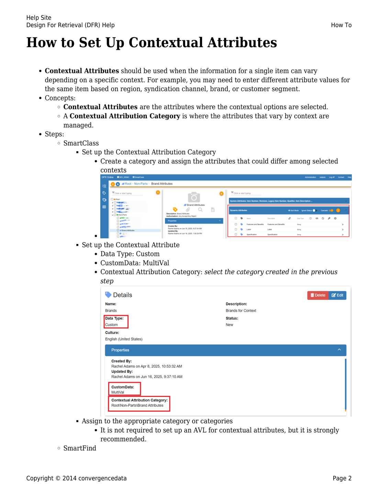

## How To

Populate the contextual attribute with the appropriate values

This will create a new tab. The tab will have the same name as the contextual

## attribute

Click on the tab to view the attributes that differ depending on the selection made

Click on the drop down to select the different contexts to view or edit

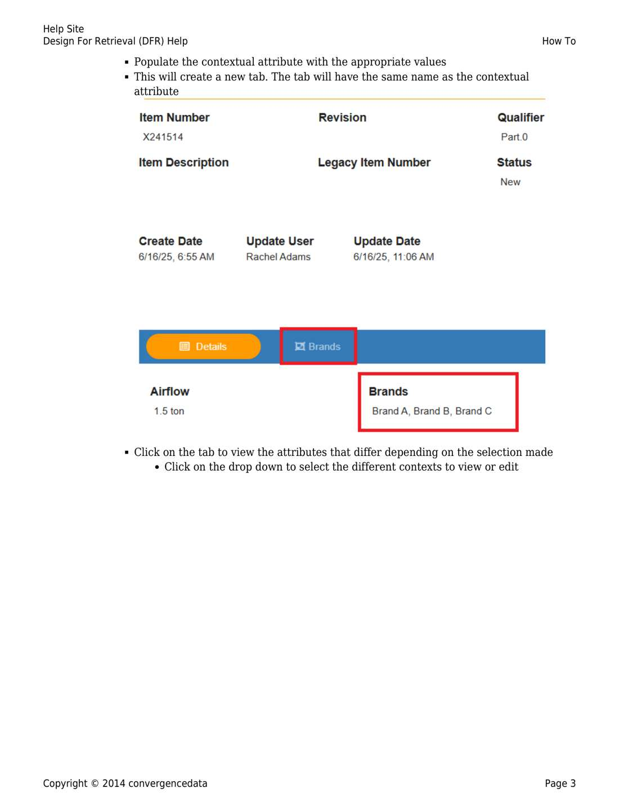

## How To

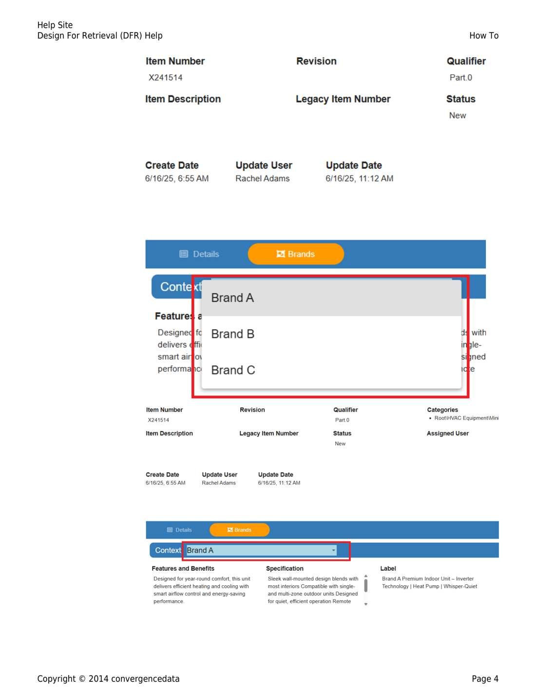

## How To

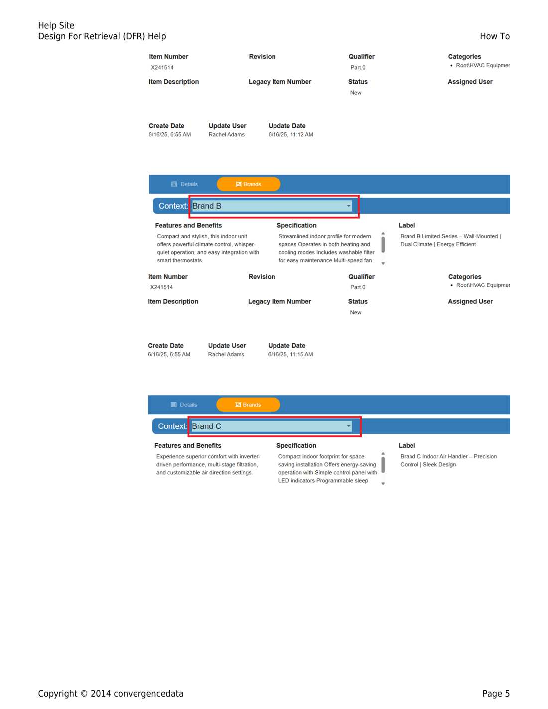

## How To

## How to Import New Item Data

The Import Manager is used to import new data, update existing data, and import or update images or

data structure. There are two types of data that can be imported: Item Data and Classification data.

Item Data refers to parts information such as an item number or attribute information while

Classification Data refers to a data structure such as categories where the parts exist.

Importing new data using the "Create" operation is a process that is used when the user has

information specific to an item number that has never existed in Convergence PIM.

Select Import Manager from the CDS Toolset and then select Item Data.

Select the file to be imported.

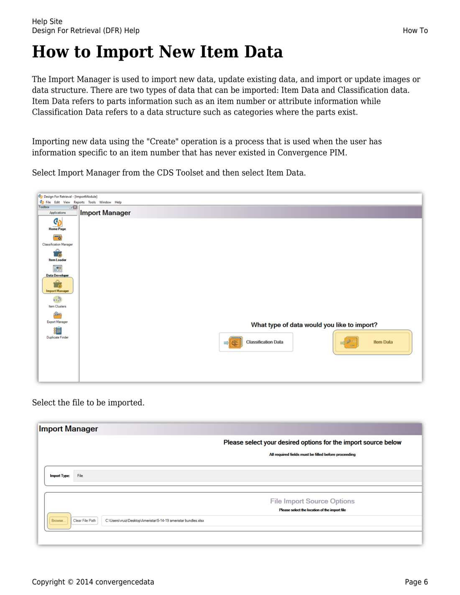

## How To

Select the Excel format from the drop-down menu.

Select Item Options from the drop-down, and type or paste the category where you want to place the

new parts like the following "RootPartsElectronic Devices and ControlsActuators".

Also, name your Import under new batch. If not renamed, the batch will automatically be imported in as

"DEFAULT\_BATCH".

Select "Create" for new part imports or Update for imports updating current part information.

The column on the left represents the list of available attributes to choose from. The column on the

right will automatically map to the left columns if there is a header with the same name.

Otherwise, this can be done manually by selecting from the drop-down, which contains all original

document headers.

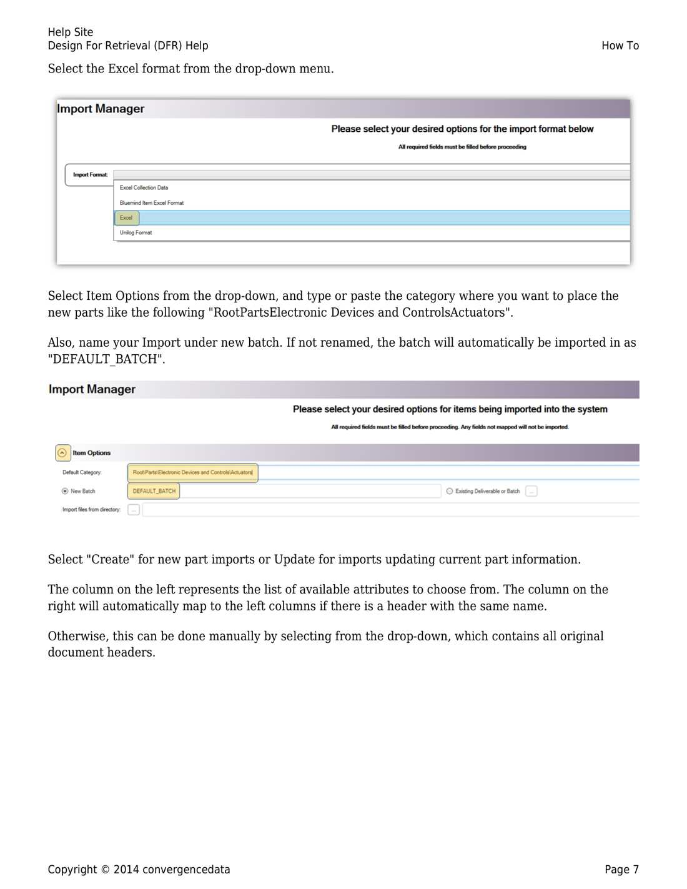

## How To

## Select Next, and then select validate

Once Validation has cleared with no errors, select Next.

### Some common errors are listed below

Item Not Found ( e.g. "Item not found in database") - this is self-explanatory and will only

generate when the Update operation is chosen on the mapping screen. To correct this error,

import using the "Create" operation which will create the part that did not already exist. This

error may also exist if the Item Number contains a revision number and "Revision" isn't selected

and mapped on the mapping screen. Without the revision number, Convergence PIM cannot

locate that part and will display an "Item Not Found" code.

Invalid Category (e.g. "Category 0 and Path RootPartsHeating ElementsCoils do not resolve to a

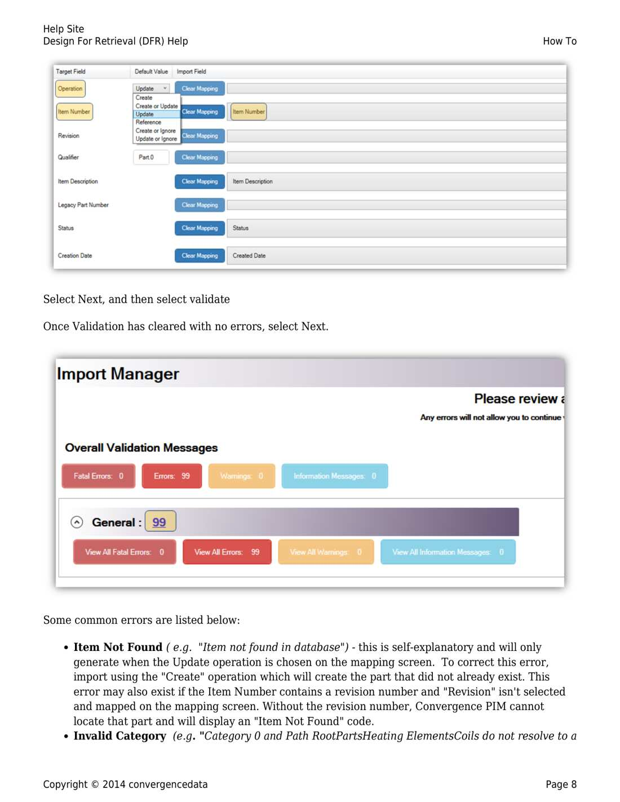

## How To

valid category") - This can appear through any of the functions. This error message is stating that

the category mapped does not exist. To correct this error, check your load document and make

sure that the category path does exist in Convergence PIM and if it does not, that category will

need to be created before you may import data using that pathway.

Select Import. The import is complete.

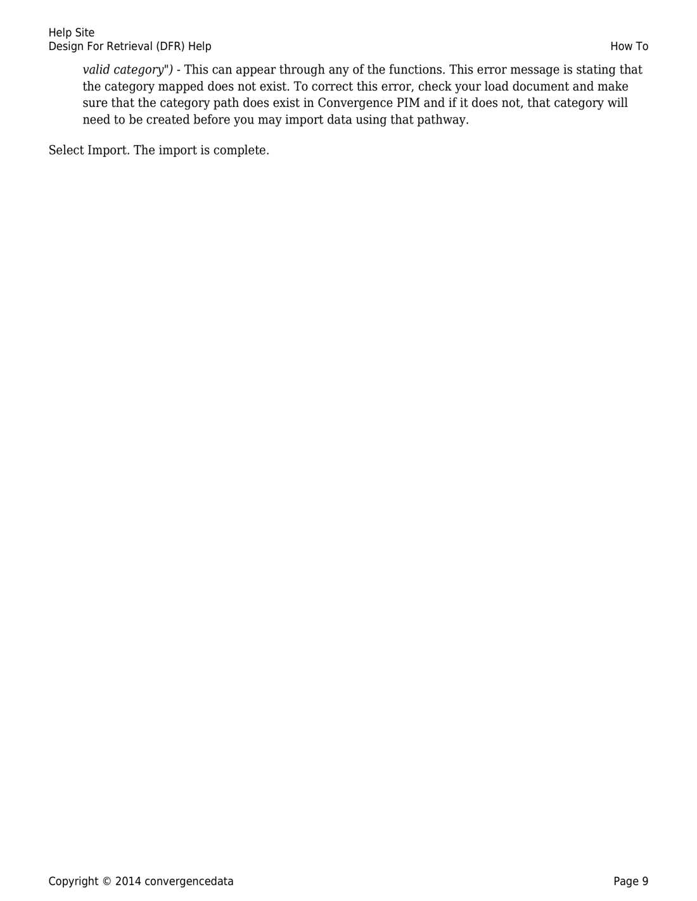

## How To

## How to Add Display Images in Parts

This feature allows users to add images to parts; thus, images can be displayed when you click on a

part.

This process can be done manually by part, or in bulk using the Import Manager.

## Manually Adding Images by Part

## Adding Multiple Images Using Import Manager

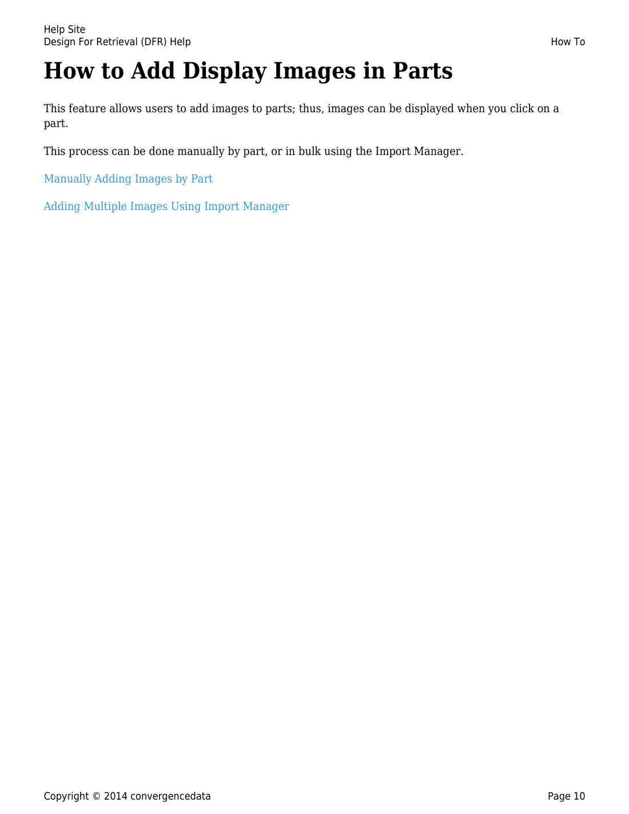

## How to Display Images in Items

## Applying Image Attribute

Go into Convergence PIM and select SmartClass.

Select the Attributes icon to create an attribute.

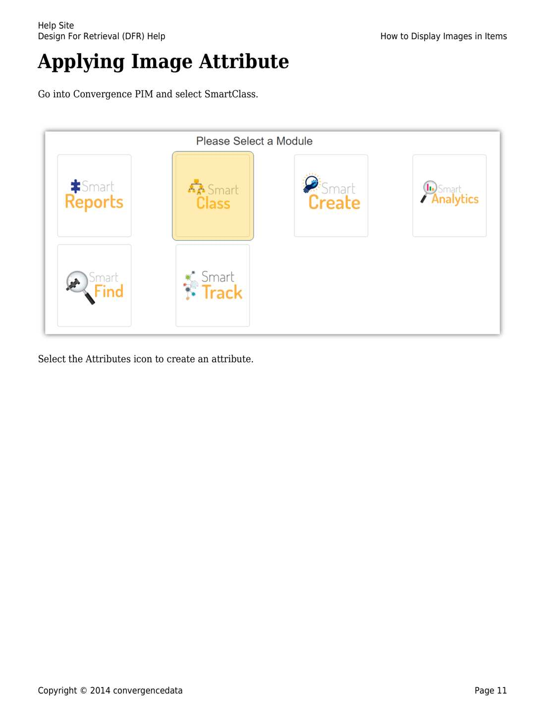

## How to Display Images in Items

## How to Display Images in Items

## How to Display Images in Items

Update the Description, and update the Data Type to "File".

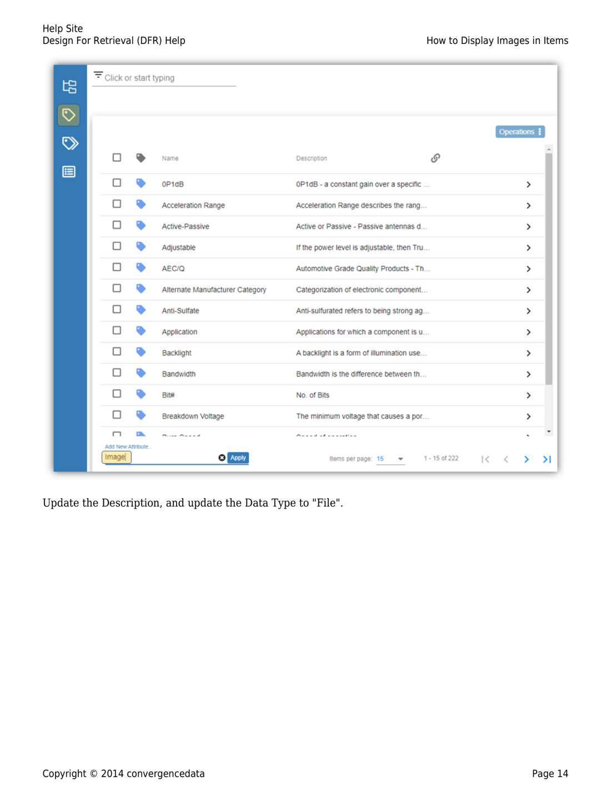
