# Attributes

## Attributes

You can now click the greyed out icons to enable the feature or click the colored icons to disable the

feature.

The circle with the exclamation inside is Required: This means the attribute is required to have a value.

The eye icon is Read Only: This means no one except for system admin can edit this attribute.

The circle with the cross through it is DNA (Does Not Apply): DNA means that this attribute does not

apply to this specific category.

The key icon is Key: This means that the attribute is important (this is usually used for filtering

purposes).

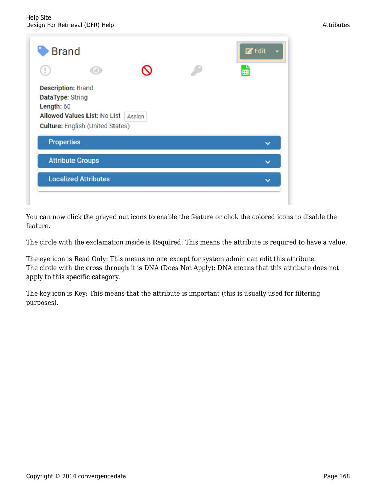

## Attributes

To finish editing your attribute you can click the green save button to save your progress.

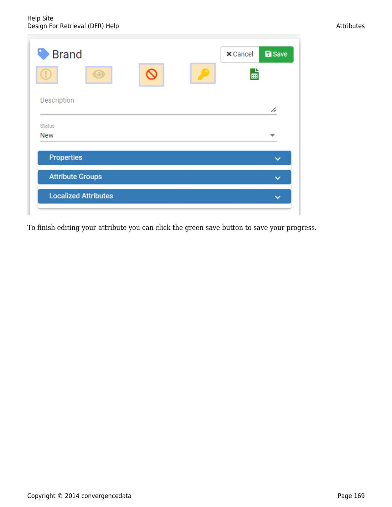

## Attributes

## System Attributes

DFR contains defaulted attributes called System Attributes; these attributes are set up when a catalog

is created.

Some customers may not want to use those system attributes in their catalog; therefore, system

attributes can be hidden or their names can be updated in order to avoid confusion.

For example, system attributes such as Item Description and Status are always displayed, but they can

be hidden or their names can be changed.

In classification, select any category and click on System Attributes.

Now all System Attributes are displayed.

As shown below, Item Number, Item Description, Status, etc are the defaulted attributes that are

currently displayed under the selected category.

On the other hand, attributes that are crossed off such as Revision, Legacy Item Number, Qualifier, and

Release Date are currently hidden under the selected category.

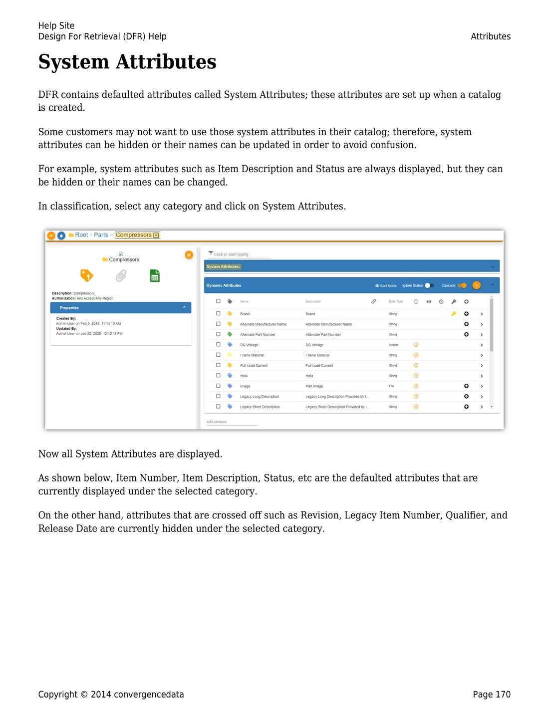

## Attributes

In order to make changes to a System Attribute, hover over the desired attribute(in this example

### "Status" is updated) and two icons will pop up

Toggle Hidden = this option will hide the attribute from the selected category and all of its

children.

Change Name = this option will allow you to change the defaulted name on the attribute.

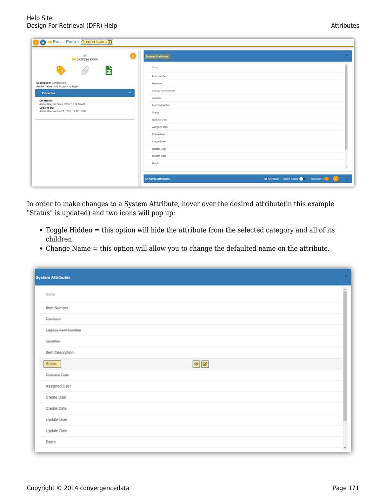

## Attributes

## Toggle Hidden

Click on Toggle Hidden and a window will pop when you click on any of those icons.

Click on Confirm to make changes to the attribute under the selected category and the sub-categories

under that attribute(if any).

Click on Save & Cascade to make changes to the attribute under the selected category and the sub-

categories under that attribute(if any).

Save & Cascade will still save property changes and they will inherit down the tree, but if someone sets

a value lower in the tree that overrides will stay there.

After selecting this option, the attribute will be crossed off.

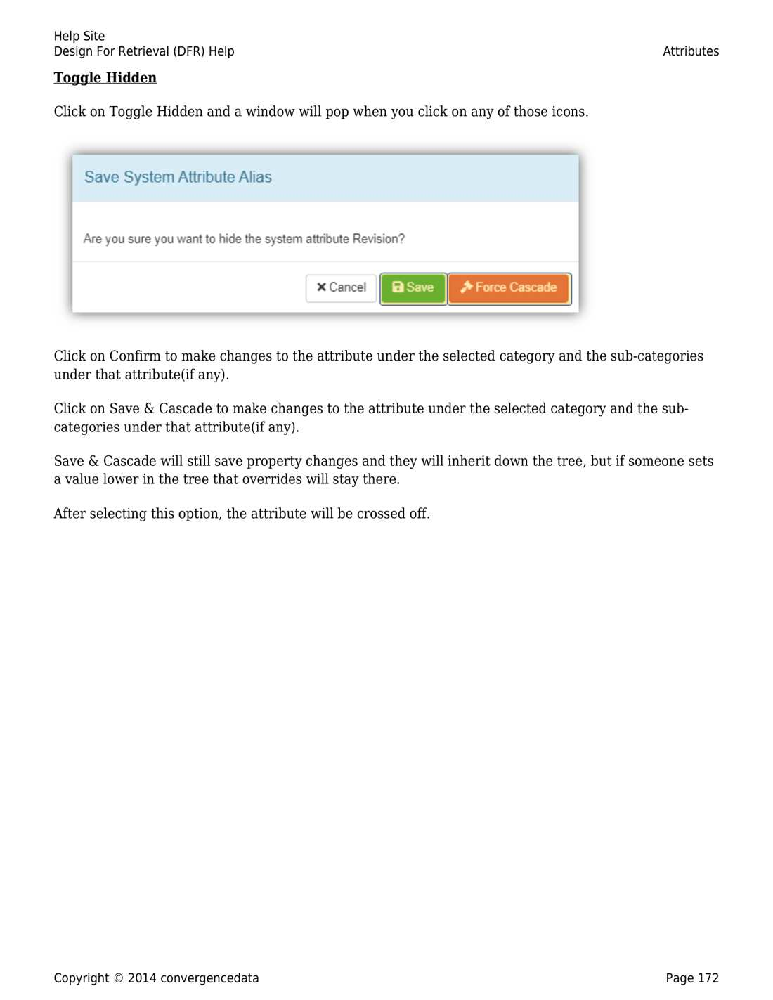

## Attributes

To undo this change, hover over the desired attribute and click on the Toggle Hidden icon.

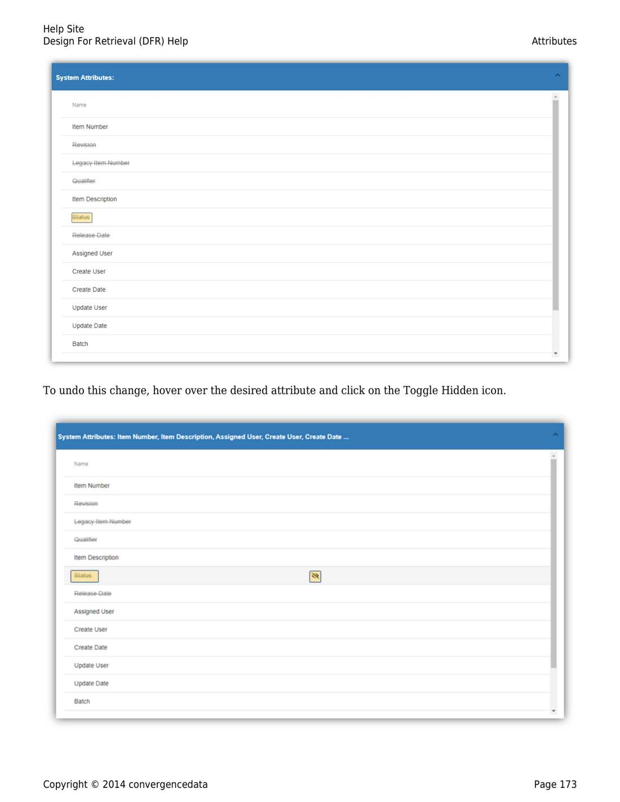

## Attributes

## Change Name

Click on Change Name and type in a new name for the selected system attribute.

Click on the Save icon to make changes or click on Cancel icon to undo this step.

Once you click on the Save icon, a window will pop up.

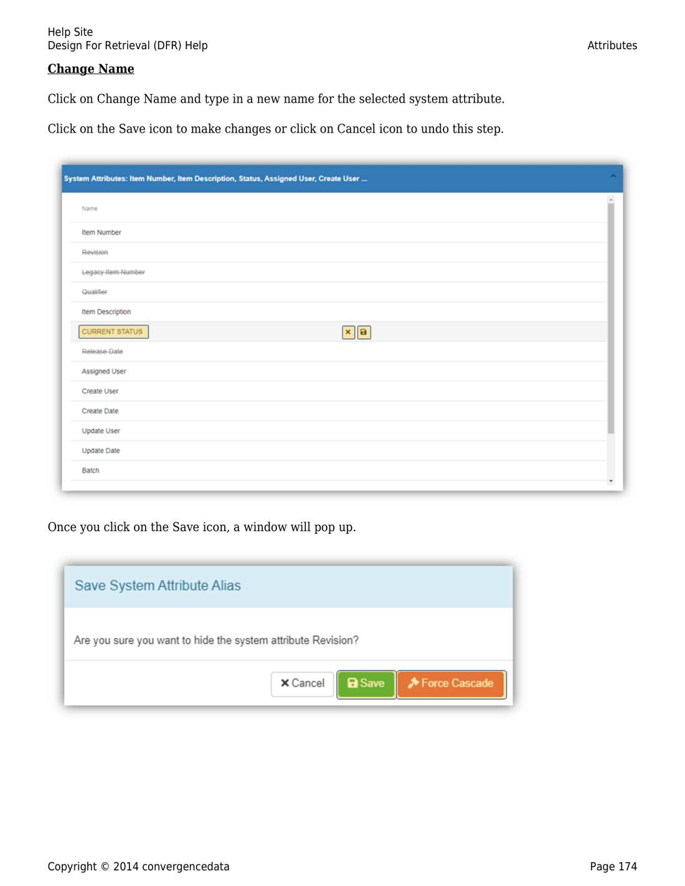

## SmartClass

## Attributes(Master Attributes)

The Attribute page allows the user to perform most of the changes to all master attributes where

attributes can be created, updated, deleted, and more.

Click on the highlighted icon to go to the Attributes page; the screenshot below represents the

Attributes page.

### Click on the links below to access the following pages

## Create New Attributes(Master Attributes)

## Delete Attributes(Master Attributes)

## Localized Attributes

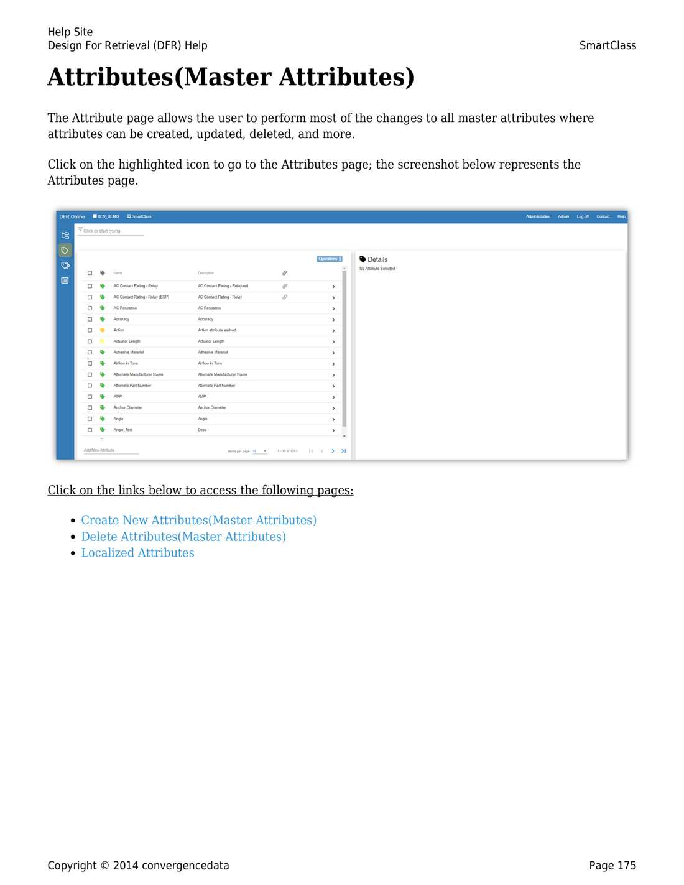

## Attributes(Master Attributes)

## Create New Attributes(Master Attributes)

Attributes can be added from the Master Attribute screen, or the classification screen. A Master

Attribute is an attribute that can be used universally and is not subject to any particular category ( for

example, Length.) Though it is important to know that any time an attribute is created on a category or

the master list, it is ultimately added to the Master Attribute list.

Permissions need to be set to add/delete/edit attributes from the Master Attribute List

Creating a new attribute should be done when the attribute does not exist.

In the Attributes page, begin typing in the new attribute name and then select Apply at the bottom of

the screen.

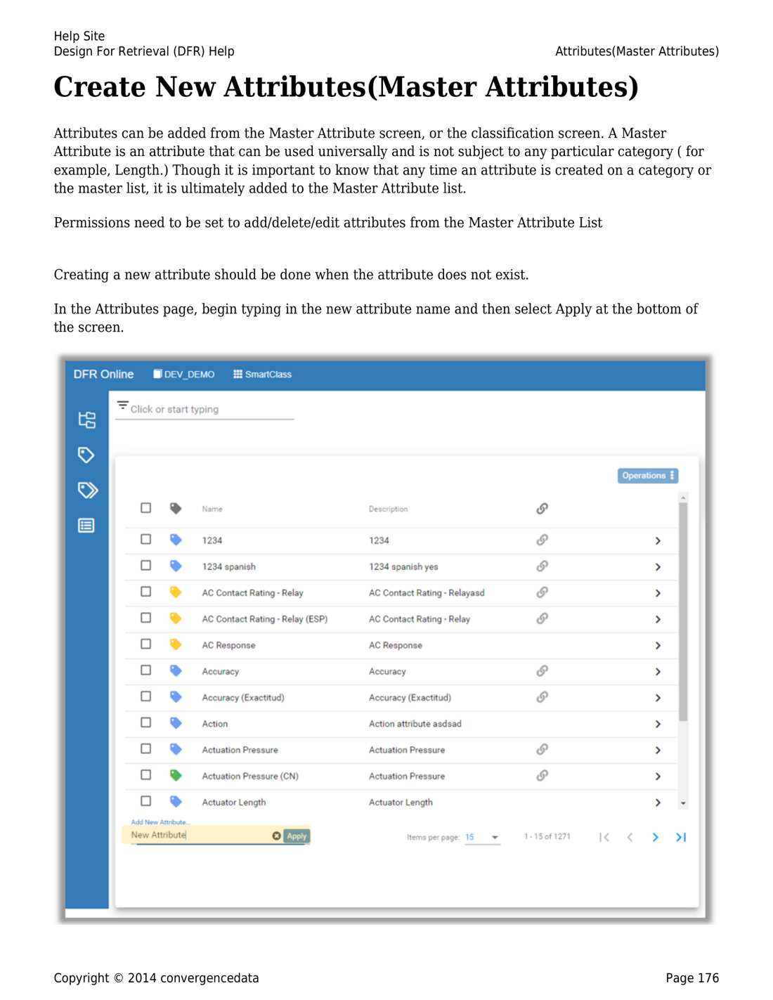

## Attributes(Master Attributes)

Once applied, another window appears on the right-hand side of the master attribute list.

This section is where all pertinent information for the new attribute is listed such as the Name,

Description, Data Type and Status.

Data Type: describes the kind of data stored in the attribute. This data can be a String, Integer,

Numeric, Boolean, Date, Fraction, URL, Items, Custom or File.

String: string attributes apply to alphanumeric values where the values could include alphabetic

characters. An attribute called "color" may have alpha values of blue, green and white. A string

attribute could also be a combination of alpha and numeric characters; an attribute called

"supplier part number" may have values: 123RDH, 45-TU-67. String types do not have units of

measure associated with them.

Numeric attributes have decimal values and have a Unit of Measure Type assigned to them. Quite

often, the same instance of a numeric attribute can have different units of measure; that is, an

attribute called "length" can have a unit of measure of feet or meters. When selecting a unit of

measure, the default unit of measure system is also being determined. These systems include

metric system, international system (SI), and US system. Each numeric attribute will also have a

Unit of Measure where, for each unit of measure type, there is a group of commonly used units.

For example, an attribute called "Pressure Rating" has a unit of measure type of pressure and

typical units of psi, kpsi, pa or kpa. Although a single unit of measure is assigned to an attribute

when it is created, the unit of measure can be reassigned on an individual data item in the Data

Developer module. The Attribute Manager offers commonly used units; however, if a unit is

needed and is not displayed, it can be defined in the database by the database administrator and

added to the pull down list.

Click Save once complete.

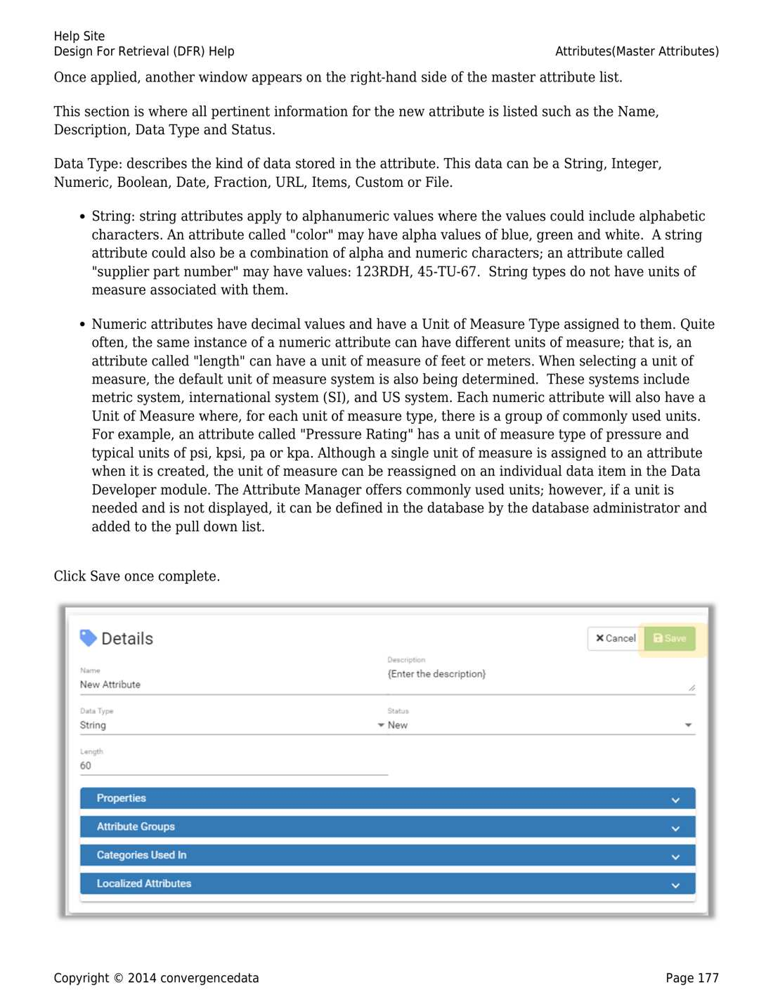

## Attributes(Master Attributes)

Click on Save to confirm changes.

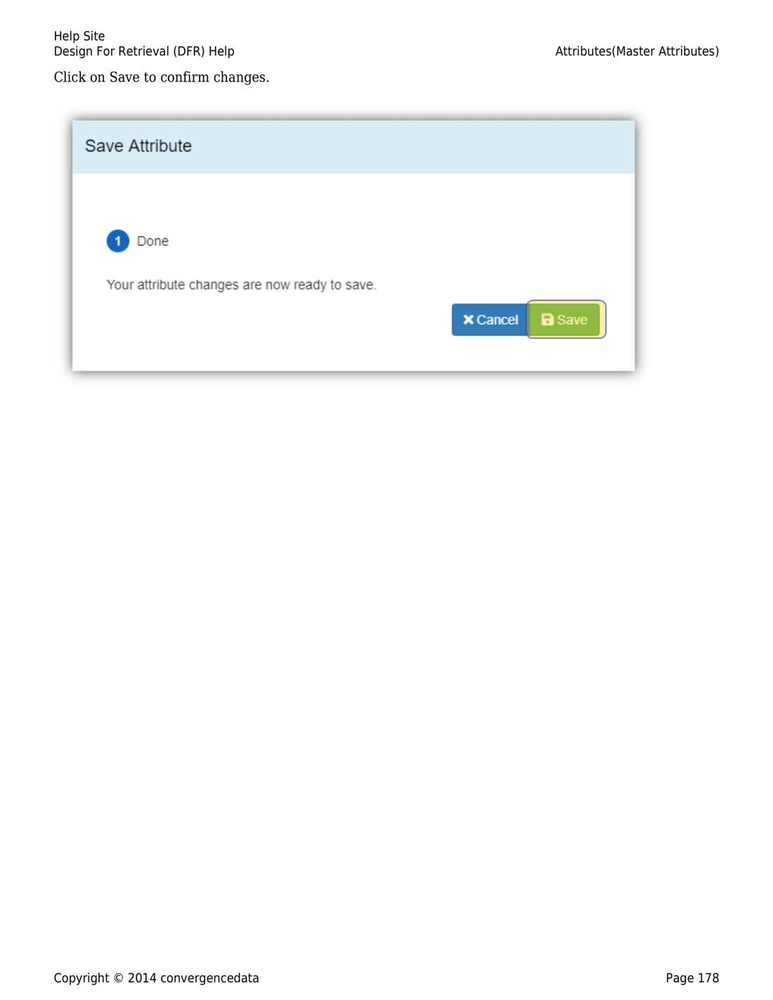

## Attributes(Master Attributes)

## Delete Attributes(Master Attributes)

SmartClass gives the user the ability to delete an attribute across all categories. Deleting an attribute

should only be done when there are duplicates or an unnecessary attribute in the attribute list. The user

must be careful when deleting attributes because once deleted, the attributes cannot be salvaged.

In the Attributes page, locate the desired attribute to be deleted; the user may search by page or

by using the filter.

Select the attribute.

Click on Operations and select Delete.

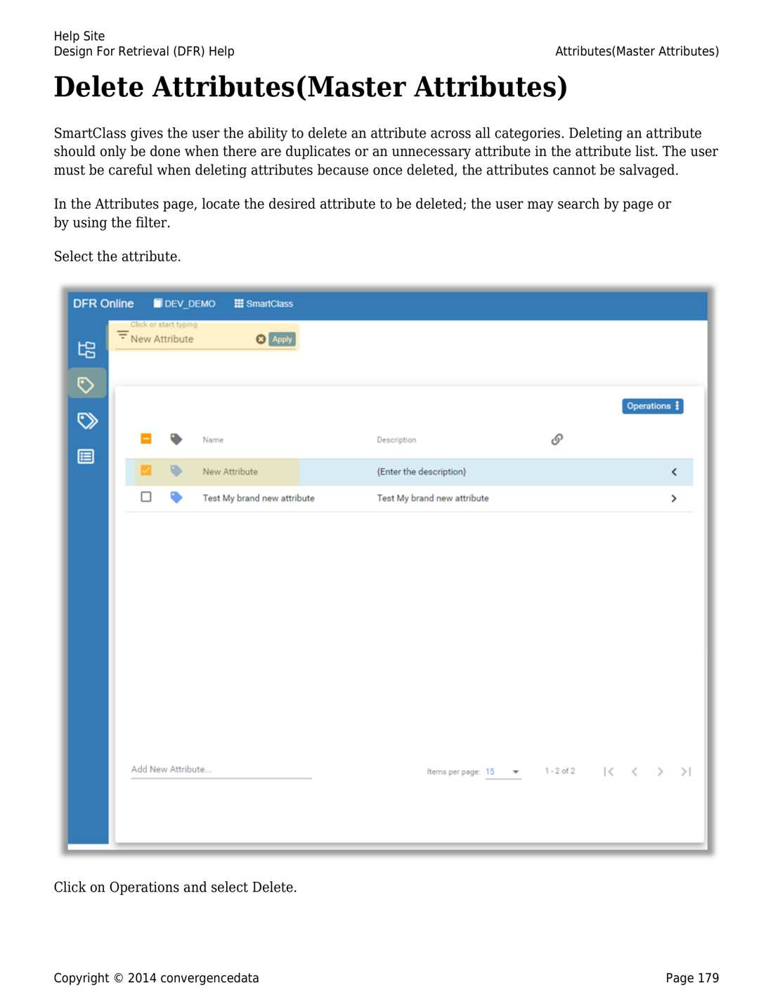

## Attributes(Master Attributes)

A final message will appear confirming the deletion.

Select Delete.

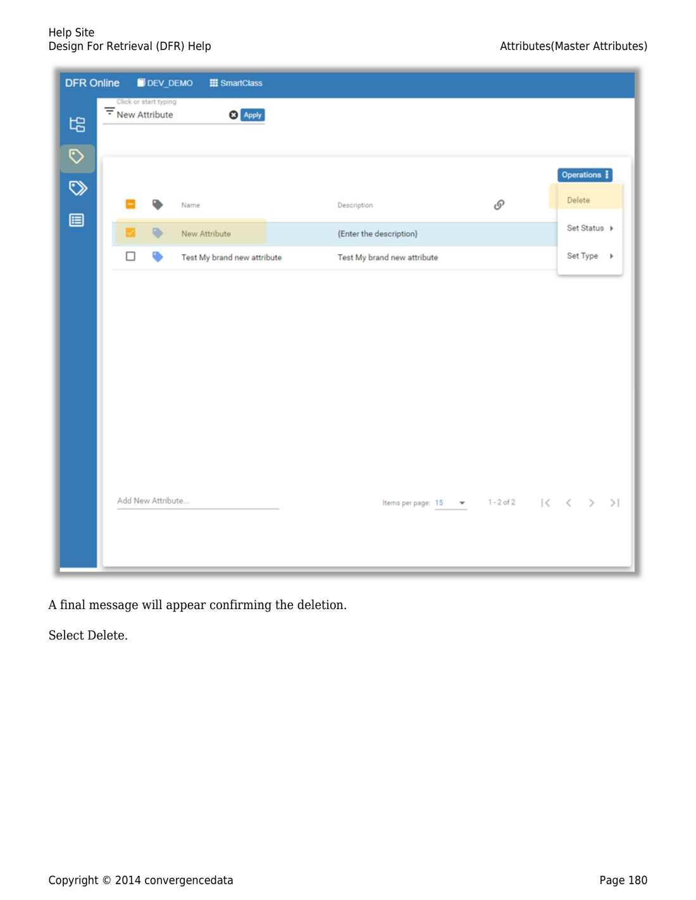

## Attributes(Master Attributes)

The attribute has been deleted from the master list. This cannot be undone.

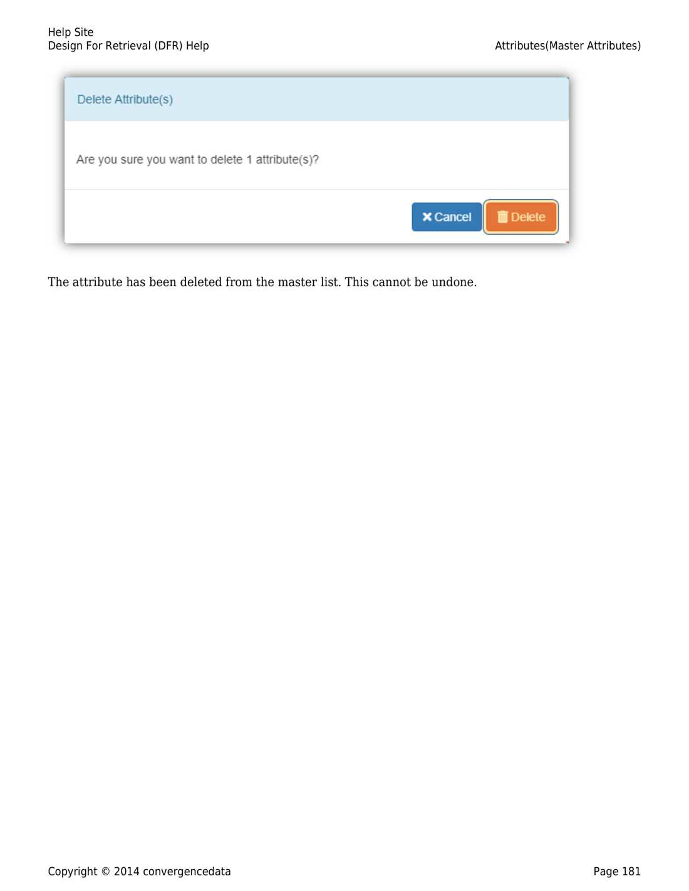

## Attributes(Master Attributes)

## Rich Text Attributes

A rich text field is a type of input or data field that allows users to format text using styles such as

bold, italics, lists, links, et al. rather than just plain text. A string attribute can be updated to become a

Rich Text editable field by updating the properties on the attribute to show RichText=Yes.

A user is then able to edit the attribute and format the text in Item Details as needed.

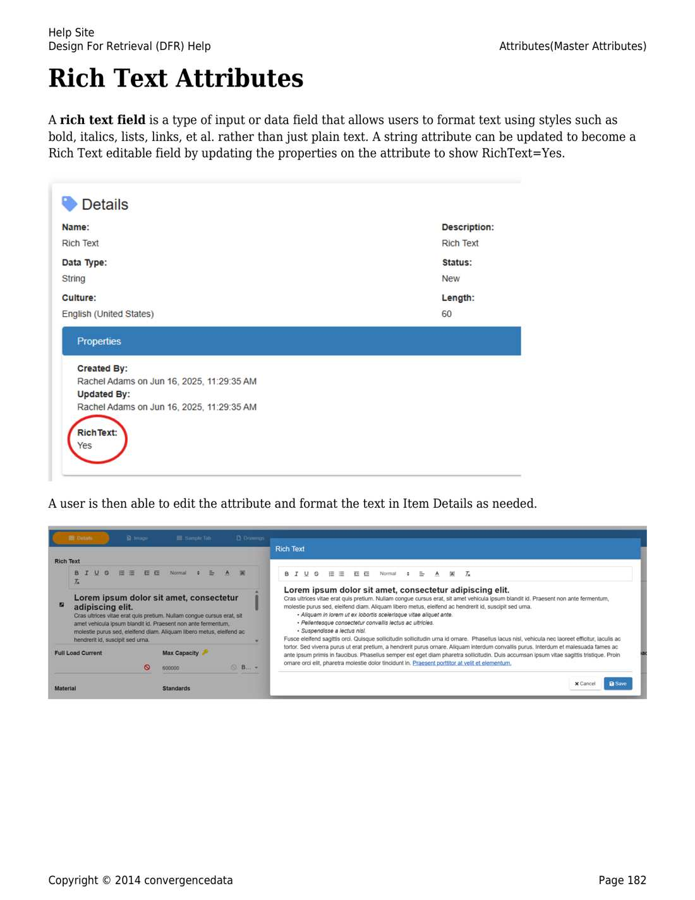

## Attributes(Master Attributes)

## Localized Attributes

### Definition

Adding localized attributes provides users the ability to duplicate an existing attribute with a different

culture (language) by creating 2 different attributes.

* Localized attributes keep the same definition except:

## Culture: preferred language

Description: attribute description is unique to the attribute

## Name: attribute name is unique to the attribute

* Localized attributes are assigned to all same categories In the Attributes page, select the desired attribute; the details for the selected attribute will display on

the right side of the screen.

Select the localized attribute section.

## Once expanded, select 'Add'

Select the desired culture (language).

Enter the name and description in the culture (language) selected.

Select 'Add'.

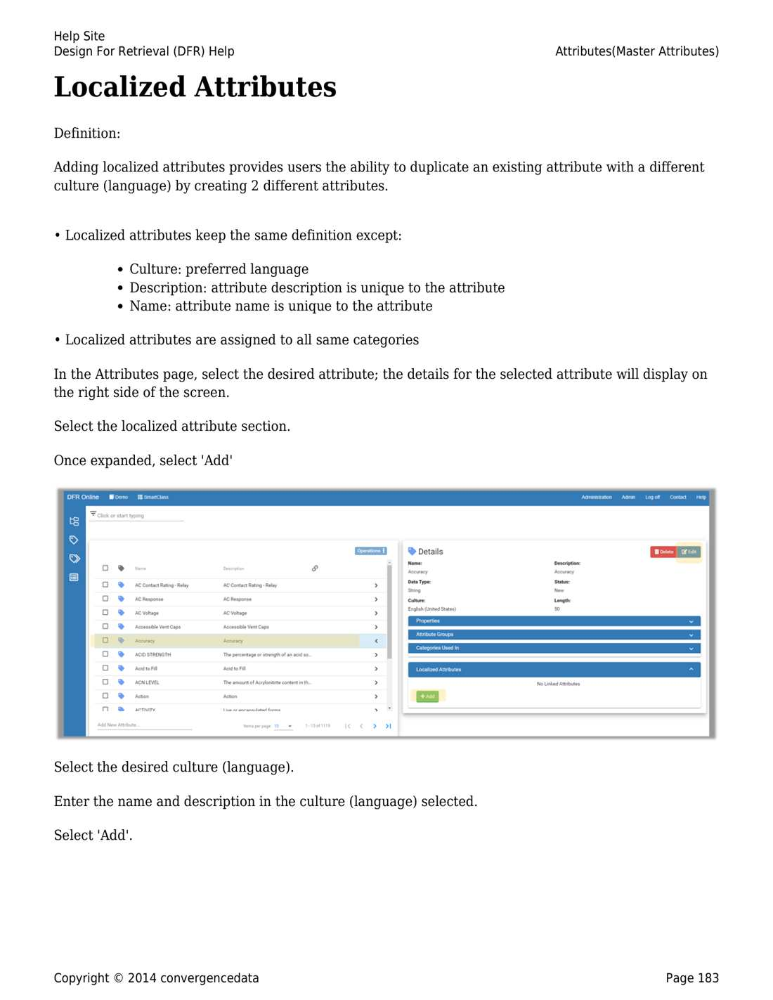

## Attributes(Master Attributes)

Once the localized attribute has been added, notice the link icon displays next to the attribute on the

left side.

Also, the localized attribute name, description, and culture (language) display in the details on the right

side of the screen.

Now the localized attribute has the same properties as the original attribute.

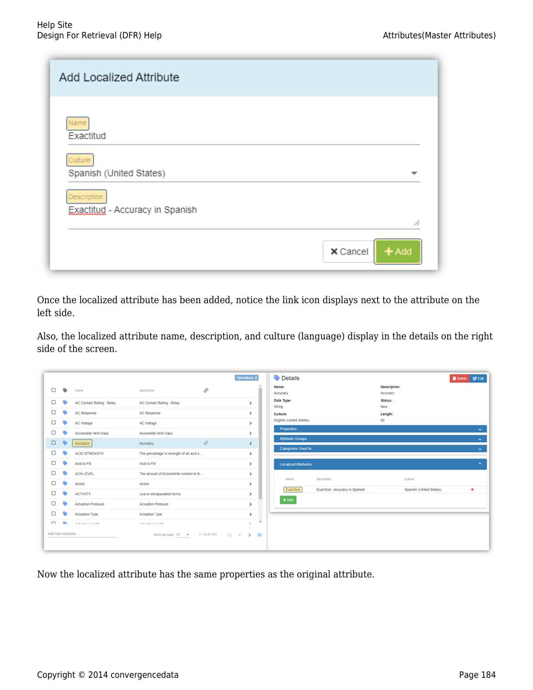
