# Filter on Parts

## Filter on Parts

OR the user can hover over "Violations", which will then provide a list on which the user can choose

which specific violation they want to filter that attribute by.

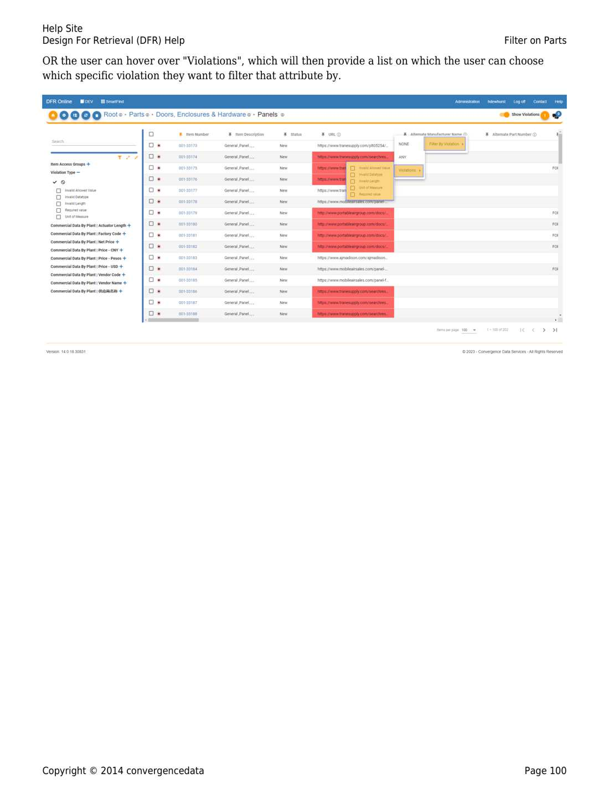

## Filter on Parts

## Status Filtering

Navigate to SmartFind and drill into a category where you would like to view and access parts.

Click on the Funnel icon highlighted below and this will take you to SmartFind Advanced Filtering.

The Advanced Filtering Menu comes up and you can choose, System Attribute Filters or Attribute

Filters. Let's start with system attribute filters, under this set of filters you can filter by assigned user or

by item status.

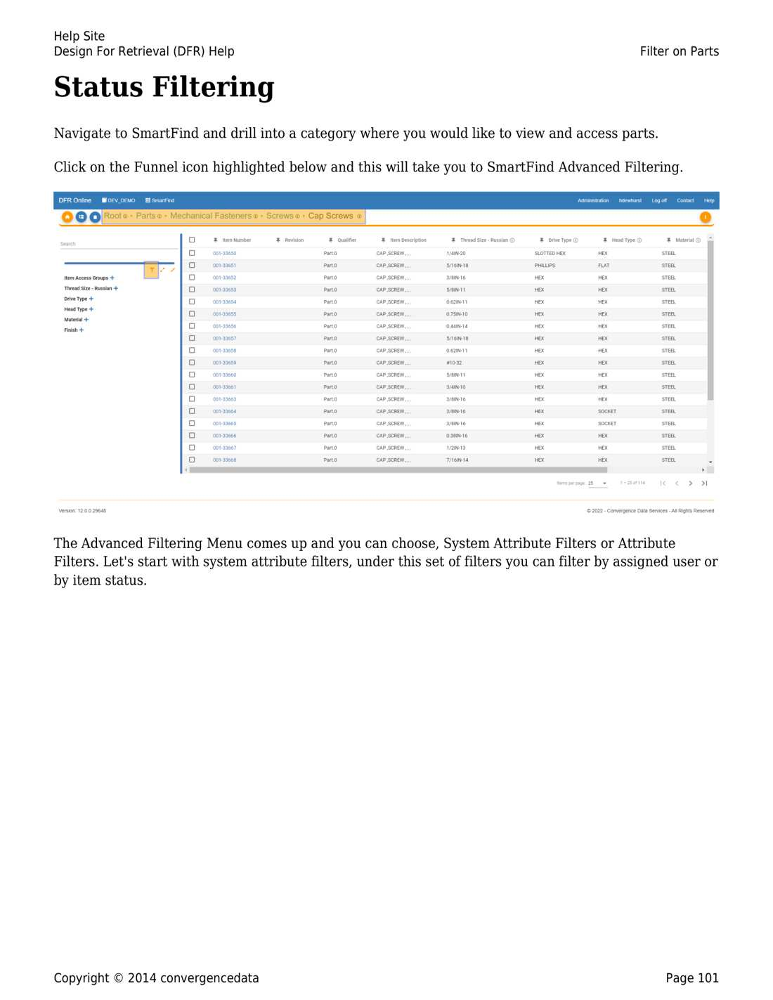

## Filter on Parts

Click one of the statuses in the list to filter by that status. In this case, I am going to filter by all items

with the "Rejected" status.

Click the check box next to the "Rejected" status, and click the "Apply" button in the bottom right of the

screen to apply the filters.

Note: You can select multiple statuses to filter at the same time.

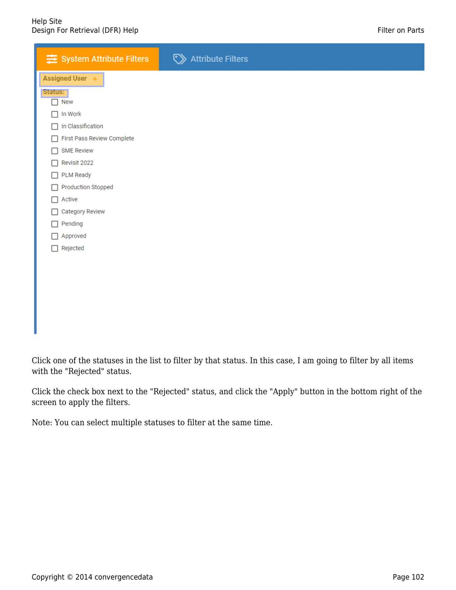

## Filter on Parts

It is shown below that the filter for all rejected items in this category is active and the items show up on

the right in the list.

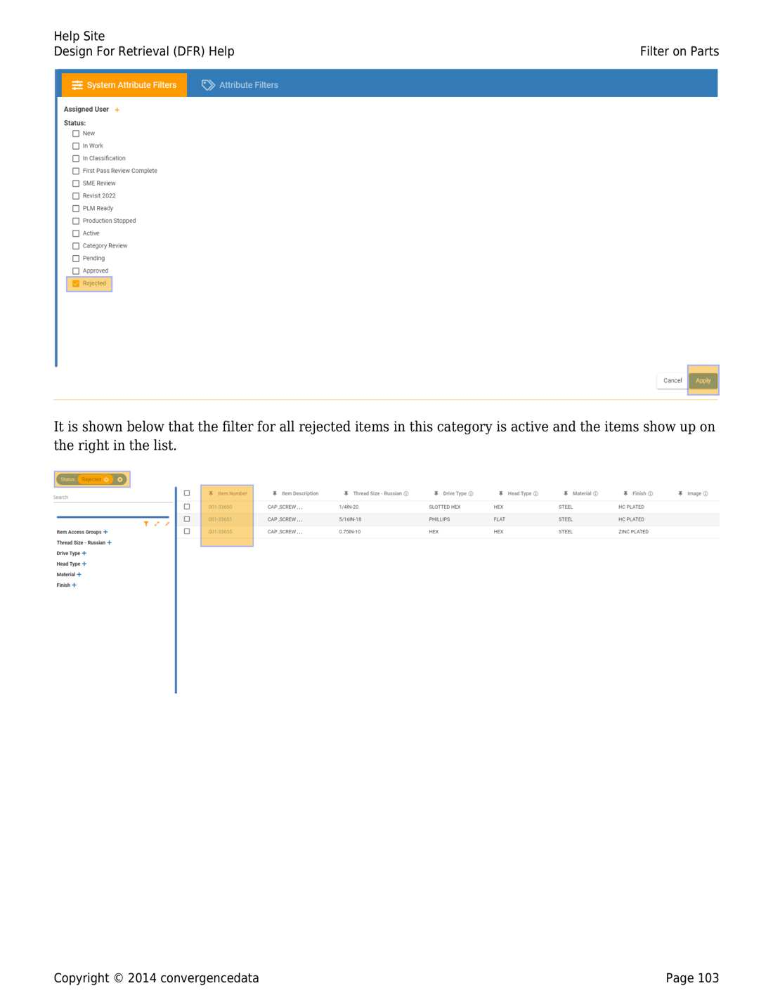

## Filter on Parts

## Attribute Filtering

Navigate to SmartFind and drill into a category where you would like to view and access parts.

Click on the Funnel icon highlighted below and this will take you to SmartFind Advanced Filtering.

The Advanced Filtering Menu comes up and you can choose, System Attribute Filters or Attribute

Filters. Let's click the Attribute Filters button on the top.

Click the plus sign to add an attribute filter.

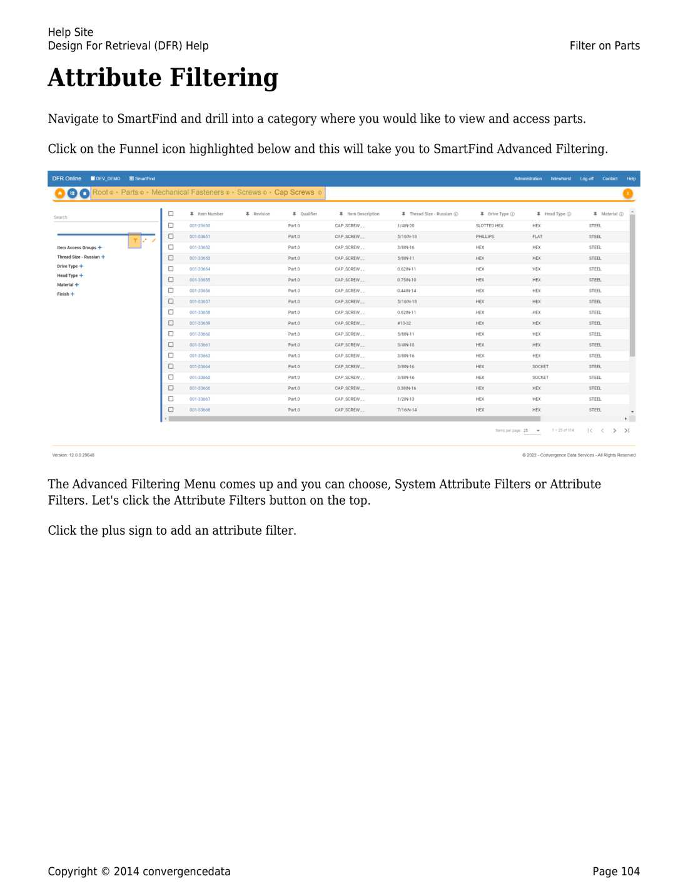

## Filter on Parts

Click the drop down menu to choose which operator you would like to use.

Since I am filtering on an attribute with a String data type I will be using the "is" operator because you

cannot use logical operators on string values.

If you are filtering on a numeric attribute you can use the logical operators that are offered in

SmartFind's advanced filtering.

Type in what you would like to filter by in the box to the right of the operator box, and click apply.

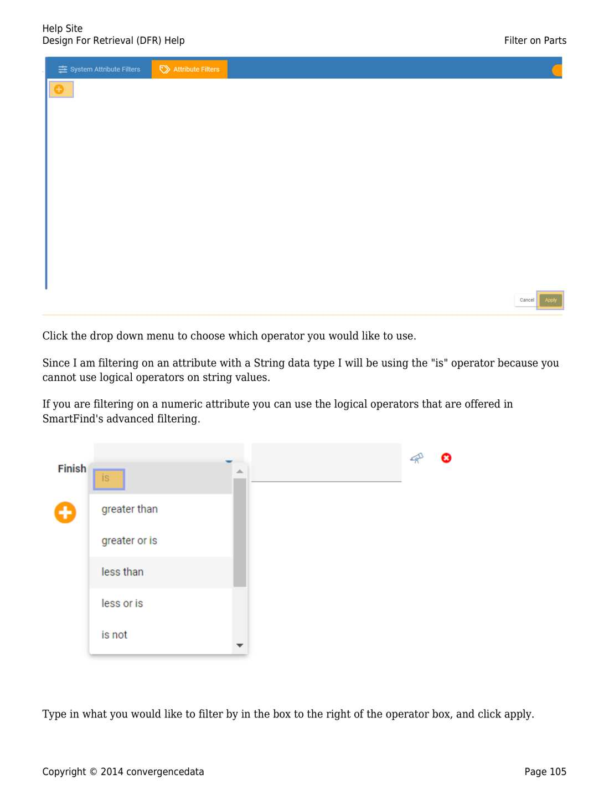

## Filter on Parts

Now the list of items will be filtered by if the finish is cadmium plated. The current active filters show

up on the top of the screen in the "chip" icons, highlighted below.

You can add as many filter "chips" as you would like and they will add on to one another to refine your

filtering.

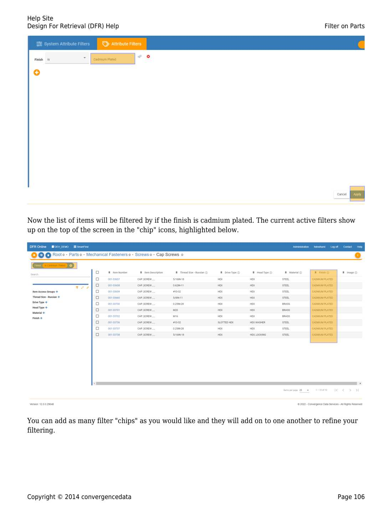

## Convergence PIM Online

## SmartClass

SmartClass is the Convergence PIM module where all updates related to the data model are

### performed, including changes to

## Category structure/schema

## Attributes

## Attribute groups

## Allowed Values Lists (AVLs)

Click on the SmartClass icon to access the module.

## SmartClass Functions

On the left-hand side of the page, there are 4 icons that allow you to change what part of SmartClass you

are working in.

The folders icon is for Classification/Schema and is where you can view the category tree.

The single tag icon is the Attribute library, where you manage all attributes for this catalog.

The multiple tags icon is the Attribute Group library, where attribute groups can be created

and attributes can be assigned to groups.

The bulleted list icon is the Allowed Values List library, where you can manage and assign

legal values for attributes.

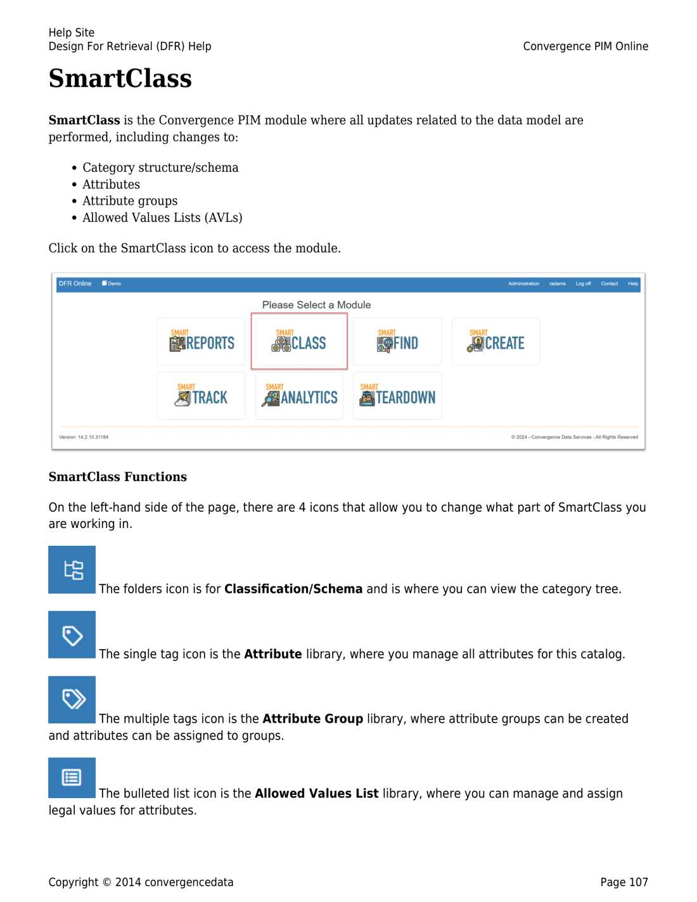

## Convergence PIM Online

### Click on the links below to access the following pages

## Classification

## Structure

## Navigate Classification Structure

## Category Management

## Copy and Paste Categories

## Add New Categories

## Add New Parts Categories

## Add New File Categories

## Edit Categories

## Edit Category Properties

## Edit Category Details

## Delete Category

## Route from Categories to Items

## Add Category Attachments

## Add Category Images

## Assign Allowed Vales Lists

## Attributes

## Edit Attribute Details

## Set Attributes as Key, Required, DNA, and Read Only

## System Attributes

## Attributes(Master Attributes)

## Create New Attributes(Master Attributes)

## Delete Attributes(Master Attributes)

## Localized Attributes

## Attribute Groups

## Create and Delete Attribute Groups

## Allowed Values

## Create Allowed Values Lists

## Edit Allowed Values Lists

## Add Values Manually & Suggested Values

## Load Values from a Text File

## Sort Values

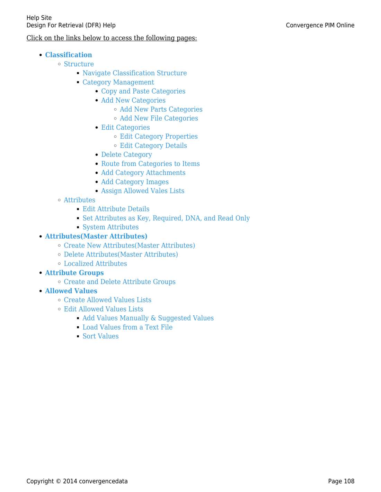

## SmartClass

## Classification Management

The Classification page allows the user to perform most of the changes to the structure/schema,

category attributes, and more.

## Click on the folders icon

to go to the Classification page.

### The page is divided into three different sections

Category Tree Structure - Folder structure displaying all categories and a search/filter bar

Category Metadata - Includes metadata for category updates, a photo if one is assigned to the

category, a link to the items in the category (magnifying glass icon), and more

Category Attributes - Includes system attributes (global) and dynamic attributes (category-

## specific)

### Click on the links below to access the following pages

## Structure

## Navigate Classification Structure

## Category Management

## Copy and Paste Categories

## Add New Categories

## Add New Parts Categories

## Add New File Categories

## Edit Categories

## Edit Category Properties

## Edit Category Details

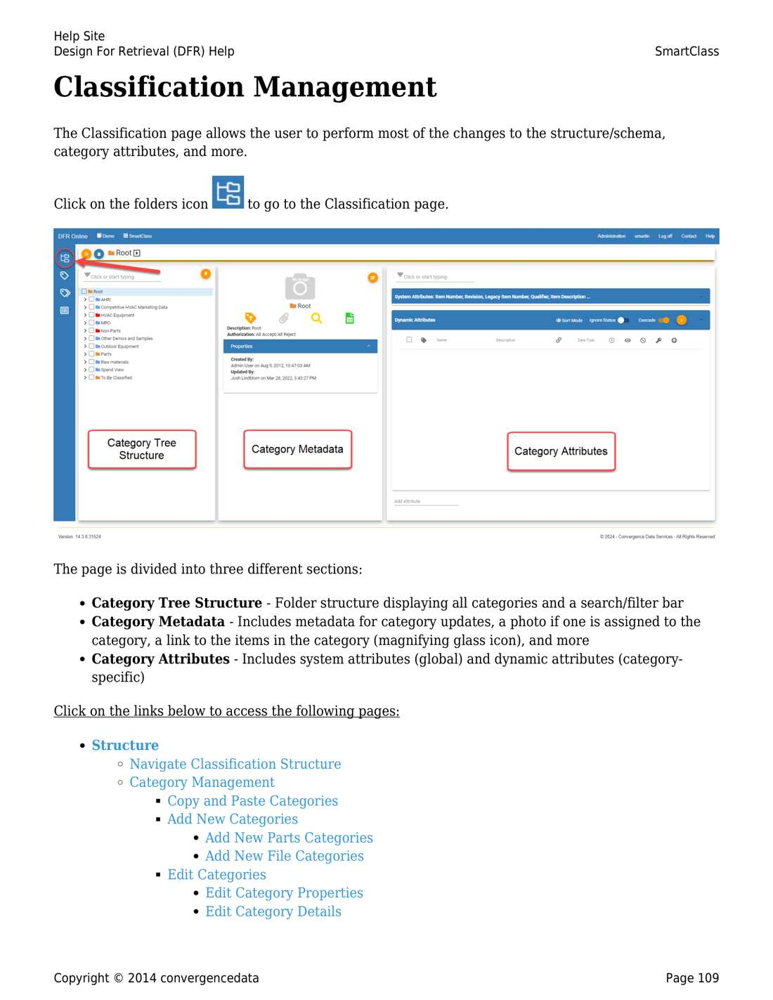

## SmartClass

## Delete Category

## Add Category Attachments

## Add Category Images

## Assign Allowed Vales Lists

## Attributes

## Add New Attributes

## Add Existing Attributes

## Remove Attributes

## Manage Attributes

## Edit Attribute Details

## Sort Attributes

## Filter Attributes

## Set Attributes as Key, Required, DNA, and Read Only

## System Attributes

## Statuses

## Category Statuses

## Attribute Statuses

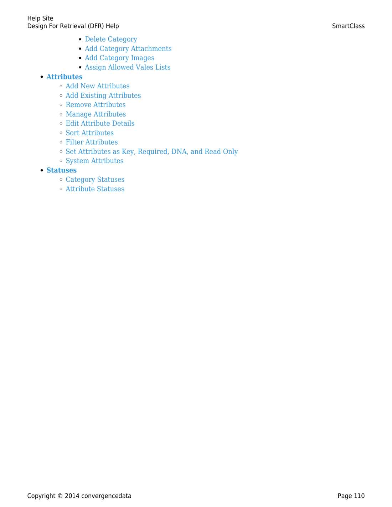

## Classification

## Category Structure

The category tree follows a typical folder structure. Categories are divided into parent categories, child

categories, and leaf nodes.

Clicking on the arrow next to a parent category name will expand any child categories beneath.

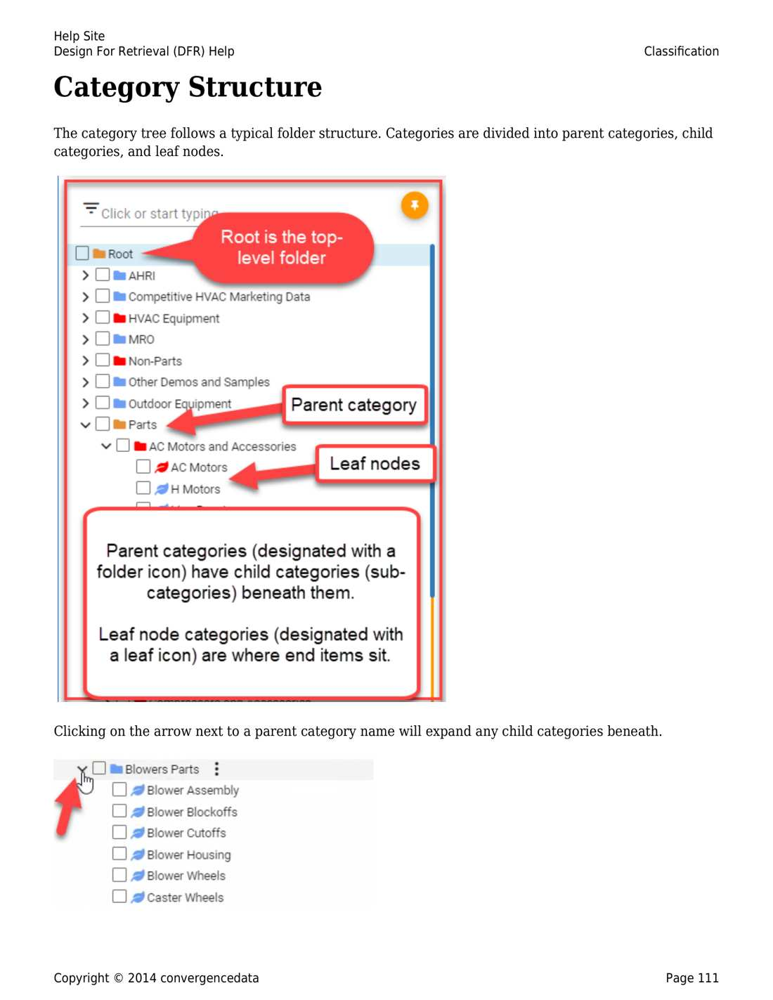

## Classification

## Leaf node (designated with the leaf icon

## )

### Click on the links below to access the following pages

## Navigate Classification Structure

## Category Management

## Copy and Paste Categories

## Add New Categories

## Add New Parts Categories

## Add New File Categories

## Edit Categories

## Edit Category Properties

## Edit Category Details

## Delete Category

## Add Category Attachments

## Add Category Images

## Assign Allowed Vales Lists

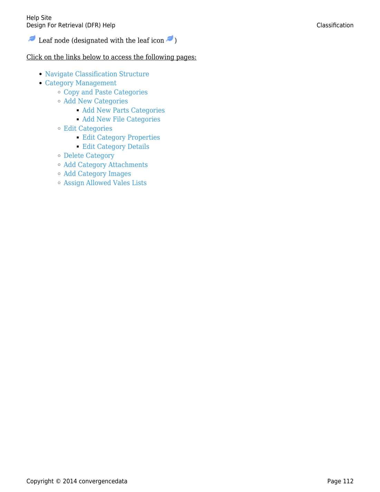

## Structure

## Navigate Classification Structure

There are multiple ways to navigate the tree.

In classification, click on the orange-colored icon; this will be located on the upper left side of the

screen.

Root will be the first selection once the window expands.

Select the arrows next to the folder to expand the desired category OR

The search bar at the top can be used to filter quickly as well.

To pin the expanded window, select the thumbtack icon.

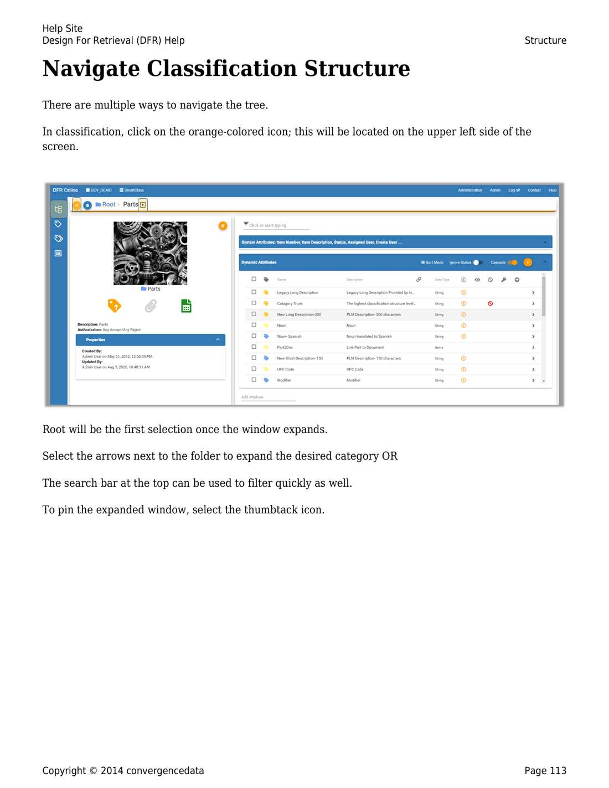

## Structure

## OR

In classification, select the black arrow next to the Root folder on the upper left side of the screen.

Select the desired category from the expanded menu screen.

Navigate the breadcrumb to the desired category and click on it.

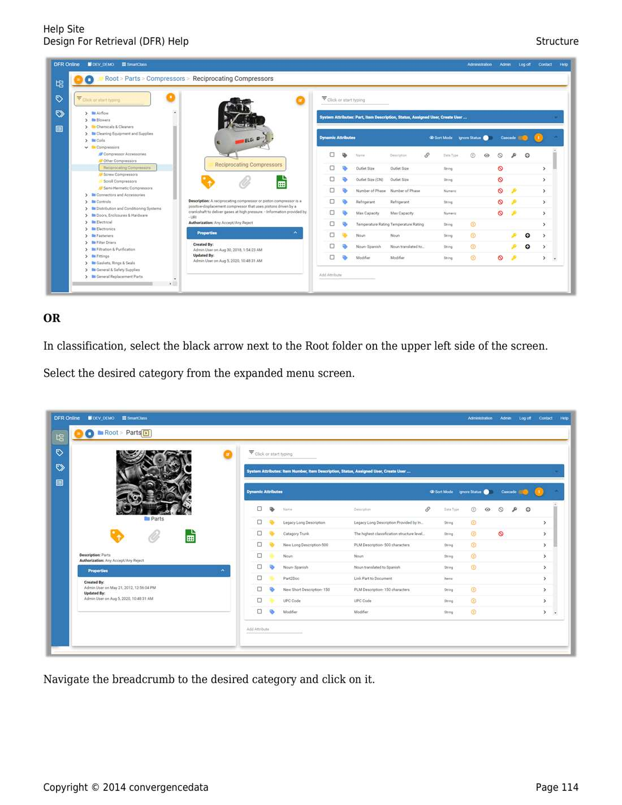

## Structure

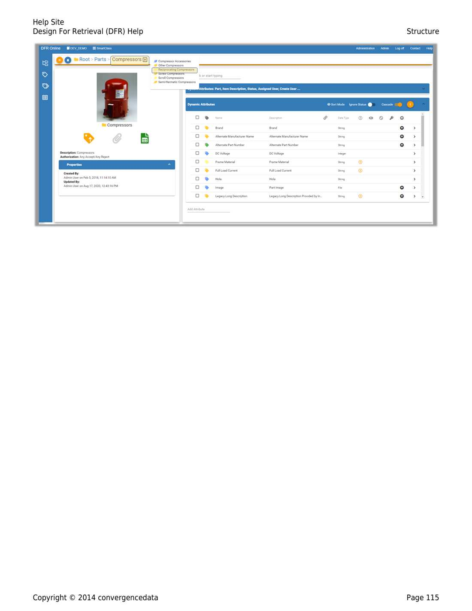

## Structure

## Category Management

Category management encompasses the abilities to create, edit, delete and otherwise manipulate

categories within SmartClass.

### Click on the links below to access the following pages

## Copy and Paste Categories

## Move Categories(Prune & Graft)

## Add New Categories

## Add New Parts Categories

## Add New File Categories

## Edit Categories

## Edit Category Properties

## Edit Category Details

## Delete Category

## Route from Categories to Items

## Add Category Attachments

## Add Category Images

## Assign Allowed Vales Lists

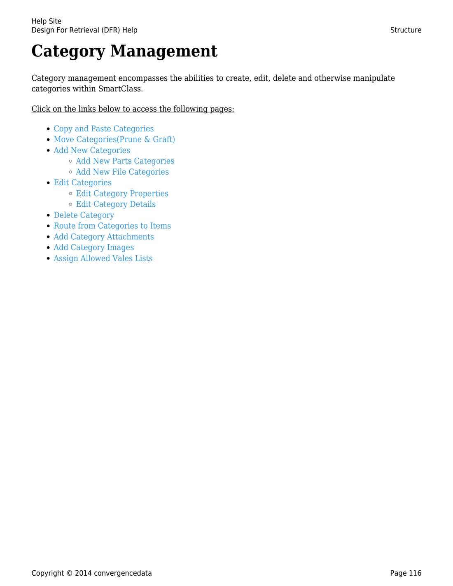
