# SmartCreate

## SmartCreate

The next screen will show the part has been created.

To verify the part created exists in DFR, select SmartFind and search for the part.

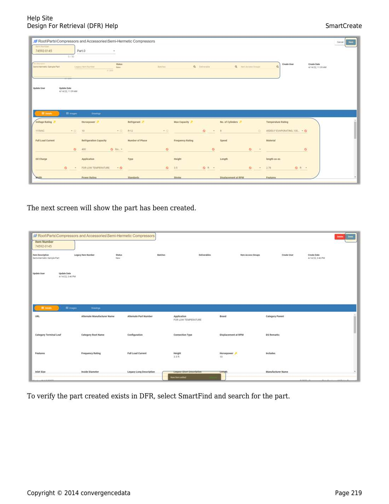

## SmartCreate

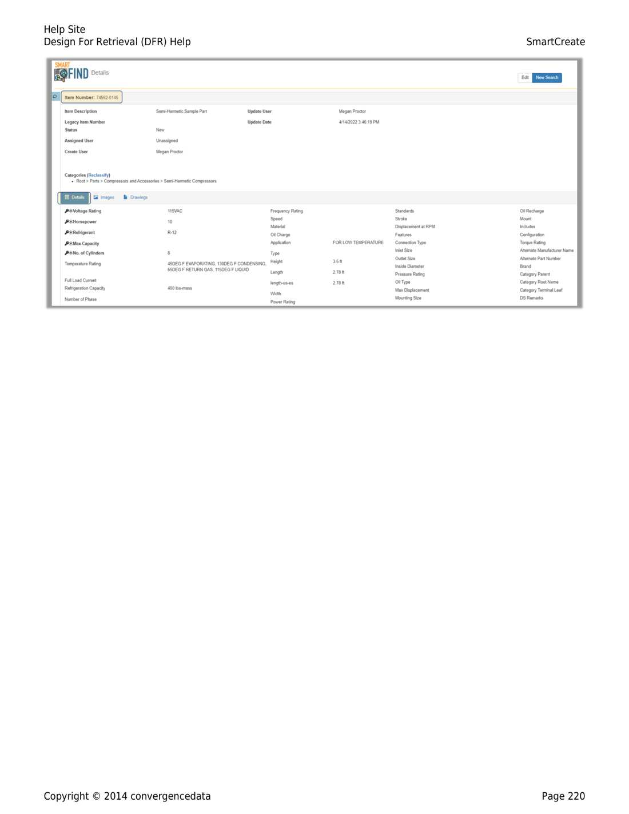

## Convergence PIM Online

## SmartAnalytics

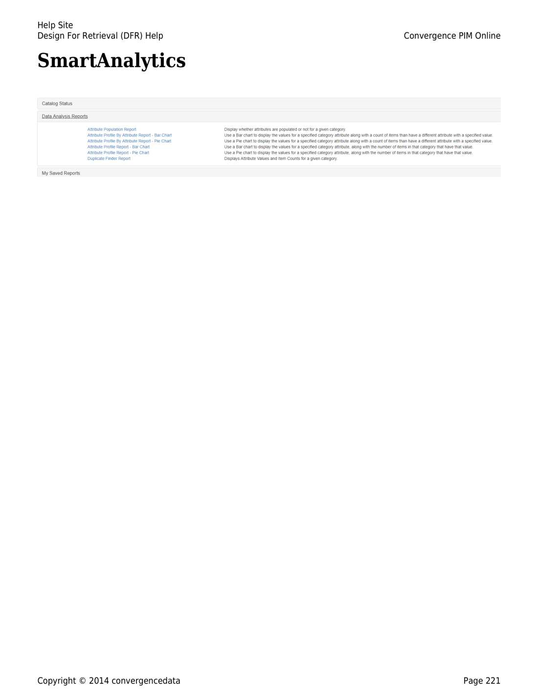

## Convergence PIM Online

## Administration

## Catalog Administration

## Status Management

## Batch Management

## Options Management

## File Storage Management

## Deliverable Management

## System Administration

## User Administration

## How to Add a New User

## Group Administration

## How to Add a User Group

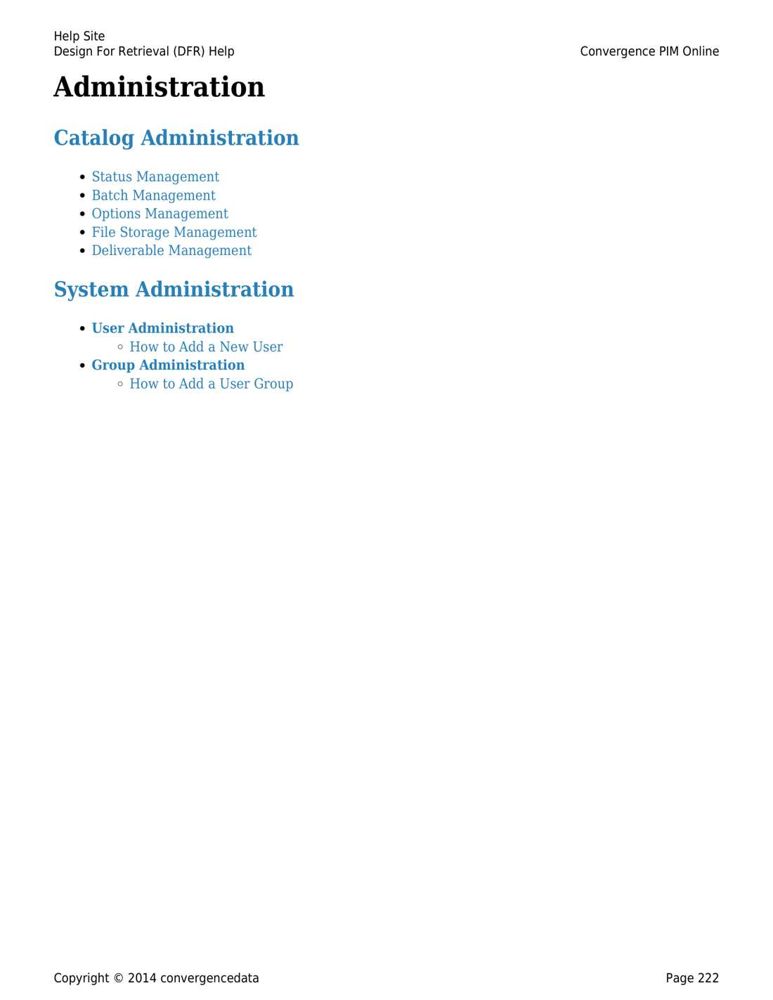

## Administration

## Catalog Administration

## Status Management

## Batch Management

## Options Management

## File Storage Management

## Deliverable Management

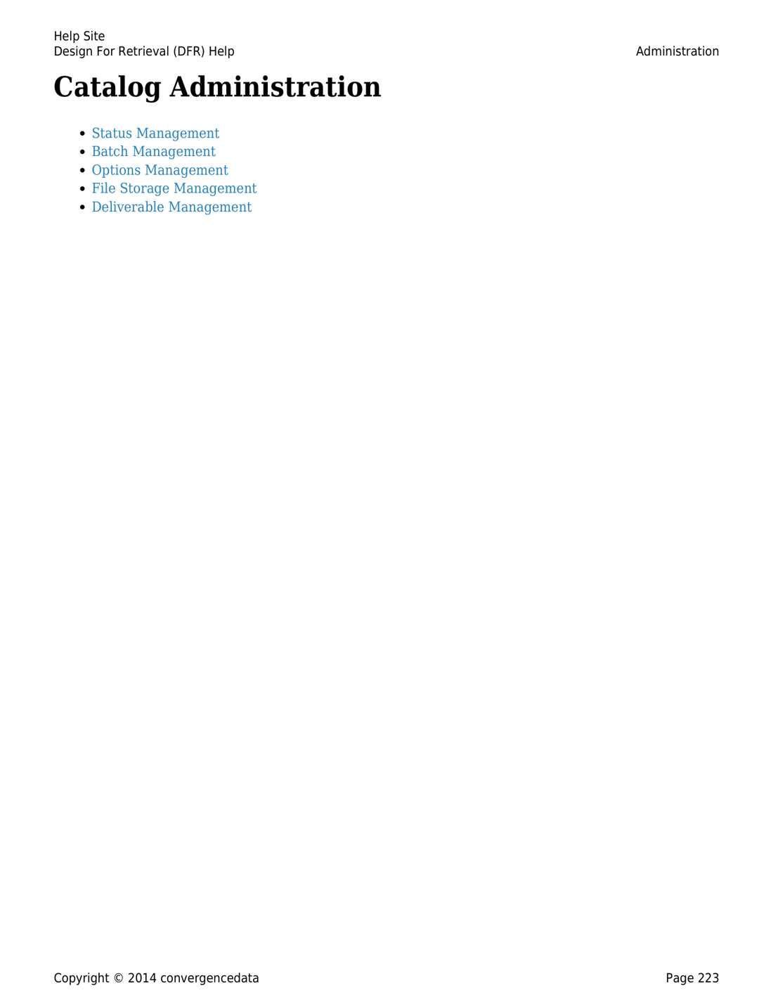

## Catalog Administration

## Status Management

Statuses are used to track the progress of categories, attributes, and items. This includes tracking

approvals, rejections, and comments.

Managing these statuses is done in Catalog Management.

Permissions need to be set and allowed for users to utilize the catalog manager and status manager.

### These permissions include

* Classification Permission: Category Permission/ Edit Items
* Catalog Permission: Access Catalog Status Module Locate the Catalog Management tab under Administration.

## Select Status Management

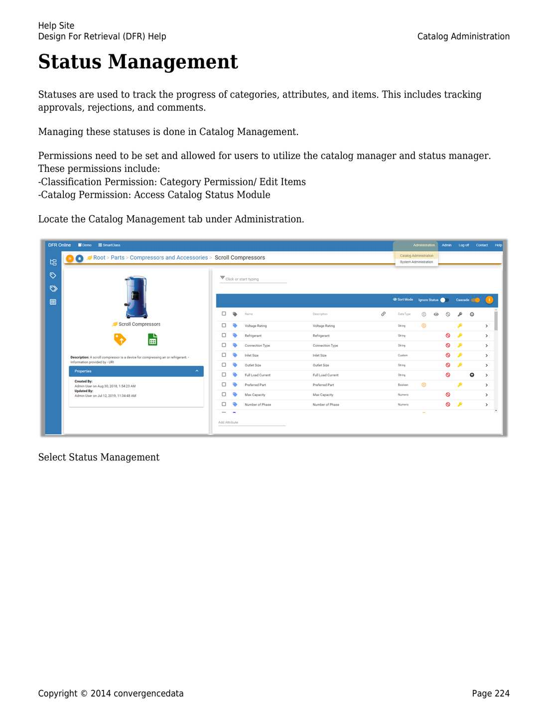

## Catalog Administration

The next screen will show all of the available statuses.

Users can create as many statuses as they would like. Each status is identified by name and a color that

the user determines themselves.

New statuses can only be created between "New" and "Pending".

Statuses such as New, Pending, Approved, and Rejected are all standard system statuses and cannot be

edited or removed.

Check boxes are available for Categories, Attributes, and Parts.

One or multiple boxes can be checked on each status: this means the status will apply to that selection.

For example: A category, and part can both be selected to go through "New, In Work, and

Classification" wheras an attribute may only need to go through "New and In Work."

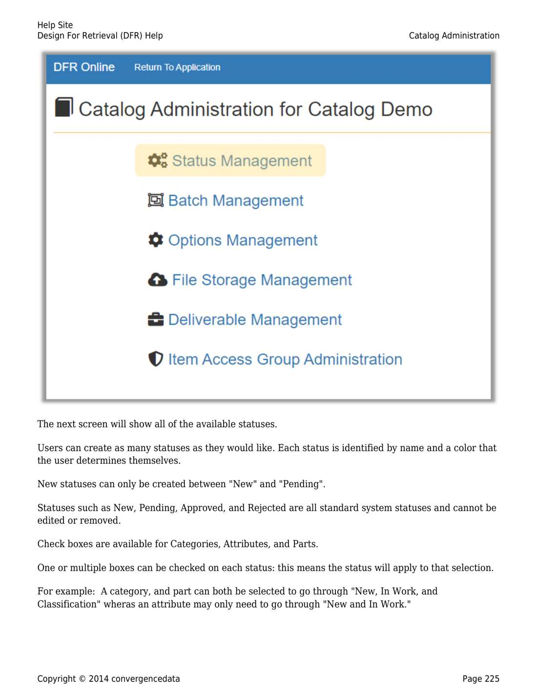

## Catalog Administration

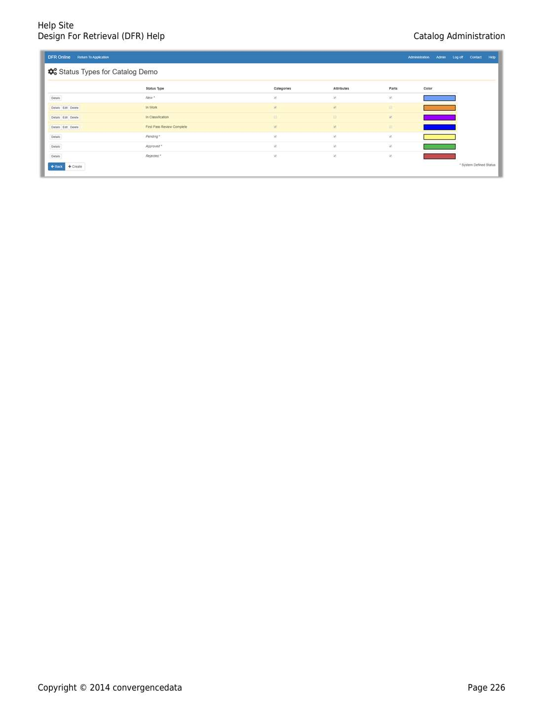

## Status Management

## Creating a New Status

Creating a new status must take into consideration what the status is going to encompass: parts,

categories, attributes or any combination of the three.

The user must also take into consideration how many statuses between New and Pending that they'd

like their team to follow.

New, Pending, Approved and Rejected cannot be edited or deleted.

Permissions need to be set and allowed for users to utilize the catalog manager and status manager.

### These permissions include

* Classification Permission: Category Permission/ Edit Items
* Catalog Permission: Access Catalog Status Module Navigate to Status Management under the Catalog Administration screen.

## To create a new status, select "Create."

Type in a name for the status and determine what items that the status will cover.

Check boxes are available for Categories, Attributes and Parts. The statuses will only show up on the

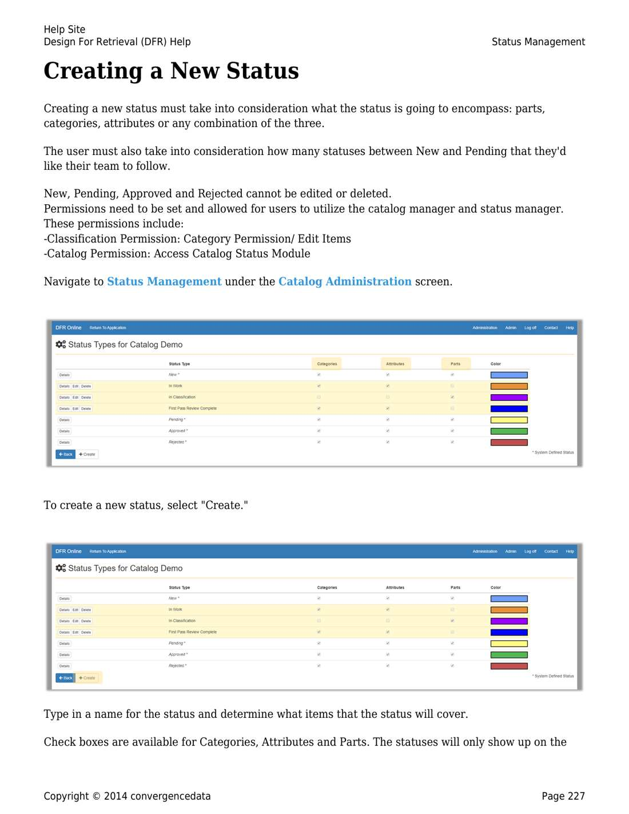

## Status Management

items that are checked.

One or multiple boxes can be checked on each status: this means the status will apply to that selection.

Example 1: If Categories is the only checkbox selected then when the user is changing an attribute

status, the status would not show up as one of the selection.

Example 2: A category and part can both be selected to go through "New, In Work, and Classification"

whereas an attribute may only need to go through "New and In Work."

The color of the status will be what the user sees when the status is changed.

This will show up in both ThickClient and Convergence PIM Online.

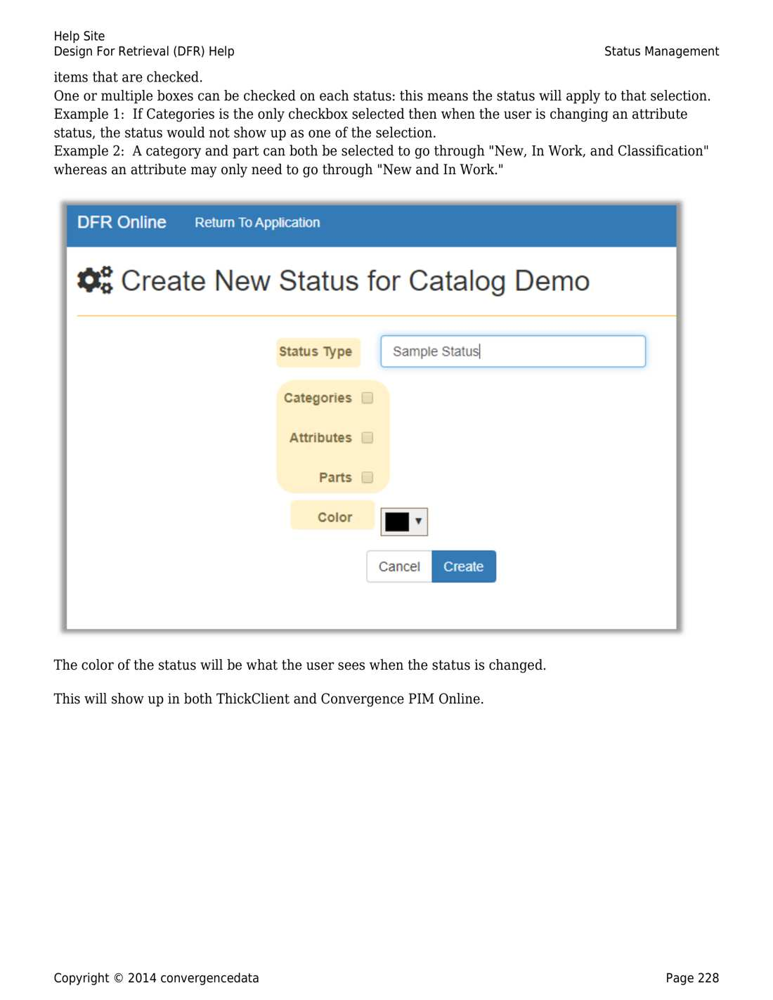

## Status Management

Select Create, and the status is ready to be used.

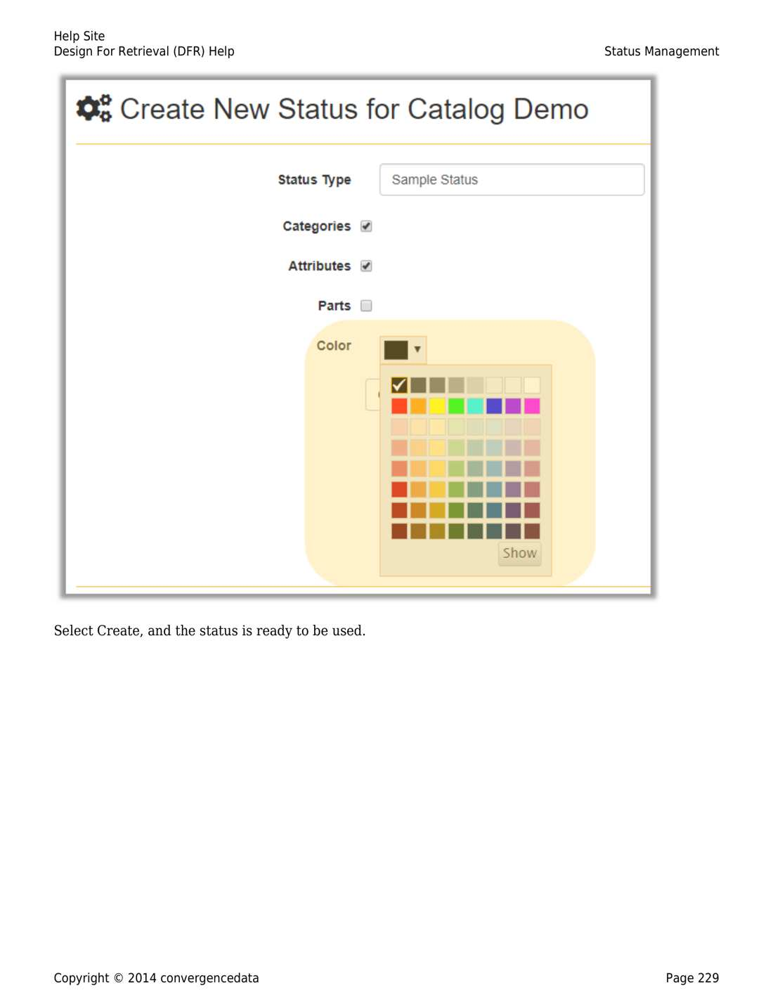

## Status Management

## Editing a Status

Editing a status will give the user the option to edit various elements of the status such as the color of

the status tag, name, and what data will be flagged under the status such as items, categories, and

parts.

Permissions need to be set and allowed for users to utilize the catalog manager and status manager.

### These permissions include

* Classification Permission: Catagory Permission/ Edit Items
* Catalog Permission: Access Catalog Status Module Editing a status is easily accomplished by navigating to the Status Mangement screen, selecting the

status and then " Edit" on the status to the left.

Once the edit screen has been opened, the user is given the choice to change any of the information

### such as the

## Status Type (Name)

## Which item(s) are being covered with this particular status

The color of the status tag which is visible in various SmartClass views, identifying the status by

## color instead of name

Usage: this will notify the user(s) of the amount of attributes, categories, category attributes or

## items that currently are under the selected status

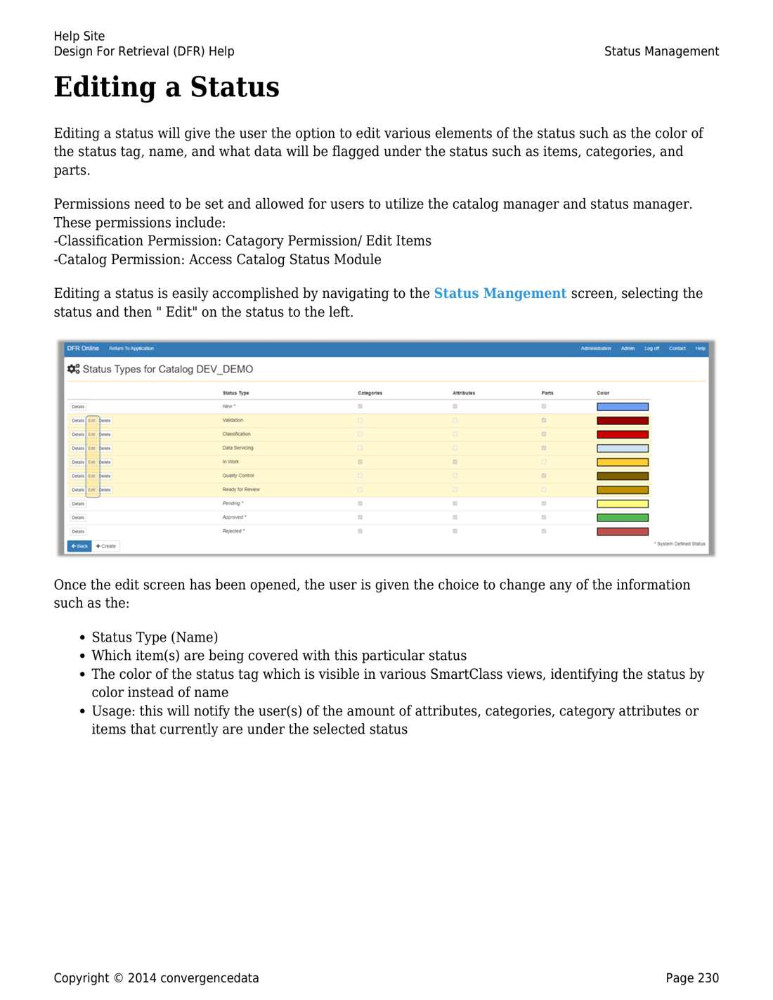

## Status Management

Select Save when complete.

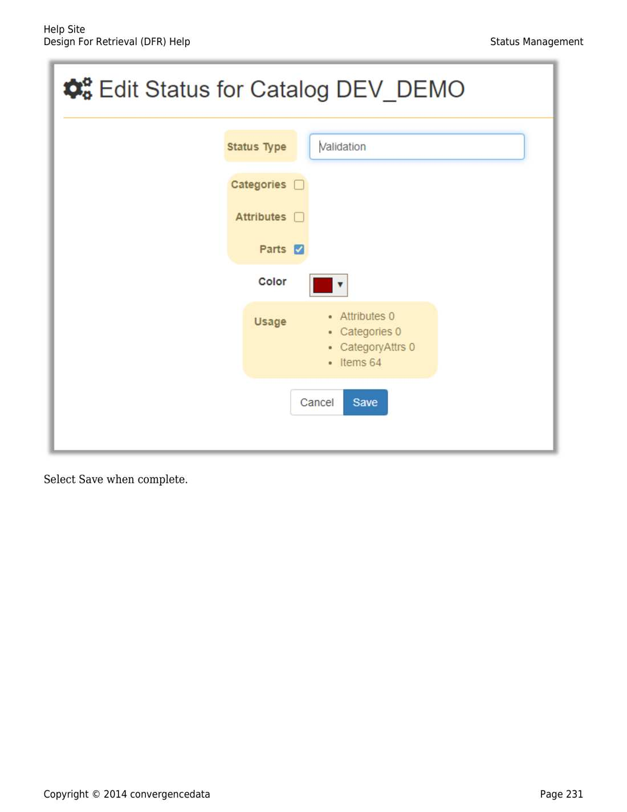

## Status Management

## Deleting a Status

Deleting a status is done when a status is no longer necessary and will remove the status indefinitely.

Permissions need to be set and allowed for users to utilize the catalog manager and status manager.

### These permissions include

* Classification Permission: Category Permission/ Edit Items
* Catalog Permission: Access Catalog Status Module Deleting a status is easily accomplished by navigating to the Status Mangement screen, selecting the

status and then " Delete" on the status to the left.

A status can only be deleted as long as it is not tied to any categories, attributes or parts.

### If a status is tied to any of the three elements listed above, an error message will be prompted

As long as the status is not tied to any of the elements listed above, a window will be prompted seen

### below

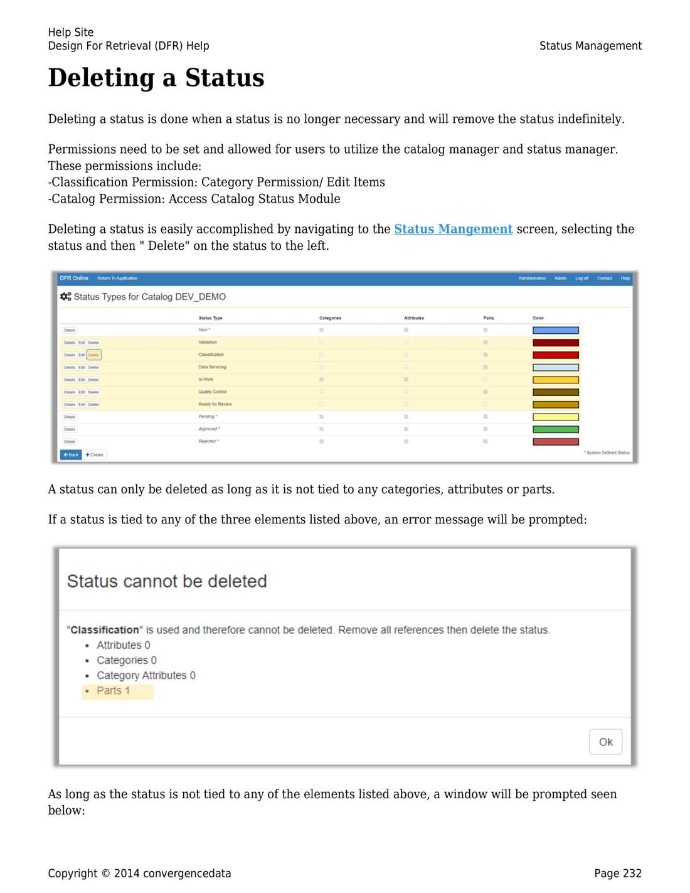

## Status Management

Select Yes. The status is now deleted.

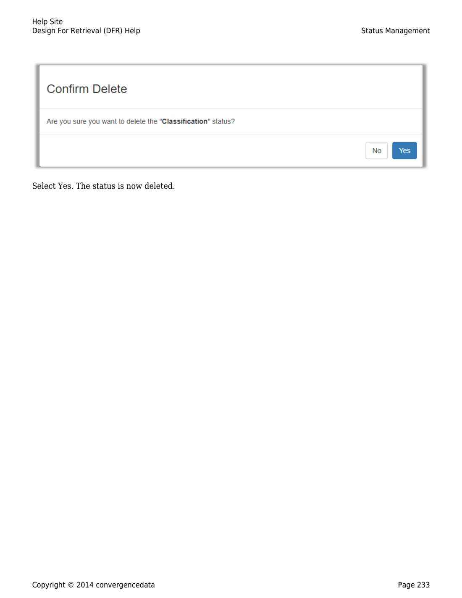

## Administration

## System Administration

## User Administration

## How to Add a New User

## Group Administration

## How to Add a User Group

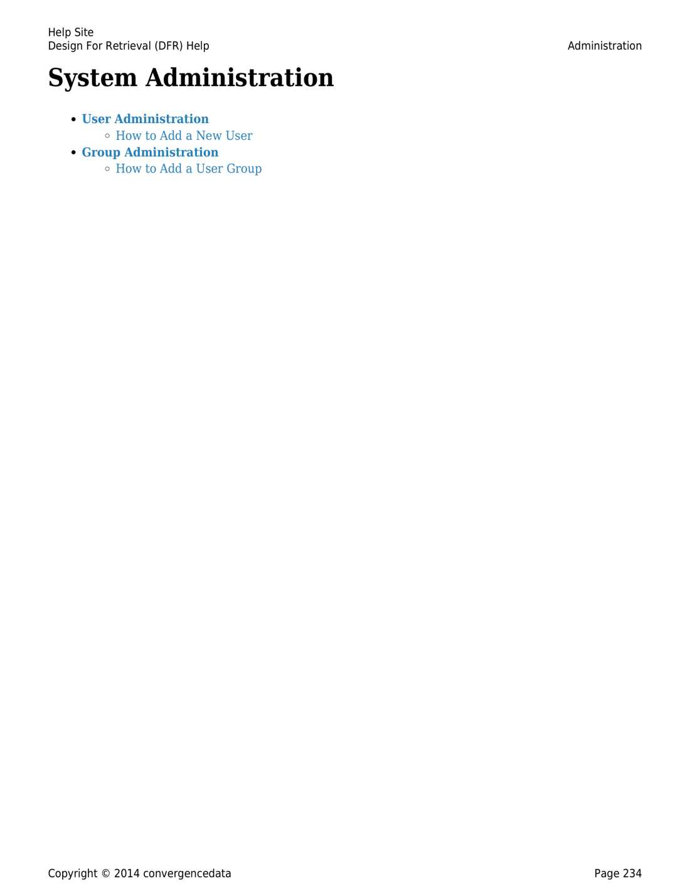

## System Administration

## User Administration

## User Administration

## How to Add a New User

## How to Search for a User

## How to Make a User Inactive

## How to Export User List

## Group Administration

## How to Add a User Group

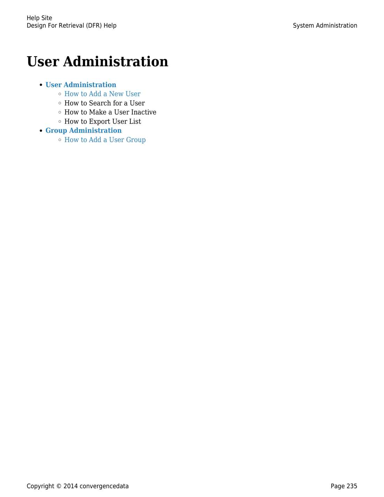
