# SmartTeardown

## SmartTeardown

Translate is also an option on some of the pages.

The translate feature allows the user to fill in translated words and descriptions that users will see

when they change the language in the top right of each SmartTeardown page.

## Language and Region

To choose a different language, navigate to the top right of each page and choose a language in the

dropdown.

## Next to the language selection is "Region."

Regions are added or removed in General Management as well.

When selected, the user will only view products added to that region.

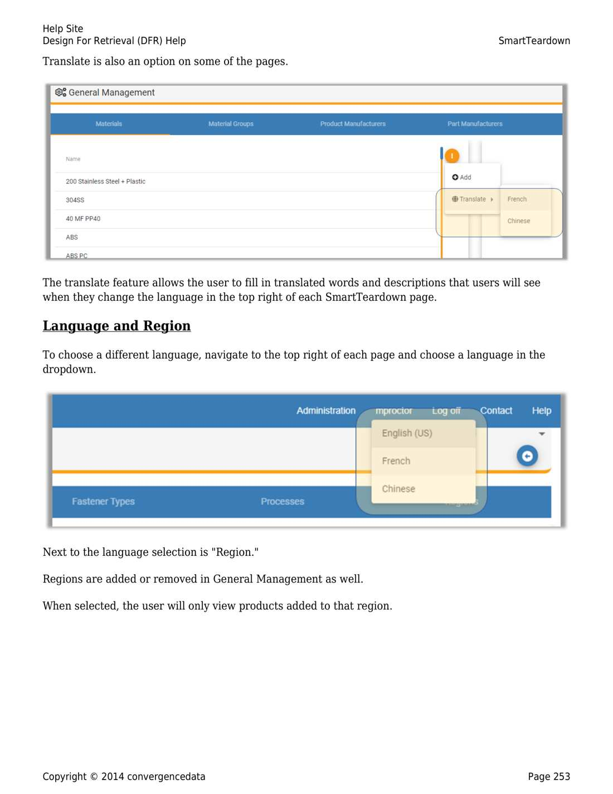

## SmartTeardown

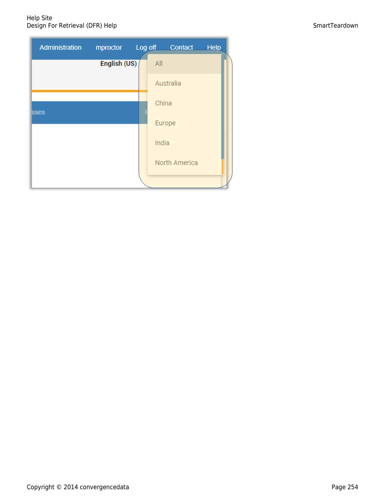

## SmartTeardown

## Importing Segment Data

As it stands, segment and fastener data are the only data that can be imported into Convergence PIM

SmartTeardown.

Structure and Model importing is not a function that Convergence PIM supports.

The first thing that needs to be done before a user can consider importing segment or fastener data is

verify that General Management and Family Management are set up correctly.

Some fields will be utilized as drop-down fields based on information in either of those administrative

areas.

Models must be added manually, and structure must be built out manually before importing can

## begin.  ( <--these will contain hyperlinks)

Once structure is built out, the user can export the family structure template in Family Management.

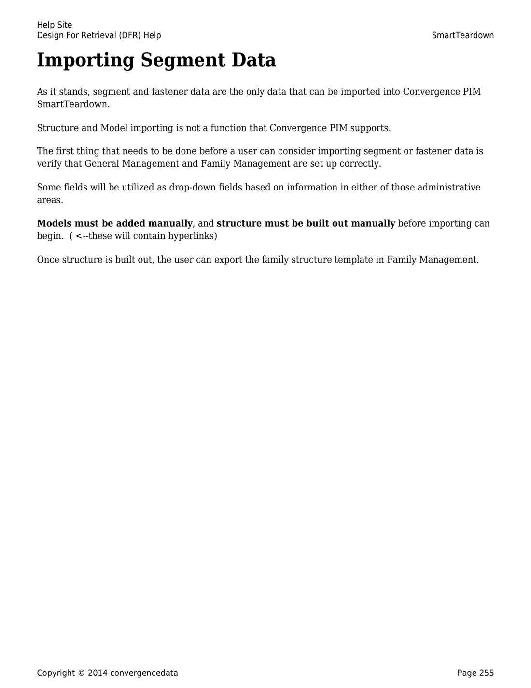

## SmartTeardown

### The family export will appear exactly as displayed below

The user at this point can fill out any and/or all information on the first 2 tabs: Segment Data and

Fastener Data.

Areas such as Region and Model are mandatory.

Remember: the model that data is being imported to has to have been previously created. Please see "

Adding A Model" for more information.

Areas under Region, Material, Manufacturer, Primary Process, Secondary Process and Type are all

based on information added into General Management. These will appear as drop-down lists and cannot

be written over.

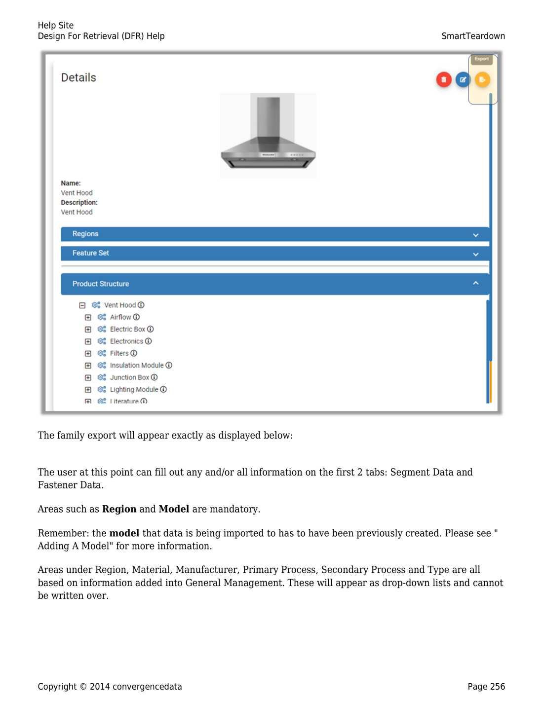

## SmartTeardown

Fill out all necessary information in the template and save.

Navigate to the Convergence PIM ThickClient and select Import Manager.

Select Teardown Data.

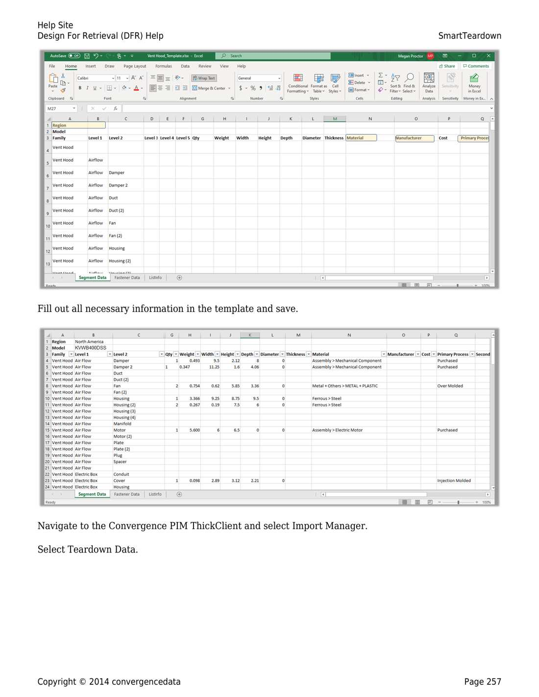

## SmartTeardown

Once asked to choose the import format, there will be only one choice: this is for product data.

The next screen is specifically asking what type of data is being loaded.

It's possible to load segment data without fastener data and vice versa as long as the segments do

already exist.

In this case, data is on both the segment and fastener tabs so both are being imported and therefore

both will be selected.

The operation will be "create" on both Segment and Fastener data screens since although the user

already created a model, they are now creating new segment data for that model.

All other fields will be auto-mapped if the user is using the family template as recommended.

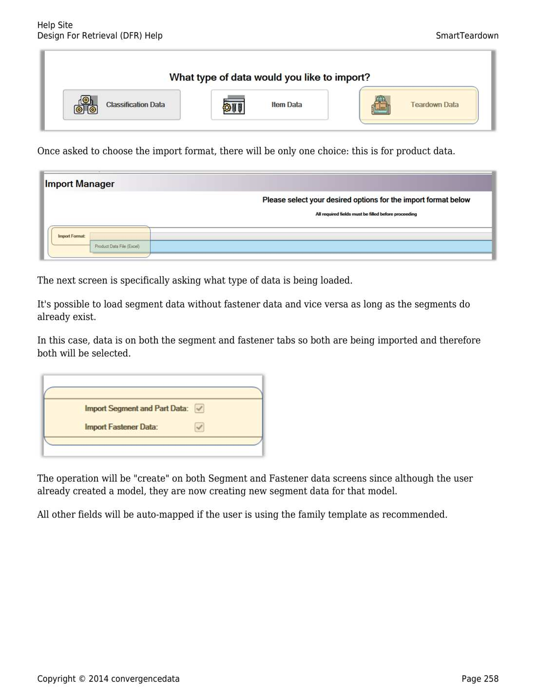

## SmartTeardown

As long as validations clear, the import can be completed.

Now when navigating to SmartTeardown's home screen, select the family, manufacturer and then

model.

The final screen should appear as shown below: to the right now displays fastener and segment data.

Gray nodes in the middle of the screen up and down the hierarchy indicate no data. Orange indicates

data whether that's just segment data (on the top such as height, width, length) or fastener data

displayed in terms of fastener type, location, total weight, etc.

Lastly, there is an export function on this model screen as well

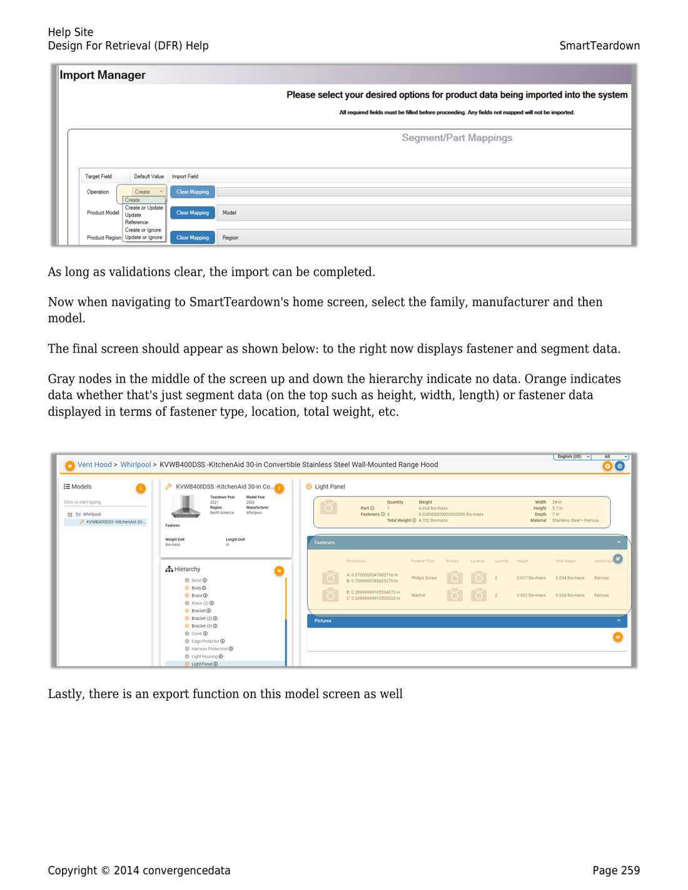

## SmartTeardown

This export feature will only export information that is not blank: fastener and segment data. It will not

import empty cells or total hierarchy if there is no data to show.

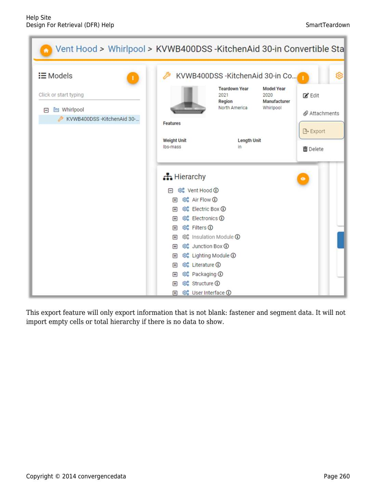

## SmartTeardown

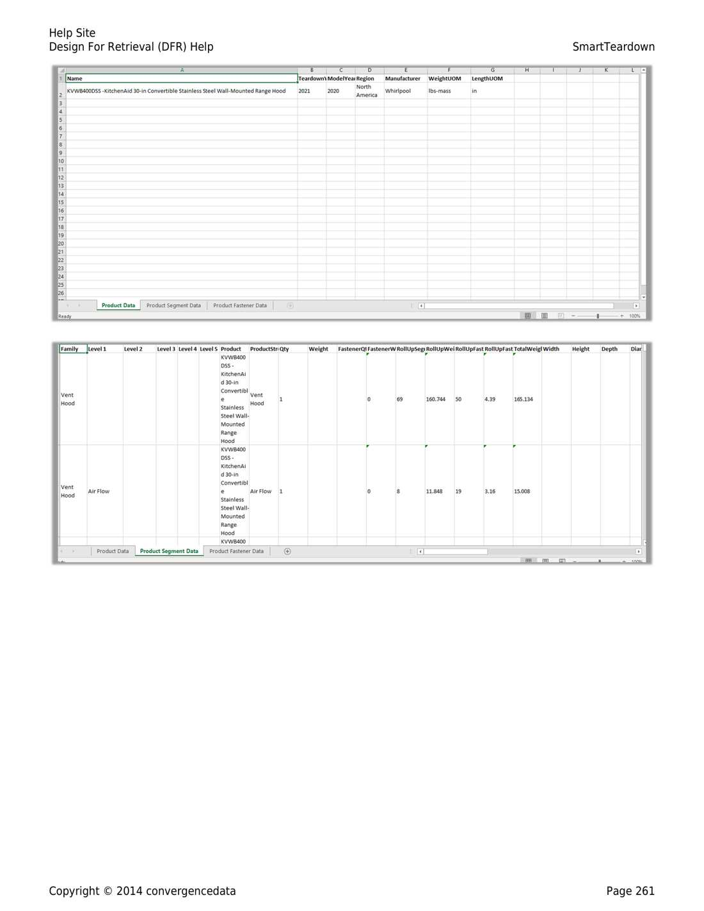

## Convergence PIM Thick Client

## Convergence PIM Thick Client

## Item Relationship Management

Convergence PIM software supports the linking of items to establish Item Relationships. These

### relationships can link items for any purpose, including but not limited to

## Alternate parts

## Related parts

## Accessories

Managing these relationships is simple. You need the ability to access/edit the SmartClass module

(Convergence PIM Online) and the Item Loader module (thick client).

## Setting Up Data Model to Support Relationships

The first step is configuring the data model to support the item linkages. This will be done using an

item-type attribute assigned to the relevant category.

1. Create the Relationship Attribute

## a. Navigate to SmartClass

## b. Open the Attribute library (click the single tag icon

## in the left-hand navigation pane)

c. Create an attribute with a name that describes the relationship type (e.g. Related Parts)

## d. Change the attribute's data type to "Items"

## e. Click on "Properties" to expand the Properties options

f. Under the "Constraining Category" field, add the full category path for the category where the

## attribute will be assigned

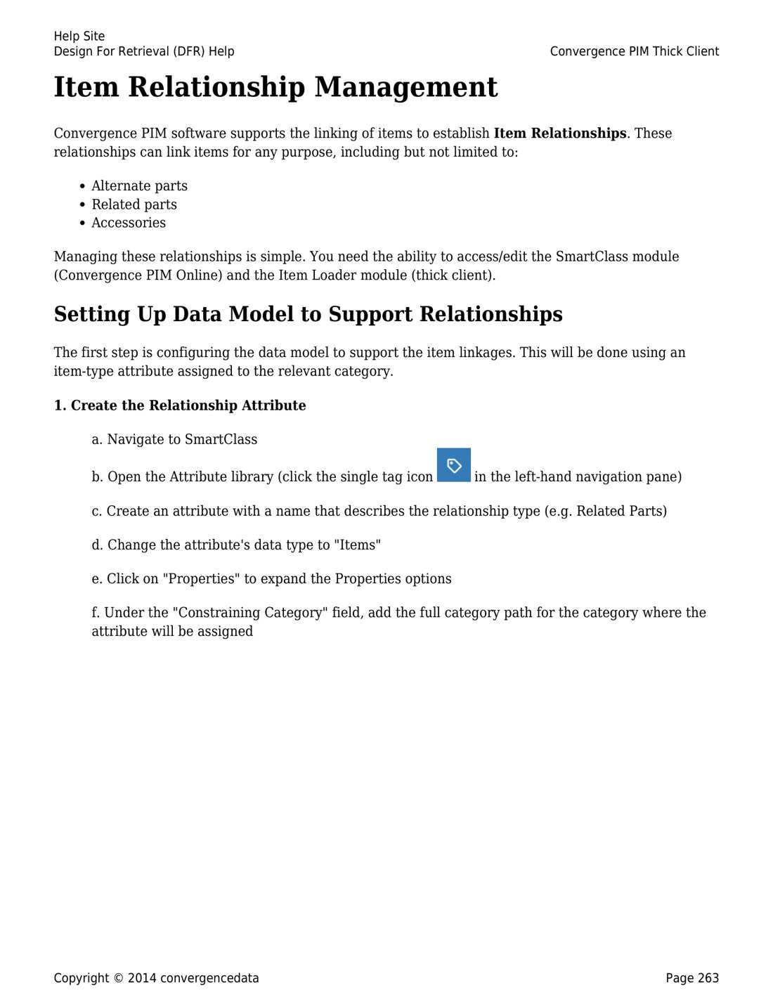

## Convergence PIM Thick Client

2. Add the Relationship Attribute to the Category

a. Open the Classification Manager (click the folder structure icon in the left-hand navigation

## pane)

## b. Navigate to and select the desired category

## c. Add the relationship attribute to the desired category

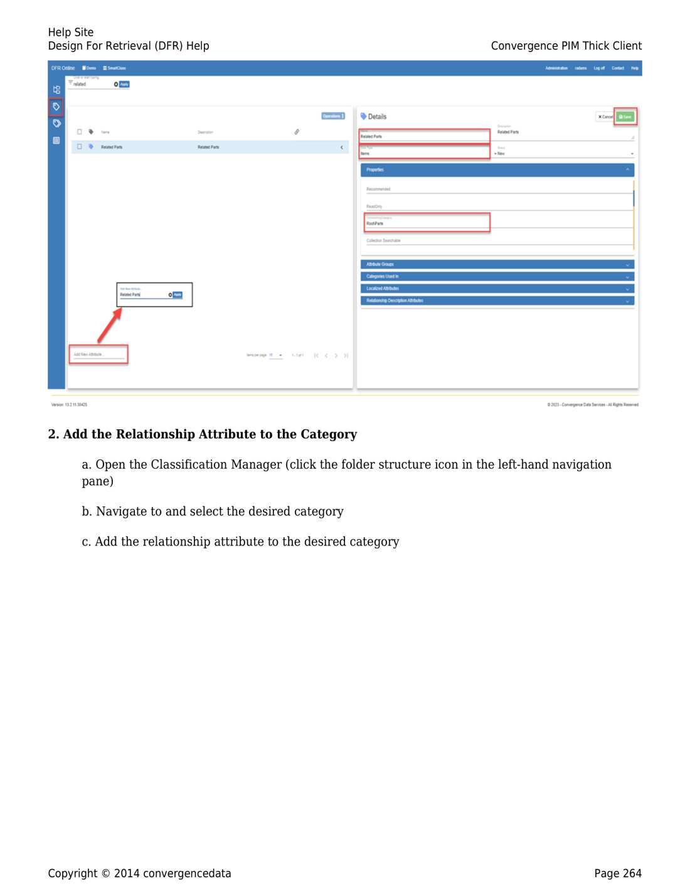

## Convergence PIM Thick Client

3. Confirm that adding the relationship attribute was successful

## a. Open the item details for an item within that category

b. The relationship attribute should appear as a Display Tab

## Establish the Relationship Between Items

To link items, you will need to create a .txt file and import that file using the Item Loader

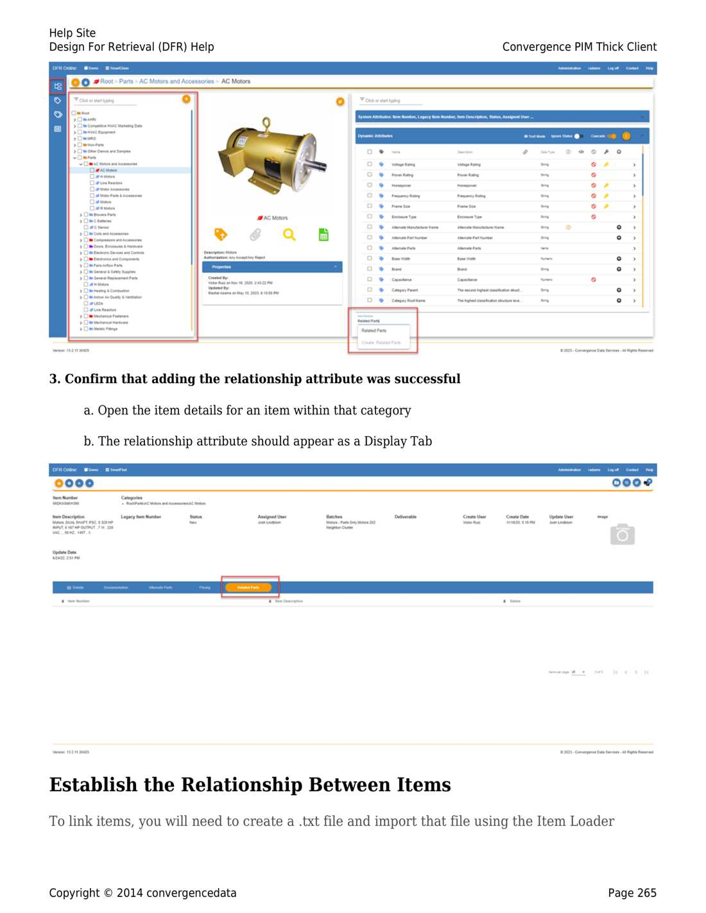

## Convergence PIM Thick Client

module in the Convergence PIM Thick Client.

1. Create the import file

## a. Create a new spreadsheet

b. In cell A1, add the following text, replacing NAME OF ATTRIBUTE with the name of the

## attribute you created

## Collection Attribute Name=NAME OF ATTRIBUTE

## So if your attribute is Related Parts, it would read

## Collection Attribute Name=Related Parts

### c. Add column headers in row 2, in this order, starting in cell A2 and going across to cell H2

## Item Number

## Item Revision

## Item Qualifier

## Member Item Number

## Member Item Revision

## Member Item Qualifier

## Member Item Root Qualifier

## Operation

d. Populate the rows beneath the headers with the desired item links

For example, imagine that you want to add item 90098765 (Qualifier = Part.0) as a

## related part to 30012345 (Qualifier = Part.0)

Item Number - The item number for the item found in the category where you added the

## relationship attribute

## In this example, the value would be 30012345

## Item Revision - This column can be left blank

Item Qualifier - The value listed after the decimal in the item's Qualifier

If your item number is 30012345 and the qualifier is Part.0, the value in this column would

## be 0

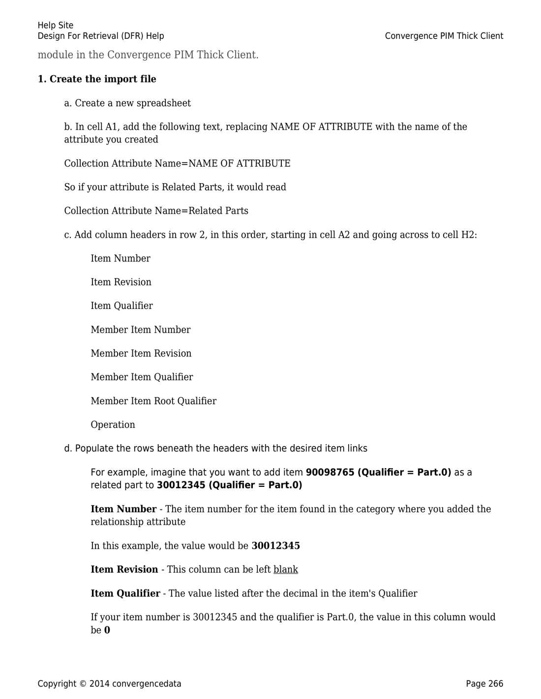

## Convergence PIM Thick Client

Member Item Number - The item number for the item to link to the item in column A

## In this example, the value would be 90098765

## Member Item Revision - This column can be left blank

Member Item Qualifier - The value listed after the decimal in the member item's Qualifier

## In this example, the value would be 0

Member Item Root Qualifier - The beginning root of the member item's Qualifier (default

## is "Part")

## In this example, the value would be Part

Operation - Indicate if the item is to be added to the relationship

## The value in this column would be Add

### Example file

## e. Save the file as a .txt file

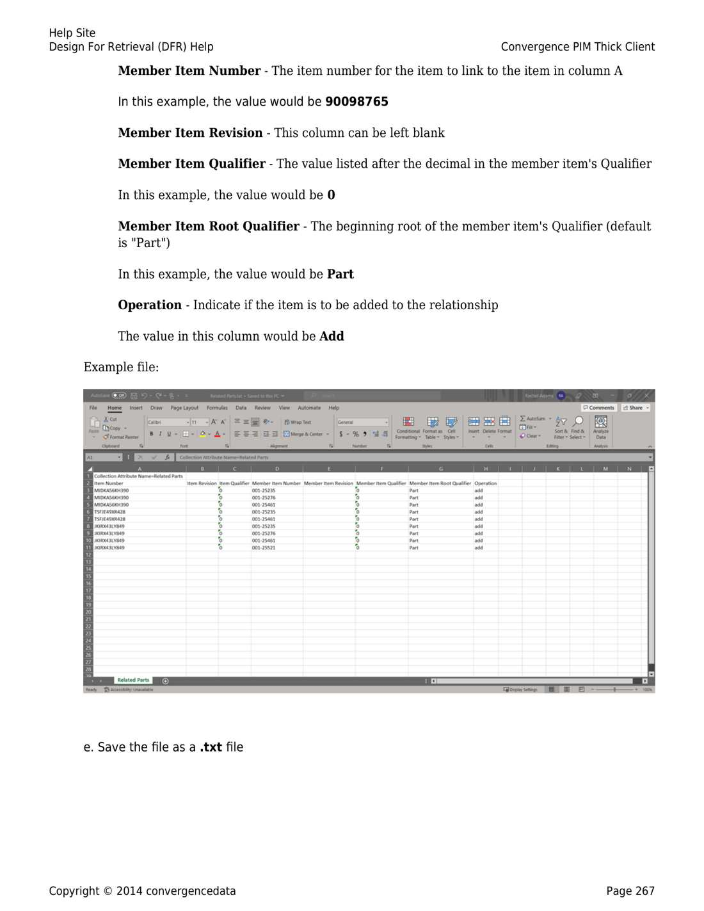

## Convergence PIM Thick Client

## f. Close the file

g. Open your File Explorer and navigate to the location where you saved your file

## h. Rename the file, changing the extension to .rdl

2. Import the file to Thick Client

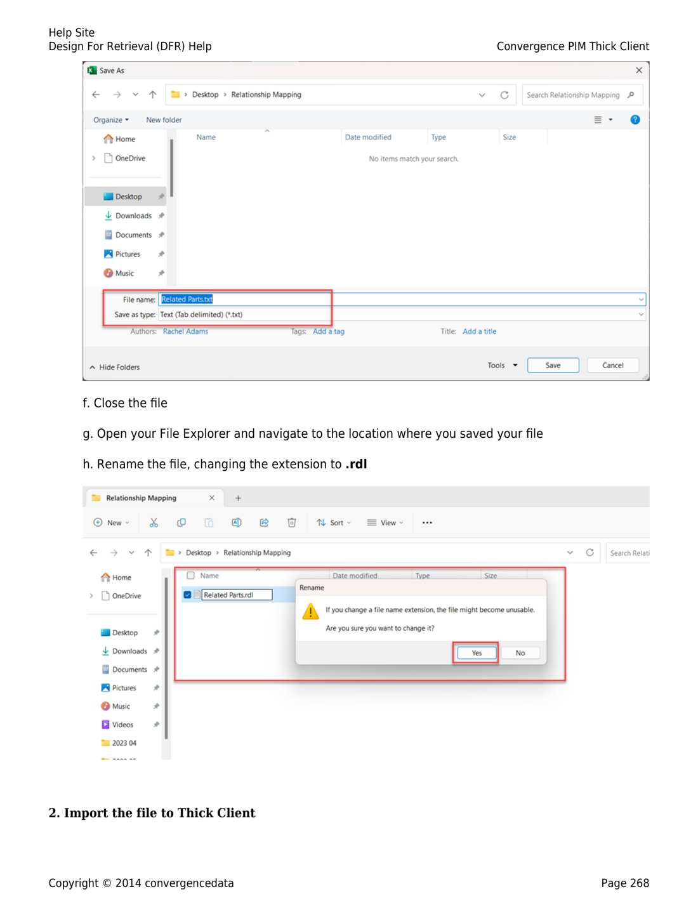

## Convergence PIM Thick Client

a. Launch the Convergence PIM Thick Client and open the Item Loader module

## b. Click "Import" at the top left of the window

c. Click on "Browse..." and select the file that you created

d. Confirm that the Root Qualifier matches what you wrote in column G of the file (default is Part)

e. Select "ITEM NUMBER" in both the Import File column and Product Attributes column, then

## click on the <--> button to map

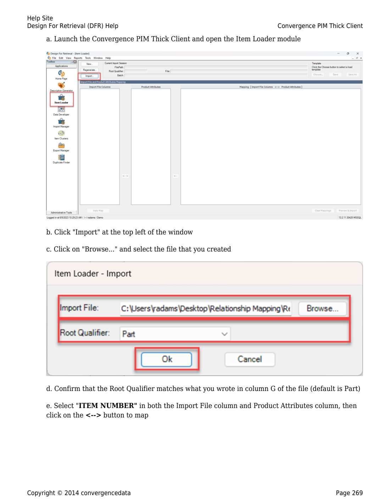

