# SmartTrack

## SmartTrack

Overall, the SmartTrack module is a valuable tool for tracking, managing, and organizing data within

your organization. By using the features and functions described above, you can easily locate and

retrieve data, track its movement and usage, and manage user access to ensure data security.

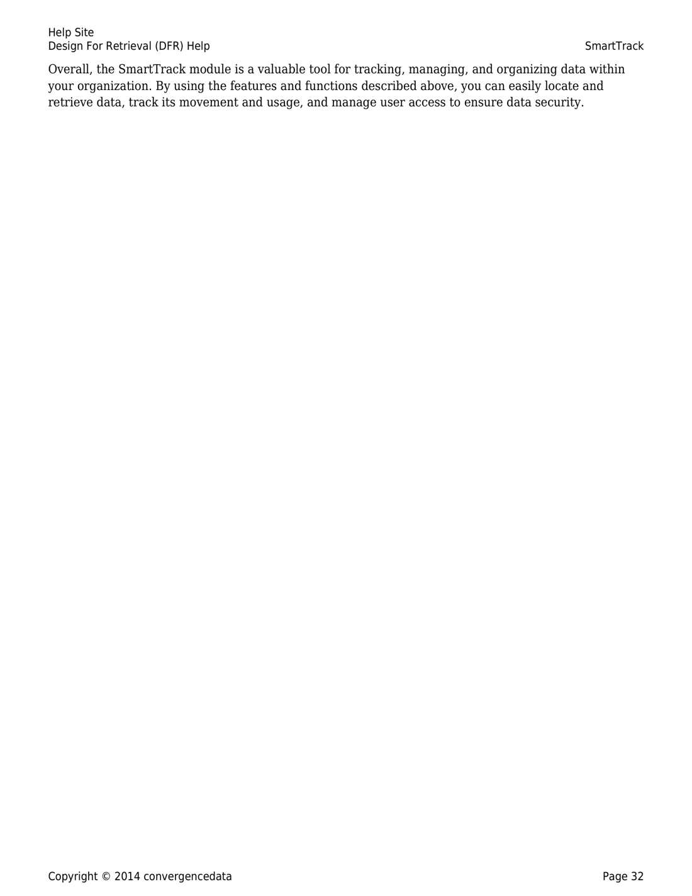

## SmartTrack

## Set up Owners and Tasks for a Deliverable

Welcome to the documentation page for Convergence Data's SmartTrack module, where we will be

discussing how to set up owners and tasks for a deliverable. Deliverable management is an essential

part of project management, and SmartTrack is designed to simplify the process of assigning ownership

and tracking progress. With SmartTrack's powerful task management features, project managers can

easily assign tasks to team members, set deadlines, and track progress in real-time. This documentation

will provide you with a comprehensive guide on how to set up owners and tasks for your deliverables

using SmartTrack, and how to leverage the module's capabilities to enhance collaboration, improve

visibility, and achieve project success. Whether you're a project manager or a team member tasked with

completing deliverables, this documentation will equip you with the knowledge and tools you need to

get the job done efficiently and effectively. Let's get started!

Log in to SmartTrack: To access the SmartTrack module, log in to your Convergence Data

1.

Services account. Then click on the SmartTrack module to get started.

2. Edit a deliverable: From the dashboard, click on the "Wrench" icon on one of the deliverables you

have made. You will then see many different areas to add and remove owners.

Add owners to the deliverable by clicking the "Add Owners" close to the top of the page.

Add primary owners to a task. This is someone who will be working with the items for that task.

Add rejected owners to a task. This is someone who will be working with the items that are

rejected within a task.

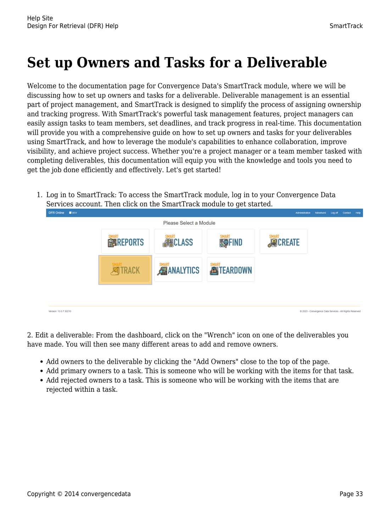

## SmartTrack

3. Add Tasks To a Deliverable: In the Manage Deliverable page you are still in you can add a task by

clicking the "Add Task" button.

When the "Add Task" button is clicked it will add a new task line at the bottom of the task list (you may

need to scroll down). Fill out the required fields, add primary and rejected, users and groups, and then

click Save in the top right of your screen.

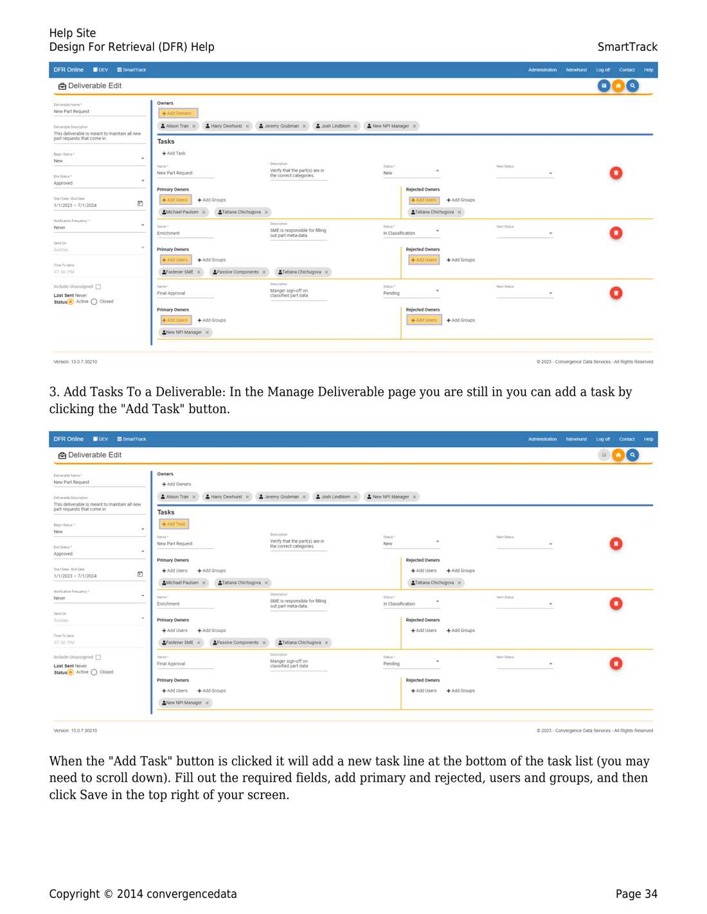

## SmartTrack

You have sucessfully added users and tasks for a deliverable.

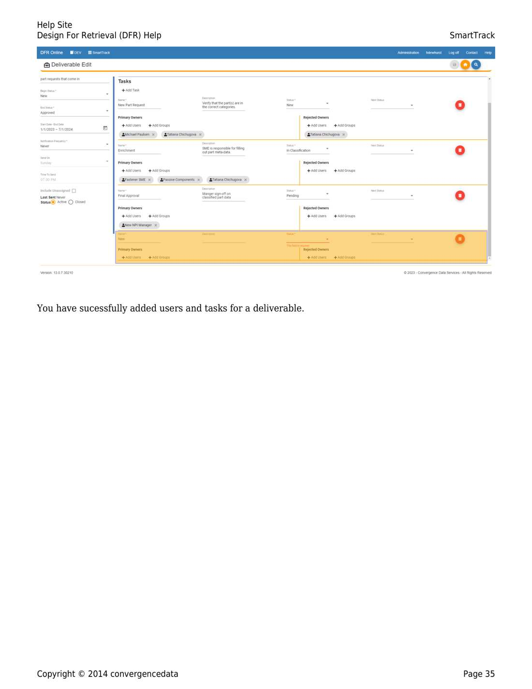

## SmartTrack

## Create and Manage a Deliverable

Welcome to the documentation page for Convergence Data's SmartTrack module, where we will be

discussing the creation and management of deliverables. As a comprehensive project management tool,

SmartTrack is designed to streamline the process of delivering projects on time and within budget. The

module offers an array of features that enable project managers and teams to collaborate effectively,

track progress, and manage project deliverables. In this documentation, we will be focusing on the

process of creating and managing deliverables using the SmartTrack module, and how it can help

simplify the process and improve project outcomes. Whether you're a seasoned project manager or a

newcomer to the field, this documentation will provide you with valuable insights and tips on how to

make the most of SmartTrack's deliverable management capabilities. Let's dive in!

Log in to SmartTrack: To access the SmartTrack module, log in to your Convergence Data

1.

Services account. This will bring you to the dashboard where you can access all modules. Click on

## SmartTrack

2. To create a deliverable first click on the "Manage Deliverable" button in the top right of the screen.

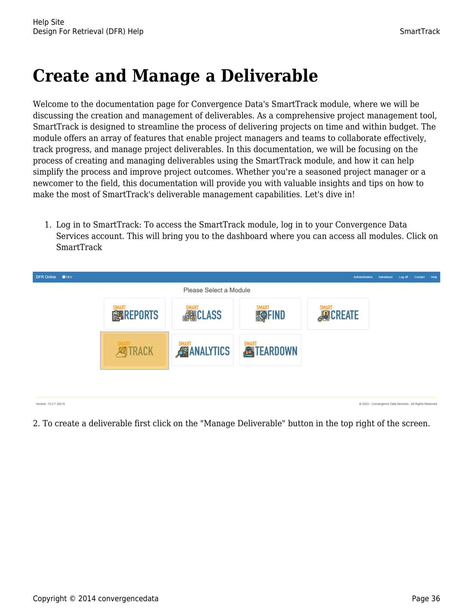

## SmartTrack

3. Now click on the "Add" button to add a new deliverable. If you already have deliverables made, you

can click on the edit button next to any of them to edit a current deliverable.

4. Now you can add all of the information that your new deliverable requires. On the right half of the

page, you can add tasks and owners and groups to the tasks with their respective buttons.  Once you

have finished entering in the information, click on the Save button in the top right of the screen to save

your progress and create the deliverable.

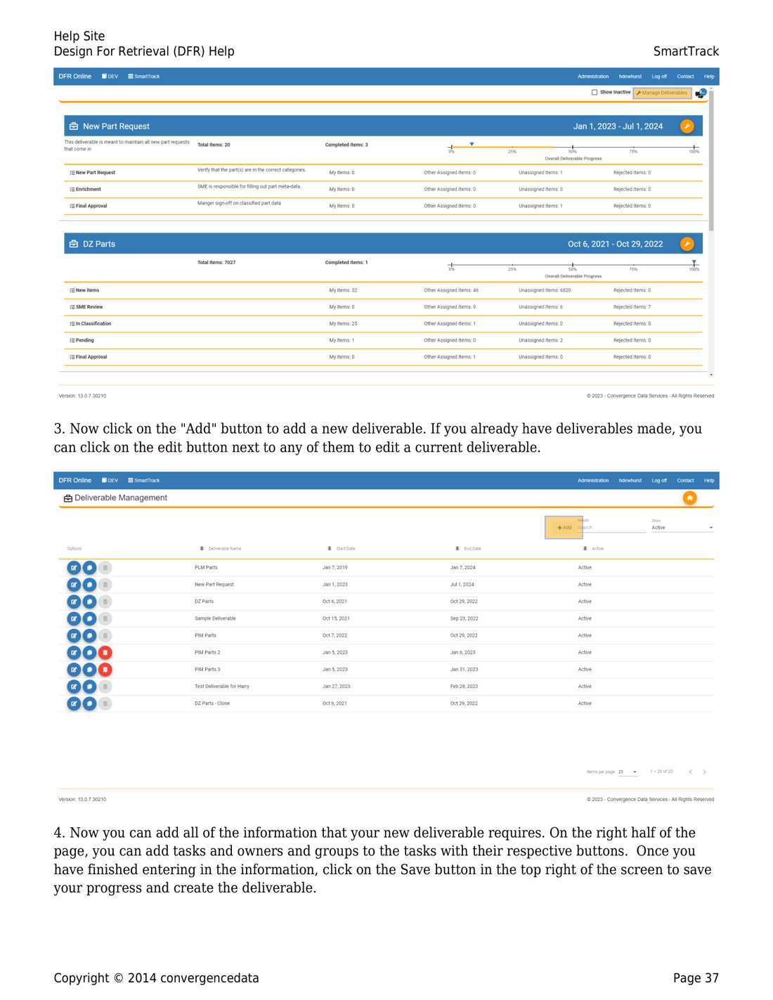

## SmartTrack

Note: All fields in red text are required to create a deliverable.

5. Manage a deliverable: Once you have a deliverable created,  you can edit it two different ways. First,

you can click on "Manage Deliverables" in the top right of your screen, then click the edit button next to

the deliverable you would like to edit or delete.

6. The second way to manage a deliverable is by clicking on the "Configure" button that is directly on

each of the deliverables when you are in the home screen of SmartTrack. This button will allow you to

edit all of the fields of the deliverable directly.

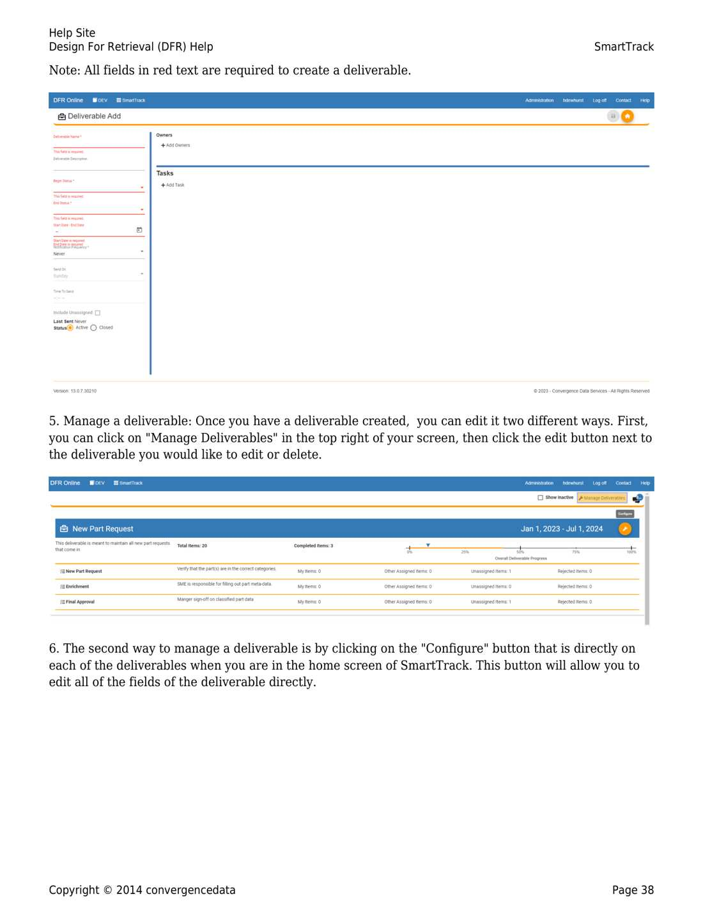

## SmartTrack

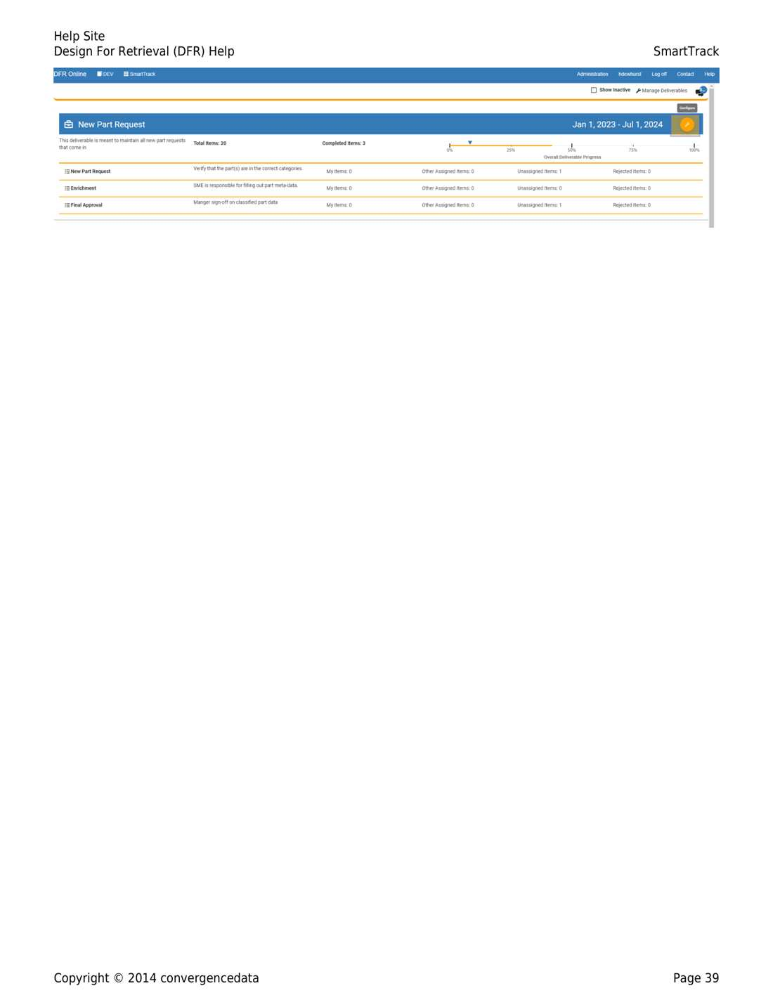

## SmartTrack

## Data Validations in SmartTrack

1. When you are in a deliverable or are viewing the deliverable summary dashboard and you have the

correct user permissions (System Administration), you will be able to see validation errors.

2. On the deliverable, there is a symbol displayed when violations are present. The symbol displayed

reflects the highest level of severity. This violation symbol can appear in the total number of items in

the deliverable, as well as next to each task name.

3. When you hover your cursor over the violation symbol next to the Total Items, it will display the count

of errors based on the level of severity for the entire deliverable.

4. When you hover your cursor over one of the violation symbols next to a deliverable task, it will

display the count of errors based on the level of severity for that particular deliverable task.

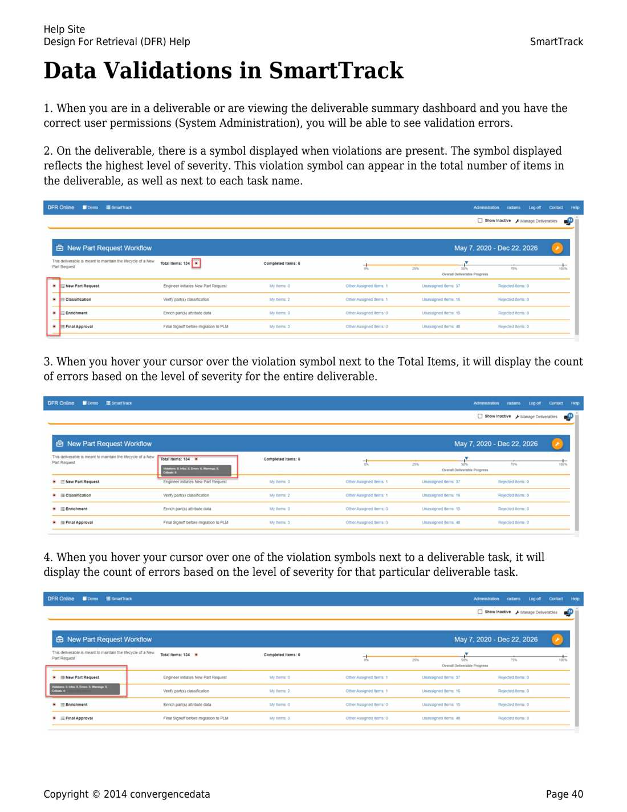

## SmartTrack

5. Violations will also be present on the item grid view page for the deliverables. When you hover your

mouse over one of the red validation errors, it will tell you what the error is.

6. When you hover your cursor over the small red "x" at the far left of every item number, it will give a

count of all the different validation errors that the item has.

7. When you click on an item to view the item details, you will see a symbol in the top right corner of the

page if there are violations present. The symbol displayed depends on the highest level of violation

present.

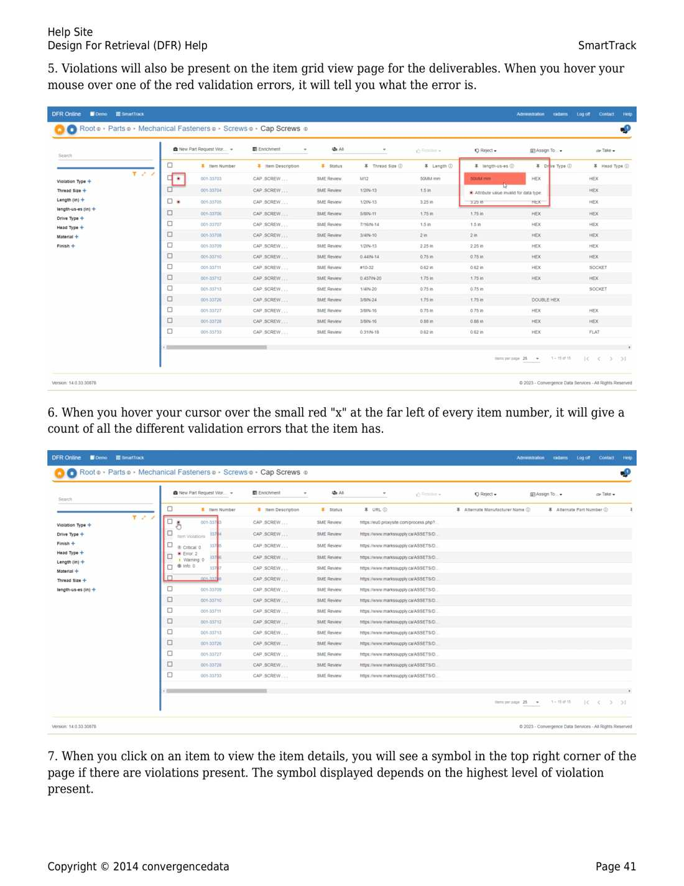

## SmartTrack

8. If you hover over the violation symbol, it will display a summary of the counts of violations by level of

severity.

9. The attributes that have a violation are highlighted in red. The tabs with violations are indicated with

a red circle that displays the count of violations on that tab.

10. When you hover your cursor over one of the attributes with red validation errors, it will tell you

what the error is.

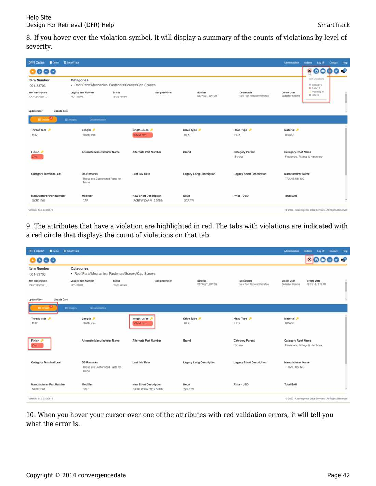

## SmartTrack

11. If you click edit, the attributes that have a violation are still highlighted in red.

12. If you make an update that resolves a violation and click save, the attribute should no longer be

highlighted in red.

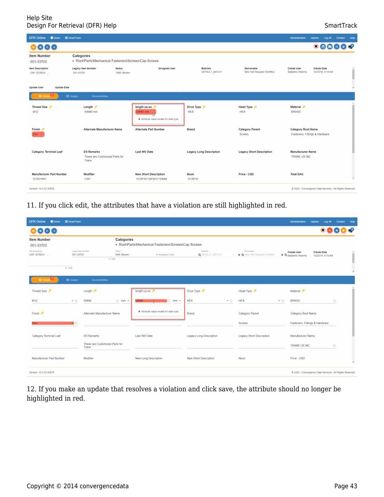

## SmartTrack

## Data Validation Filtering

Introducing a powerful enhancement: the ability to filter by data validation type directly on the item

details page. This new feature streamlines your workflow, making it easier than ever to pinpoint and

manage specific data categories with precision and efficiency.

1. When on the item grid view page on the left-hand side, you will see the filter called "Validation Type".

Click the plus sign next to the filter to expand the list of filterable values.

2. The user can now click on any of the Violation Types listed to filter.

3. The "check mark" and the "error" symbol will check all of the filters and uncheck all of the filters. The

filter tiles currently in use are also shown at the top of the screen.

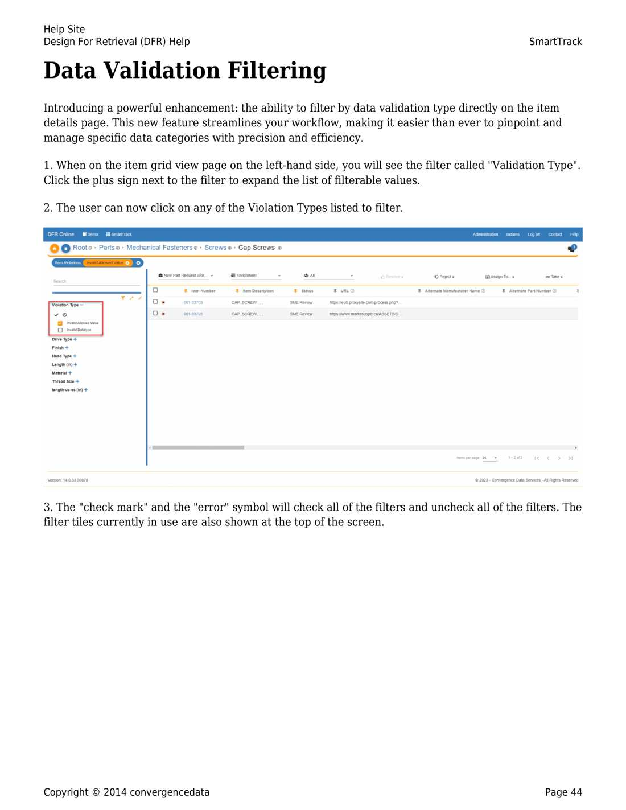

## SmartTrack

4. The user can also filter by validation type on a specific attribute. Right click on the attribute name,

then click on "Filter By Violation".

The user can then click NONE, which will filter the items that do not have a violation for that attribute.

OR the user can click ANY, which will filter the items that have any type of violation for that attribute.

OR the user can hover over "Violations", which will then provide a list on which the user can choose

which specific violation they want to filter that attribute by.

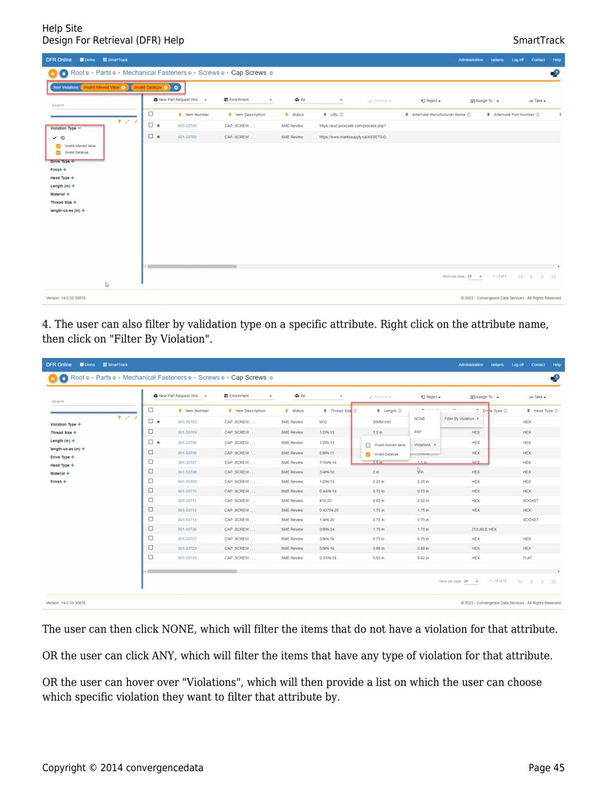

## Convergence PIM Online

## Smart Find

Welcome to the documentation for SmartFind, a module of Convergence PIM online software!

SmartFind is a powerful tool for searching and finding data within your organization. With its advanced

search capabilities, you can easily locate the information you need, regardless of where it is stored.

### Some key features of SmartFind include

Full-text search: SmartFind allows you to search for data across your data housed in Convergence

PIM's database. This means you can find the information you need by searching for any word or

phrase within the data.

Customized search filters: You can use SmartFind's customizable search filters to narrow down

your results and find the most relevant information. For example, you can search for data within a

specific date range, or filter by data type or location.

User-friendly interface: The SmartFind interface is designed to be easy to use, with a simple

search bar and clear search results. This makes it easy for anyone in your organization to find the

data they need quickly and efficiently.

Advanced search capabilities: SmartFind includes advanced search capabilities, such as wildcard

searches and Boolean operators, to help you find specific data more accurately.

Overall, SmartFind is a valuable tool for quickly and easily finding data within your organization.

Whether you are looking for specific documents, data sets, or other information, SmartFind can help

you locate it quickly and easily.

### Click on the links below to access the following pages

## Search for Parts

## Search by Classification

## Search by Part Number

## Search by Keyword

## Navigate Data Through Category Images

## Reclassify Parts

## Copy from Another Part

## Find Duplicate Parts

## Filter on Parts

## Export Parts

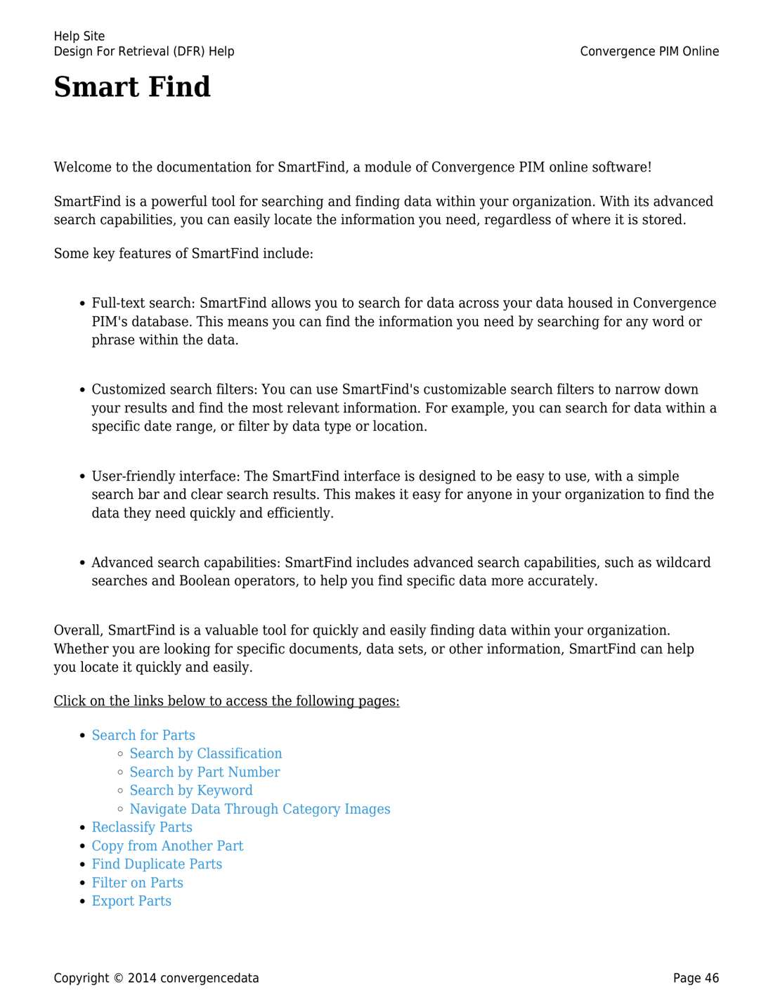

## SmartFind

## Search for Parts

SmartFind is a search engine designed to locate specific parts, categories, or even keywords that

relate to parts.

SmartFind will locate the desired category or part so the user is then able to edit, reclassify, assign,

approve, or reject parts. Searching for a Part can be done in multiple ways.

### Searching for parts can be done in four ways

## Search by Classification

## Search by Part Number

## Search by Keyword

## Navigating Data Through Category Images

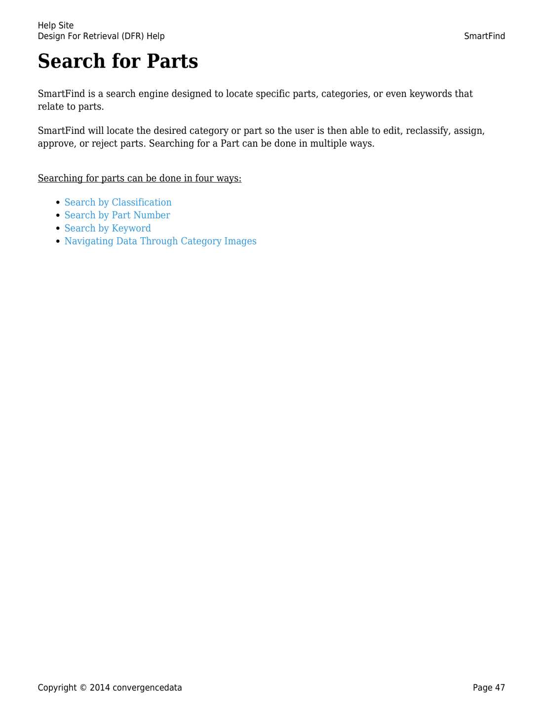

## Search for Parts

## Item Details

To page through the items that you have in a certain category, you can use the "Next Item" and

"Previous Item" buttons.

When you click the "Next Item" button you will be taken to the item details page of the next item in the

category.

When you click the "Previous Item" button you will be taken back to the item details page of the

previous item.

Clicking the "Back"  button on the item details page will bring you back to the results page of your

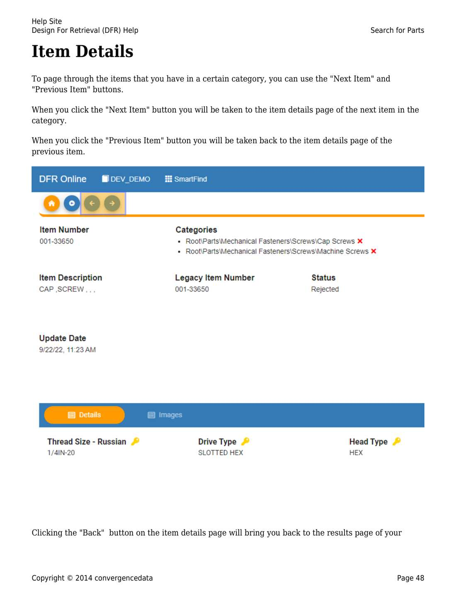

