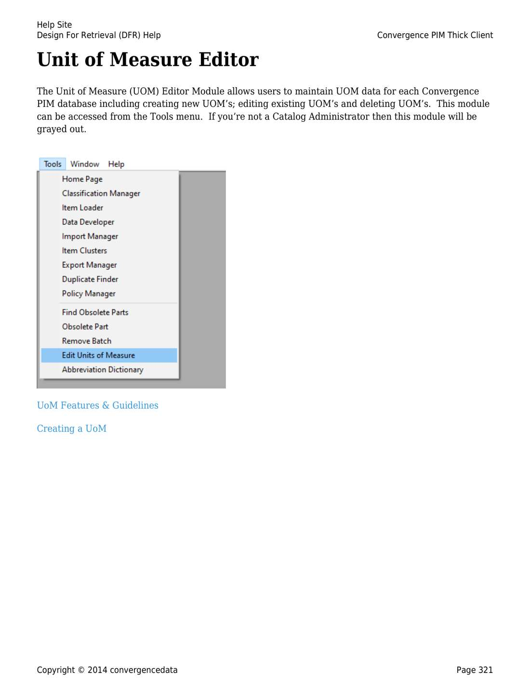
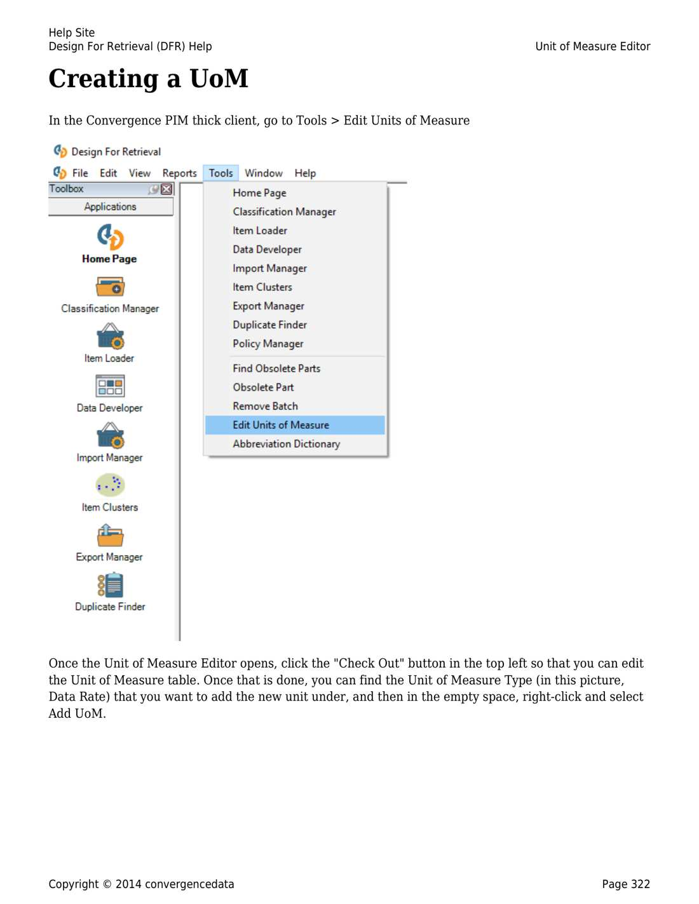
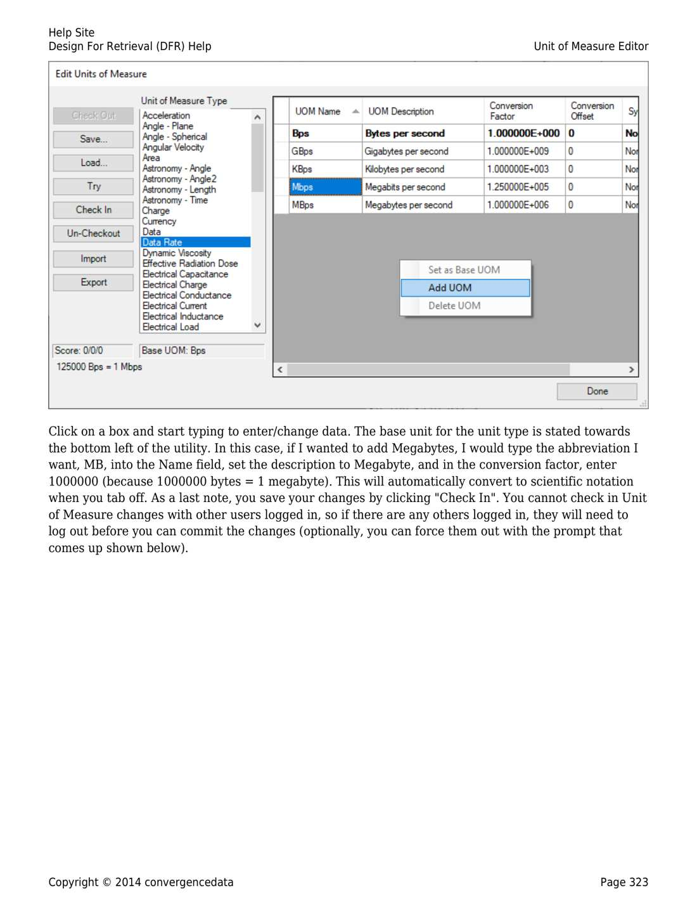
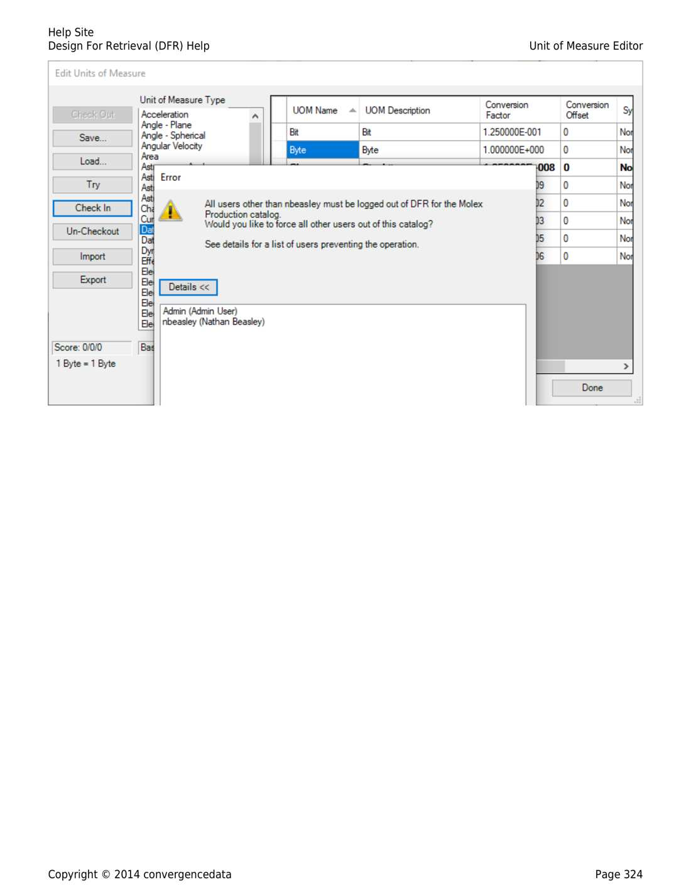
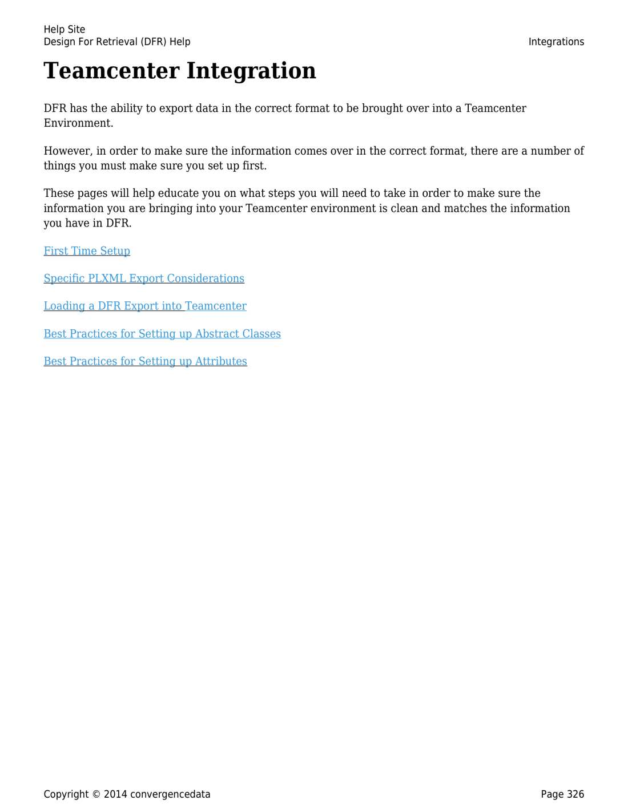
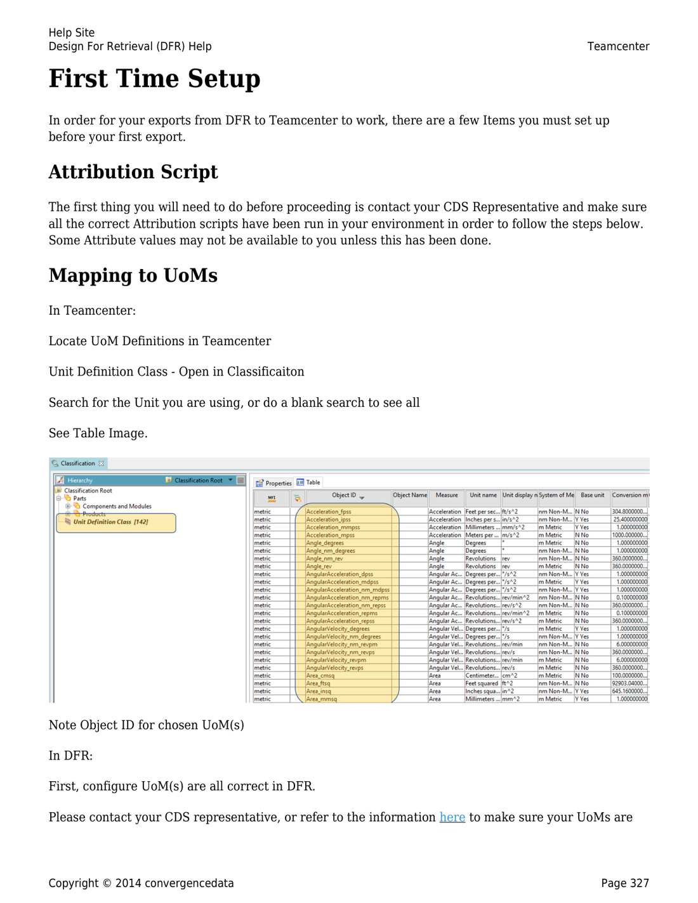
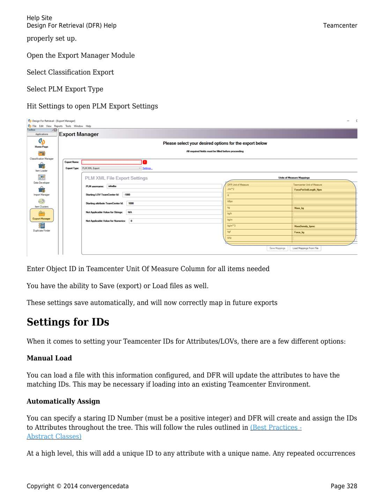
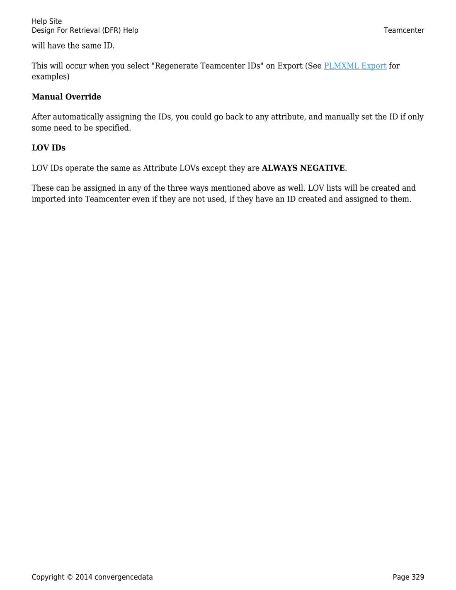
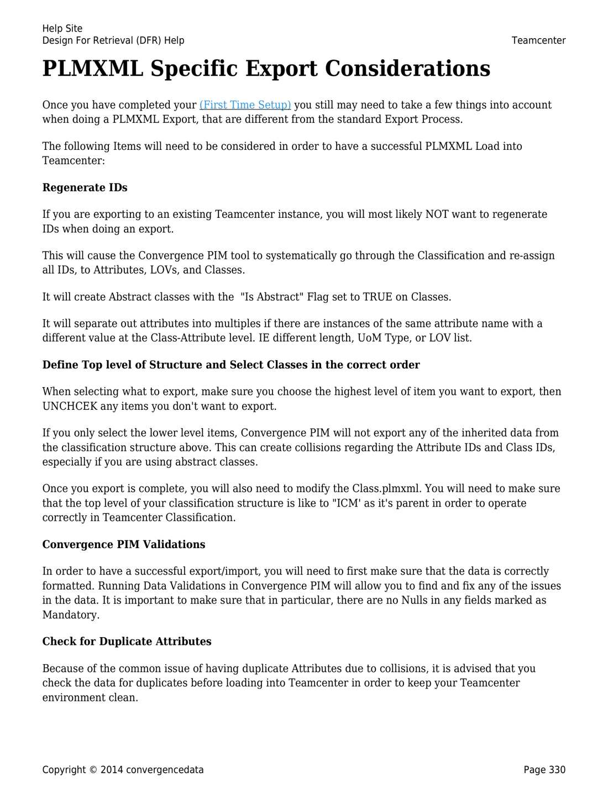
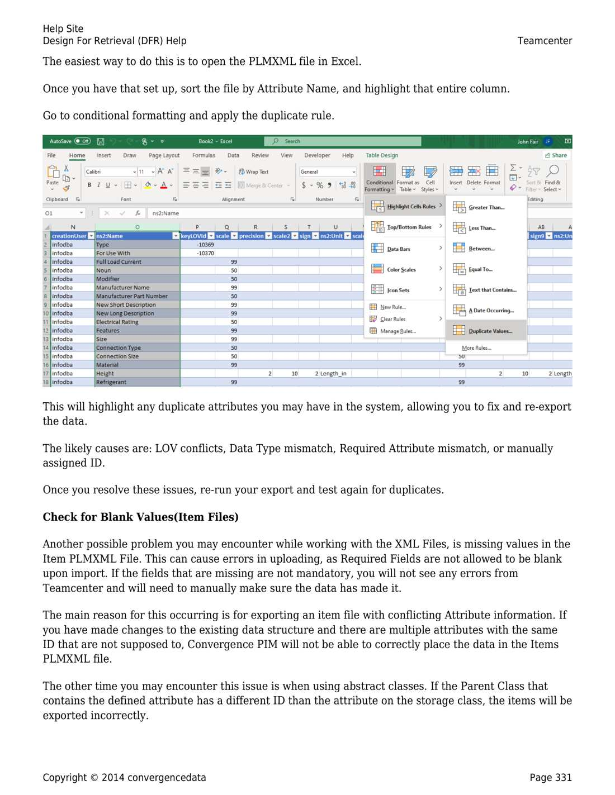

# Convergence PIM Thick Client

## Convergence PIM Thick Client

## Unit of Measure Editor

The Unit of Measure (UOM) Editor Module allows users to maintain UOM data for each Convergence

PIM database including creating new UOM’s; editing existing UOM’s and deleting UOM’s.  This module

can be accessed from the Tools menu.  If you’re not a Catalog Administrator then this module will be

grayed out.

## UoM Features & Guidelines

## Creating a UoM

## Unit of Measure Editor

## Creating a UoM

In the Convergence PIM thick client, go to Tools > Edit Units of Measure

Once the Unit of Measure Editor opens, click the "Check Out" button in the top left so that you can edit

the Unit of Measure table. Once that is done, you can find the Unit of Measure Type (in this picture,

Data Rate) that you want to add the new unit under, and then in the empty space, right-click and select

Add UoM.

## Unit of Measure Editor

Click on a box and start typing to enter/change data. The base unit for the unit type is stated towards

the bottom left of the utility. In this case, if I wanted to add Megabytes, I would type the abbreviation I

want, MB, into the Name field, set the description to Megabyte, and in the conversion factor, enter

1000000 (because 1000000 bytes = 1 megabyte). This will automatically convert to scientific notation

when you tab off. As a last note, you save your changes by clicking "Check In". You cannot check in Unit

of Measure changes with other users logged in, so if there are any others logged in, they will need to

log out before you can commit the changes (optionally, you can force them out with the prompt that

comes up shown below).

## Unit of Measure Editor

## Integrations

## Integrations

## Teamcenter Integration

DFR has the ability to export data in the correct format to be brought over into a Teamcenter

Environment.

However, in order to make sure the information comes over in the correct format, there are a number of

things you must make sure you set up first.

These pages will help educate you on what steps you will need to take in order to make sure the

information you are bringing into your Teamcenter environment is clean and matches the information

you have in DFR.

## First Time Setup

## Specific PLXML Export Considerations

## Loading a DFR Export into Teamcenter

## Best Practices for Setting up Abstract Classes

## Best Practices for Setting up Attributes

## Teamcenter

## First Time Setup

In order for your exports from DFR to Teamcenter to work, there are a few Items you must set up

before your first export.

## Attribution Script

The first thing you will need to do before proceeding is contact your CDS Representative and make sure

all the correct Attribution scripts have been run in your environment in order to follow the steps below.

Some Attribute values may not be available to you unless this has been done.

## Mapping to UoMs

### In Teamcenter

## Locate UoM Definitions in Teamcenter

## Unit Definition Class - Open in Classificaiton

Search for the Unit you are using, or do a blank search to see all

See Table Image.

## Note Object ID for chosen UoM(s)

### In DFR

First, configure UoM(s) are all correct in DFR.

Please contact your CDS representative, or refer to the information here to make sure your UoMs are

## Teamcenter

properly set up.

## Open the Export Manager Module

## Select Classification Export

## Select PLM Export Type

## Hit Settings to open PLM Export Settings

Enter Object ID in Teamcenter Unit Of Measure Column for all items needed

You have the ability to Save (export) or Load files as well.

These settings save automatically, and will now correctly map in future exports

## Settings for IDs

### When it comes to setting your Teamcenter IDs for Attributes/LOVs, there are a few different options

## Manual Load

You can load a file with this information configured, and DFR will update the attributes to have the

matching IDs. This may be necessary if loading into an existing Teamcenter Environment.

## Automatically Assign

You can specify a staring ID Number (must be a positive integer) and DFR will create and assign the IDs

to Attributes throughout the tree. This will follow the rules outlined in (Best Practices -

## Abstract Classes)

At a high level, this will add a unique ID to any attribute with a unique name. Any repeated occurrences

## Teamcenter

will have the same ID.

This will occur when you select "Regenerate Teamcenter IDs" on Export (See PLMXML Export for

## examples)

## Manual Override

After automatically assigning the IDs, you could go back to any attribute, and manually set the ID if only

some need to be specified.

## LOV IDs

LOV IDs operate the same as Attribute LOVs except they are ALWAYS NEGATIVE.

These can be assigned in any of the three ways mentioned above as well. LOV lists will be created and

imported into Teamcenter even if they are not used, if they have an ID created and assigned to them.

## Teamcenter

## PLMXML Specific Export Considerations

Once you have completed your (First Time Setup) you still may need to take a few things into account

when doing a PLMXML Export, that are different from the standard Export Process.

The following Items will need to be considered in order to have a successful PLMXML Load into

### Teamcenter

## Regenerate IDs

If you are exporting to an existing Teamcenter instance, you will most likely NOT want to regenerate

IDs when doing an export.

This will cause the Convergence PIM tool to systematically go through the Classification and re-assign

all IDs, to Attributes, LOVs, and Classes.

It will create Abstract classes with the  "Is Abstract" Flag set to TRUE on Classes.

It will separate out attributes into multiples if there are instances of the same attribute name with a

different value at the Class-Attribute level. IE different length, UoM Type, or LOV list.

Define Top level of Structure and Select Classes in the correct order

When selecting what to export, make sure you choose the highest level of item you want to export, then

UNCHCEK any items you don't want to export.

If you only select the lower level items, Convergence PIM will not export any of the inherited data from

the classification structure above. This can create collisions regarding the Attribute IDs and Class IDs,

especially if you are using abstract classes.

Once you export is complete, you will also need to modify the Class.plmxml. You will need to make sure

that the top level of your classification structure is like to "ICM' as it's parent in order to operate

correctly in Teamcenter Classification.

## Convergence PIM Validations

In order to have a successful export/import, you will need to first make sure that the data is correctly

formatted. Running Data Validations in Convergence PIM will allow you to find and fix any of the issues

in the data. It is important to make sure that in particular, there are no Nulls in any fields marked as

Mandatory.

## Check for Duplicate Attributes

Because of the common issue of having duplicate Attributes due to collisions, it is advised that you

check the data for duplicates before loading into Teamcenter in order to keep your Teamcenter

environment clean.

## Teamcenter

The easiest way to do this is to open the PLMXML file in Excel.

Once you have that set up, sort the file by Attribute Name, and highlight that entire column.

Go to conditional formatting and apply the duplicate rule.

This will highlight any duplicate attributes you may have in the system, allowing you to fix and re-export

the data.

The likely causes are: LOV conflicts, Data Type mismatch, Required Attribute mismatch, or manually

assigned ID.

Once you resolve these issues, re-run your export and test again for duplicates.

## Check for Blank Values(Item Files)

Another possible problem you may encounter while working with the XML Files, is missing values in the

Item PLMXML File. This can cause errors in uploading, as Required Fields are not allowed to be blank

upon import. If the fields that are missing are not mandatory, you will not see any errors from

Teamcenter and will need to manually make sure the data has made it.

The main reason for this occurring is for exporting an item file with conflicting Attribute information. If

you have made changes to the existing data structure and there are multiple attributes with the same

ID that are not supposed to, Convergence PIM will not be able to correctly place the data in the Items

PLMXML file.

The other time you may encounter this issue is when using abstract classes. If the Parent Class that

contains the defined attribute has a different ID than the attribute on the storage class, the items will be

exported incorrectly.

## Teamcenter

## Look out for file mismatches

When exporting multiple files, you must make sure you keep track of which files are exported when. If

you are importing Item files that are newer/older than the rest of the classification files, you will very

quickly encounter errors. By default the Convergence PIM Export will name the file with the Date and

Time which can help you track this. Consider using this, or adding additional information to your files

names in order to prevent any mismatches.

